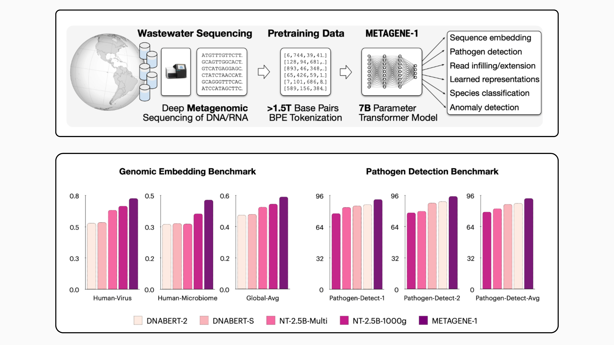

# Researchers from USC and Prime Intellect Released METAGENE-1: A 7B Parameter Autoregressive Transformer Model Trained on Over 1.5T DNA and RNA Base Pairs

> In a time when global health faces persistent threats from emerging pandemics, the need for advanced biosurveillance and pathogen detection systems is increasingly evident. Traditional genomic analysis methods, while effective in isolated cases, often struggle to address the complexities of large-scale health monitoring. A significant challenge is identifying and understanding the genomic diversity in environments […]

In a time when global health faces persistent threats from emerging pandemics, the need for advanced biosurveillance and pathogen detection systems is increasingly evident. Traditional genomic analysis methods, while effective in isolated cases, often struggle to address the complexities of large-scale health monitoring. A significant challenge is identifying and understanding the genomic diversity in environments such as wastewater, which contains a rich mix of microbial and viral DNA and RNA. The rapid advancements in biological research have further emphasized the importance of scalable, accurate, and interpretable models to analyze vast amounts of metagenomic data, aiding in the prediction and mitigation of health crises.

Researchers from the University of Southern California, Prime Intellect, and the Nucleic Acid Observatory have introduced METAGENE-1, a metagenomic foundation model. This 7-billion-parameter autoregressive transformer model is specifically designed to analyze metagenomic sequences. METAGENE-1 is trained on a dataset comprising over 1.5 trillion DNA and RNA base pairs derived from human wastewater samples, utilizing next-generation sequencing technologies and a tailored byte-pair encoding (BPE) tokenization strategy to capture the intricate genomic diversity present in these datasets. The model is open-sourced, encouraging collaboration and further advancements in the field.

### Technical Highlights and Benefits

METAGENE-1’s architecture draws on modern transformer models, including GPT and Llama families. This decoder-only transformer uses a causal language modeling objective to predict the next token in a sequence based on preceding tokens. **Its key features include:**

- **Dataset Diversity**: The training data encompasses sequences from tens of thousands of species, representing the microbial and viral diversity found in human wastewater.

- **Tokenization Strategy**: The use of BPE tokenization enables the model to process novel nucleic acid sequences efficiently.

- **Training Infrastructure**: Advanced distributed training setups ensured stable training on large datasets despite hardware limitations.

- **Applications**: METAGENE-1 supports tasks like pathogen detection, anomaly detection, and species classification, making it valuable for metagenomic studies and public health research.

These features enable METAGENE-1 to generate high-quality sequence embeddings and adapt to specific tasks, enhancing its utility in the genomic and public health domains.

### Results and Insights

The capabilities of METAGENE-1 were assessed using multiple benchmarks, where it demonstrated notable performance. In a pathogen detection benchmark based on human wastewater samples, the model achieved an average Matthews correlation coefficient (MCC) of 92.96, significantly outperforming other models. Additionally, METAGENE-1 showed strong results in anomaly detection tasks, effectively distinguishing metagenomic sequences from other genomic data sources.

In embedding-based genomic analyses, METAGENE-1 excelled on the Gene-MTEB benchmark, achieving a global average score of 0.59. This performance underscores its adaptability in both zero-shot and fine-tuning scenarios, reinforcing its value in handling complex and diverse metagenomic data.

### Conclusion

METAGENE-1 represents a thoughtful integration of artificial intelligence and metagenomics. By leveraging transformer architectures, the model offers practical solutions for biosurveillance and pandemic preparedness. Its open-source release invites researchers to collaborate and innovate, advancing the field of genomic science. As challenges related to emerging pathogens and global pandemics continue, METAGENE-1 demonstrates how technology can play a crucial role in addressing public health concerns effectively and responsibly.

---

Check out **_the [Paper](https://metagene.ai/metagene-1-paper.pdf), [Website](https://metagene.ai/), [GitHub Page](https://github.com/metagene-ai/metagene-pretrain), and [Model on Hugging Face](https://huggingface.co/metagene-ai)._** All credit for this research goes to the researchers of this project. Also, don’t forget to follow us on **[Twitter](https://twitter.com/Marktechpost)** and join our **[Telegram Channel](https://github.com/XGenerationLab/XiYan-SQL)** and [**LinkedIn Gr**](https://www.linkedin.com/groups/13668564/)[**oup**](https://www.linkedin.com/groups/13668564/). Don’t Forget to join our **[60k+ ML SubReddit](https://www.reddit.com/r/machinelearningnews/)**.

**🚨 FREE UPCOMING AI WEBINAR (JAN 15, 2025): [Boost LLM Accuracy with Synthetic Data and Evaluation Intelligence](https://info.gretel.ai/boost-llm-accuracy-with-sd-and-evaluation-intelligence?utm_source=marktechpost&utm_medium=newsletter&utm_campaign=202501_gretel_galileo_webinar)**–**[Join this webinar to gain actionable insights into boosting LLM model performance and accuracy while safeguarding data privacy](https://info.gretel.ai/boost-llm-accuracy-with-sd-and-evaluation-intelligence?utm_source=marktechpost&utm_medium=newsletter&utm_campaign=202501_gretel_galileo_webinar).**
