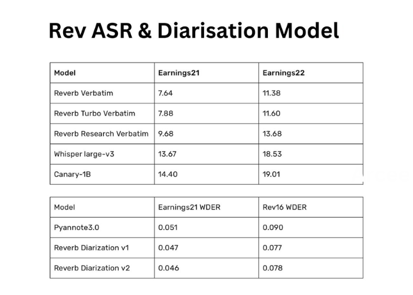

# Rev Releases Reverb AI Models: Open Weight Speech Transcription and Diarization Model Beating the Current SoTA Models

> Automatic Speech Recognition (ASR) and Diarization technologies have become essential tools for transforming how machines interpret human speech. These innovations enable accurate transcription, speech segmentation, and speaker identification across various applications like media transcriptions, legal documentation, and customer service automation. By breaking down audio data into comprehensible text and attributing speech to different speakers, these […]

Automatic Speech Recognition (ASR) and Diarization technologies have become essential tools for transforming how machines interpret human speech. These innovations enable accurate transcription, speech segmentation, and speaker identification across various applications like media transcriptions, legal documentation, and customer service automation. By breaking down audio data into comprehensible text and attributing speech to different speakers, these systems have paved the way for smarter and more interactive AI-driven applications.

One of the core challenges in the ASR and Diarization field has been achieving high accuracy in transcription and speaker identification. Existing models often need help in long-form speech recognition, which may involve different speakers with varying accents and speech patterns. This complexity results in higher error rates and increased computational costs, making it challenging for ASR systems to perform well in real-world environments. Speaker diarization encounters significant obstacles in distinguishing speakers accurately in overlapping speech segments, leading to misattributions and reducing the overall effectiveness of these systems.

Traditional methods for ASR, such as Whisper large-v3 by OpenAI and Canary-1B by NVIDIA, have set high benchmarks in terms of accuracy but often come with limitations. These models rely on large parameter sets and require significant computing power, making them less feasible for scalable applications. Similarly, earlier diarization models, like PyAnnote3.0, provide a baseline for speaker segmentation but need more refinements to integrate seamlessly with ASR systems. While these models have pushed the boundaries of speech technology, they leave room for improvement in both performance and resource efficiency.

The research team at Rev, a leading speech technology company, has introduced the Reverb ASR and Reverb Diarization models v1 and v2, setting new standards for accuracy and computational efficiency in the domain. The Reverb ASR is an English model trained on 200,000 hours of human-transcribed speech data, achieving the state-of-the-art Word Error Rate (WER). The diarization models, built upon the PyAnnote framework, are fine-tuned with 26,000 hours of labeled data. These models not only excel in separating speech but also address the issue of speaker attribution in complex auditory environments.

The technology behind Reverb ASR combines Convolutional Time-Classification (CTC) and attention-based architectures. The ASR model comprises 18 conformer and six transformer layers, totaling 600 million parameters. The architecture supports multiple decoding modes, such as CTC prefix beam search, attention rescoring, and joint CTC/attention decoding, providing flexible deployment options. The Reverb Diarization v1 model, built on PyAnnote3.0 architecture, incorporates 2 LSTM layers with 2.2 million parameters. Meanwhile, Reverb Diarization v2 replaces SincNet features with WavLM, enhancing the diarization’s precision. This technological shift has enabled the Rev research team to deliver a more robust speaker segmentation and attribution system.

Regarding performance, the Reverb ASR and Diarization models outperform traditional solutions across several benchmark datasets. On the Earnings21 dataset, Reverb ASR achieved a WER of 9.68, significantly lower than Whisper large-v3’s 14.26 and Canary-1B’s 14.40. Similarly, on the Earnings22 dataset, Reverb ASR recorded a WER of 13.68 compared to Whisper’s 19.05 and Canary-1B’s 19.01. The Rev16 dataset showed Reverb ASR with a WER of 10.30, while Whisper and Canary reported 10.86 and 13.82, respectively. This marked improvement in performance highlights Reverb ASR’s efficiency in handling long-form speech. For diarization, Reverb Diarization v1 provided a 16.5% improvement in Word Diarization Error Rate (WDER) over PyAnnote3.0, and v2 achieved a 22.25% relative improvement, making it a superior option for ASR integration.

Rev’s new models not only address the challenges faced by traditional systems but also provide a production-ready solution for various industries. The optimized pipeline for Reverb ASR includes a Weighted Finite-State Transducer (WFST) beam search, a unigram language model, and attention rescoring, making it highly adaptable for different transcription needs. Further, the model offers customizable verbatim transcription, allowing users to choose the level of verbatimicity, making it suitable for scenarios ranging from clean transcriptions to audio editing. The diarization models integrate seamlessly with ASR systems, assigning words to speakers with high accuracy even in noisy environments.

Rev has established itself as a frontrunner in the speech technology industry with these advancements. Their open-weight strategy allows the community to access these powerful models through platforms like Hugging Face, encouraging further innovation and collaboration. By setting new benchmarks in ASR and speaker diarization, Rev’s research team has provided the industry with a more reliable, scalable, and adaptable solution for automated speech understanding and speaker attribution. The continuous refinement of these models signifies Rev’s commitment to pushing the boundaries of speech technology and setting new standards for future advancements.

---

Check out the **[Details](https://www.rev.com/blog/speech-to-text-technology/introducing-reverb-open-source-asr-diarization)**, **Models on [Hugging Face](https://huggingface.co/Revai) and [GitHub](https://github.com/revdotcom/reverb)**. All credit for this research goes to the researchers of this project. Also, don’t forget to follow us on **[Twitter](https://twitter.com/Marktechpost)** and join our **[Telegram Channel](https://pxl.to/at72b5j)** and [**LinkedIn Gr**](https://www.linkedin.com/groups/13668564/)[**oup**](https://www.linkedin.com/groups/13668564/). **If you like our work, you will love our**[** newsletter..**](https://marktechpost-newsletter.beehiiv.com/subscribe) Don’t Forget to join our **[50k+ ML SubReddit](https://www.reddit.com/r/machinelearningnews/)**

**Interested in promoting your company, product, service, or event to over 1 Million AI developers and researchers? [Let’s collaborate!](https://pxl.to/9z1g32d)**
