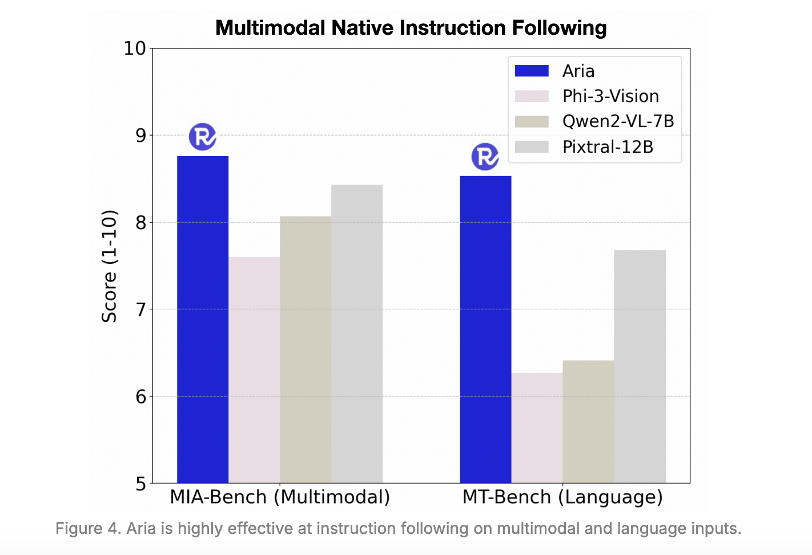

# Rhymes AI Released Aria: An Open Multimodal Native MoE Model Offering State-of-the-Art Performance Across Diverse Language, Vision, and Coding Tasks

> The field of multimodal artificial intelligence (AI) revolves around creating models capable of processing and understanding diverse input types such as text, images, and videos. Integrating these modalities allows for a more holistic understanding of data, making it possible for the models to provide more accurate and contextually relevant information. With growing applications in areas […]

The field of multimodal artificial intelligence (AI) revolves around creating models capable of processing and understanding diverse input types such as text, images, and videos. Integrating these modalities allows for a more holistic understanding of data, making it possible for the models to provide more accurate and contextually relevant information. With growing applications in areas like autonomous systems and advanced analytics, powerful multimodal models have become essential. Although proprietary models currently dominate the space, there is a pressing need for open models that offer competitive performance and accessibility for wider research and development.

A major issue in this domain is the need for open-source models with high efficiency and performance across various multimodal tasks. Most open-source models are limited in capability, excelling in one modality while underperforming in others. On the other hand, proprietary models like GPT-4o or Gemini-1.5 have demonstrated success across diverse tasks but are closed to the public, hindering further innovation and application. This creates a significant gap in the AI research landscape, as researchers need open models that can adequately serve as benchmarks or tools for further advancements in multimodal research.

The AI research community has explored various methods to build multimodal models, but most of these approaches have needed help with the complexity of integrating different data types. Existing open models are often designed to handle only a single kind of input at a time, like text or images, making it difficult to adapt them for tasks that require combined understanding. While proprietary models have shown how multimodal understanding can be achieved, they often rely on undisclosed training techniques and data resources, making them inaccessible for broader use. This limitation has left the research community looking for an open model to deliver strong performance in language and visual tasks without access barriers.

A team of researchers from Rhymes AI introduced [**Aria**](https://huggingface.co/rhymes-ai/Aria), an open multimodal AI model designed from scratch to handle various tasks, seamlessly integrating text, images, and video inputs. Aria utilizes a fine-grained mixture-of-experts (MoE) architecture, ensuring efficient computational resource utilization and superior performance. The model boasts 3.9 billion activated parameters per visual token and 3.5 billion per text token, making it a powerful tool for multimodal tasks. Also, Aria’s model size includes 24.9 billion parameters in total, and it activates only a fraction of these parameters at a time, resulting in lower computation costs than fully dense models.

The technical backbone of Aria lies in its mixture-of-experts decoder, which is complemented by a specialized visual encoder. The visual encoder converts visual inputs such as images and video frames into visual tokens with the same feature dimensions as word embeddings, enabling the model to integrate these seamlessly. Also, the model employs a 64,000-token context window, allowing it to process long-form multimodal data efficiently. This extended context window sets Aria apart from other models, making it highly effective in tasks that require a deep understanding of long and complex sequences, such as video comprehension and document analysis.

**Key Features of Aria:**

- **Multimodal Native Understanding: **Aria is designed to seamlessly process text, images, videos, and code in a single model without requiring separate setups for each input type. It demonstrates state-of-the-art performance across various multimodal tasks and matches or exceeds modality-specialized models in understanding capabilities.

- **SoTA Multimodal Native Performance: **Aria performs strongly across various multimodal, language, and coding tasks. It excels particularly in video and document understanding, outperforming other models in these areas and demonstrating its ability to handle complex multimodal data efficiently.

- **Efficient Mixture-of-Experts (MoE) Architecture: **Aria leverages a fine-grained Mixture-of-Experts architecture, activating only a fraction of its total parameters per token (3.9 billion for visual tokens and 3.5 billion for text tokens), ensuring parameter efficiency and lower computational costs. This is compared to full parameter activation in Pixtral-12B and Llama3.2-11B models.

- **Long Context Window:** The model boasts a long multimodal context window of 64,000 tokens, making it capable of processing complex, long data sequences, such as long documents or extended videos with subtitles. It significantly outperforms competing models like GPT-4o mini and Gemini-1.5-Flash in understanding long papers and videos.

- **High Performance on Benchmarks:** Aria has achieved best-in-class benchmark results for multimodal, language, and coding tasks. It competes favorably with top proprietary models like GPT-4o and Gemini-1.5, making it a preferred choice for document understanding, chart reading, and visual question answering.

- **Open Source and Developer-Friendly: **Released under the Apache 2.0 license, Aria provides open model weights and an accessible code repository, making it easy for developers to fine-tune the model on various datasets. The support for fast and easy inference using Transformers or vllm allows broader adoption and customization.

- **Multimodal Native Training Pipeline:** Aria is trained using a four-stage pipeline: Language Pre-Training, Multimodal Pre-Training, Multimodal Long-Context Pre-Training, and Multimodal Post-Training. This method progressively enhances the model’s understanding capabilities while retaining previously acquired knowledge.

- **Pre-Training Dataset:** The model was pre-trained on a large, curated dataset, which includes 6.4 trillion language tokens and 400 billion multimodal tokens. This dataset was collected from various sources, such as interleaved image-text sequences, synthetic image captions, document transcriptions, and question-answering pairs.

- **Instruction Following Capability:** Aria understands and follows instructions based on multimodal and language inputs. It performs better than open-source models on instruction-following benchmarks like MIA-Bench and MT-Bench.

When evaluated against competing models, Aria achieved remarkable results across several benchmarks. It consistently outperformed open-source models like Pixtral-12B and Llama3.2-11B in multimodal understanding tasks. For instance, Aria scored 92.6% on the TextVQA validation set and 81.8% on the MATH benchmark, highlighting its superior capability in visual question-answering and mathematical reasoning. In addition, Aria demonstrated state-of-the-art performance in long-context video understanding, achieving over 90% accuracy on the VideoMME benchmark with subtitles, surpassing many proprietary models. The model’s efficient architecture also results in lower computational costs, making it a feasible option for real-world applications where both performance and cost-efficiency are crucial.

Aria is released under the Apache 2.0 license, making it accessible for academic and commercial use. The research team also provides a robust training framework for fine-tuning Aria on various data sources, allowing users to leverage the model for specific use cases. This open access to a high-performance multimodal model will catalyze further research and development, driving innovation in virtual assistants, automated content generation, and multimodal search engines.

In conclusion, Aria fills a critical gap in the AI research community by offering a powerful open-source alternative to proprietary multimodal models. Its fine-grained mixture-of-experts architecture, lightweight visual encoder, and extended context window enable it to perform exceptionally well on complex tasks that require comprehensive understanding across multiple modalities. Aria is a versatile tool for a wide range of multimodal applications by achieving competitive performance on various benchmarks and offering low computation costs.

---

Check out the **[Paper](https://arxiv.org/abs/2410.05993)**, **[Model](https://huggingface.co/rhymes-ai/Aria)**, and **[Details](https://www.rhymes.ai/blog-details/aria-first-open-multimodal-native-moe-model)**. All credit for this research goes to the researchers of this project. Also, don’t forget to follow us on **[Twitter](https://twitter.com/Marktechpost)** and join our **[Telegram Channel](https://pxl.to/at72b5j)** and [**LinkedIn Gr**](https://www.linkedin.com/groups/13668564/)[**oup**](https://www.linkedin.com/groups/13668564/). **If you like our work, you will love our**[** newsletter..**](https://marktechpost-newsletter.beehiiv.com/subscribe) Don’t Forget to join our **[50k+ ML SubReddit](https://www.reddit.com/r/machinelearningnews/)**

**[[Upcoming Event- Oct 17 202] RetrieveX – The GenAI Data Retrieval Conference (Promoted)](https://www.retrievex.co/application?utm_source=print&utm_medium=markettechpost&utm_campaign=retrievex&utm_term=speakers&utm_content=SIZE)**
