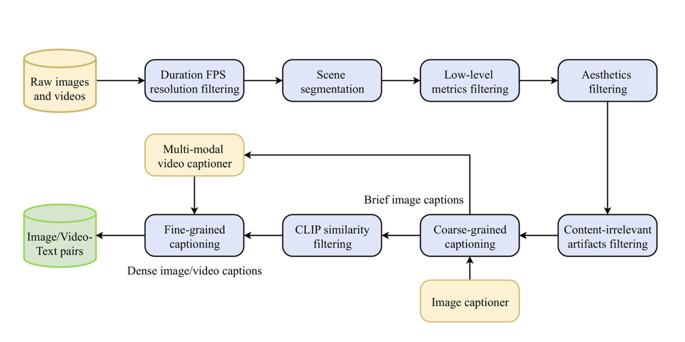

# Rhymes AI Unveils Allegro-TI2V: A Breakthrough in Visual Storytelling with Open-Source AI Video Generation Technology

> Rhymes AI has open-sourced Allegro-TI2V, a cutting-edge text-image-to-video generation model that promises to revolutionize visual content creation. This innovative release marks a milestone in the rapidly evolving landscape of generative AI technologies. Allegro-TI2V is an advanced iteration of the original Allegro model, offering unprecedented capabilities in transforming textual descriptions and images into dynamic, high-quality video […]

Rhymes AI has open-sourced [**Allegro-TI2V**](https://huggingface.co/rhymes-ai/Allegro-TI2V), a cutting-edge text-image-to-video generation model that promises to revolutionize visual content creation. This innovative release marks a milestone in the rapidly evolving landscape of generative AI technologies. Allegro-TI2V is an advanced iteration of the original Allegro model, offering unprecedented capabilities in transforming textual descriptions and images into dynamic, high-quality video content. The model stands out for its remarkable versatility and technical sophistication, providing content creators and researchers with a powerful tool for visual storytelling.

The model boasts an impressive technical profile that sets it apart from previous video generation approaches:

- A context length of 79.2K, equivalent to 88 frames

- High-resolution output of 720×1280 pixels

- Video generation at 15 frames per second, with optional interpolation to 30 FPS

- Support for multiple precision modes (FP32, BF16, FP16)

- Efficient GPU memory usage of just 9.3 GB in BF16 mode

With a compact yet powerful architecture, Allegro-TI2V features a 175 million parameter VideoVAE and a 2.8 billion-variant VideoDiT model. This sophisticated design enables the generation of detailed, nuanced videos that capture the essence of user-provided prompts and initial images.

*[**Image Source**](https://huggingface.co/rhymes-ai/Allegro-TI2V)*

Allegro-TI2V introduces two groundbreaking generation modes that expand the possibilities of AI-powered video creation:

- **Subsequent Video Generation:** Users can create follow-up video content by providing a text prompt and an initial frame image. This allows for the seamless continuation of visual narratives.

- **Intermediate Video Generation:** When given first and last frame images, the model can generate in-between video content, enabling more complex and controlled video creation.

Rhymes AI has released Allegro-TI2V under the Apache 2.0 License. This open-source approach allows researchers, developers, and content creators to access, study, and build upon the model’s groundbreaking technology. The company has provided comprehensive documentation and resources to help users quickly integrate the model into their workflows. Key requirements include Python 3.10 or higher, PyTorch 2.4 or newer, and CUDA 12.4 or later. A simple command-line interface enables users to generate videos with minimal setup, making the technology accessible to technical and non-technical users.

*[**Image Source**](https://huggingface.co/rhymes-ai/Allegro-TI2V)*

The potential applications for Allegro-TI2V are vast and exciting. Content creators, filmmakers, game developers, and digital artists can leverage the model to rapidly prototype visual concepts, generate dynamic background sequences, create innovative storytelling tools, develop unique visual effects, and explore new forms of AI-assisted creative expression. The model can generate 6-second videos in approximately 20 minutes on a single H100 GPU, reducing this to just 3 minutes when using an 8xH100 configuration. The optional CPU offloading feature further enhances accessibility by reducing GPU memory requirements.

In conclusion, Allegro-TI2V stands as a testament to the incredible potential of machine learning in creative domains. Its open-source nature, technical sophistication, and user-friendly design make it a landmark release that will inspire and enable new forms of digital creativity. Developers and creators interested in this groundbreaking technology can find the model weights and documentation on the Hugging Face platform and the Allegro GitHub repository.

---

Check out **[the Paper](https://arxiv.org/abs/2410.15458), [Details](https://rhymes.ai/blog-details/allegro-advanced-video-generation-model), and [Hugging Face Page](https://huggingface.co/rhymes-ai/Allegro-TI2V).** All credit for this research goes to the researchers of this project. Also, don’t forget to follow us on **[Twitter](https://twitter.com/Marktechpost)** and join our **[Telegram Channel](https://github.com/XGenerationLab/XiYan-SQL)** and [**LinkedIn Gr**](https://www.linkedin.com/groups/13668564/)[**oup**](https://www.linkedin.com/groups/13668564/). **If you like our work, you will love our**[** newsletter..**](https://marktechpost-newsletter.beehiiv.com/subscribe) Don’t Forget to join our **[55k+ ML SubReddit](https://www.reddit.com/r/machinelearningnews/)**.

**🎙️ 🚨 ‘[Evaluation of Large Language Model Vulnerabilities: A Comparative Analysis of Red Teaming Techniques’ Read the Full Report _(Promoted)_](https://hubs.li/Q02Y39sh0)**
