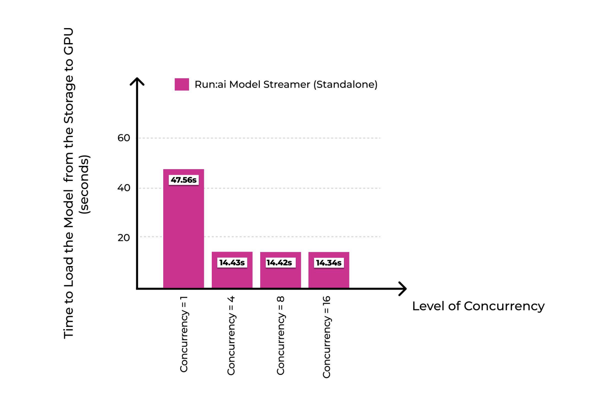

# Run AI Open Sources Run:ai Model Streamer: A Purpose-Built Solution to Make Large Models Loading Faster, and More Efficient

> In the fast-moving world of artificial intelligence and machine learning, the efficiency of deploying and running models is key to success. For data scientists and machine learning engineers, one of the biggest frustrations has been the slow and often cumbersome process of loading trained models for inference. Whether models are stored locally or in the […]

In the fast-moving world of artificial intelligence and machine learning, the efficiency of deploying and running models is key to success. For data scientists and machine learning engineers, one of the biggest frustrations has been the slow and often cumbersome process of loading trained models for inference. Whether models are stored locally or in the cloud, inefficiencies during loading can create frustrating bottlenecks, reducing productivity and delaying the delivery of valuable insights. This issue becomes even more critical when scaling to real-world scenarios, where inference must be both quick and reliable to meet user expectations. Optimizing model loading times across different storage solutions—whether on-premises or in the cloud—remains a significant challenge for many teams.

Run AI recently announced an open-source solution to tackle this very problem: Run AI: Model Streamer. This tool aims to drastically cut down the time it takes to load inference models, helping the AI community overcome one of its most notorious technical hurdles. Run AI: Model Streamer achieves this by providing a high-speed, optimized approach to loading models, making the deployment process not only faster but also more seamless. By releasing it as an open-source project, Run AI is empowering developers to innovate and leverage this tool in a wide variety of applications. This move demonstrates the company’s commitment to making advanced AI accessible and efficient for everyone.

*https://www.youtube.com/watch?v=luMhZyMAbPM&t=3s*

Run AI: Model Streamer is built with several key optimizations that set it apart from traditional model-loading methods. One of its most notable benefits is the ability to load models up to six times faster. The tool is designed to work across all major storage types, including local storage, cloud-based solutions, Amazon S3, and Network File System (NFS). This versatility ensures that developers do not need to worry about compatibility issues, regardless of where their models are stored. Additionally, Run Model Streamer integrates natively with popular inference engines, eliminating the need for time-consuming model format conversions. For instance, models from Hugging Face can be loaded directly without any conversion, significantly reducing friction in the deployment process. This native compatibility allows data scientists and engineers to focus more on innovation and less on the cumbersome aspects of model integration.

The importance of Run AI: Model Streamer cannot be overstated, particularly when considering the real-world performance benefits it provides. Run AI’s benchmarks highlight a striking improvement: when loading a model from Amazon S3, the traditional method takes approximately 37.36 seconds, whereas Run Model Streamer can do it in just 4.88 seconds. Similarly, loading a model from an SSD is reduced from 47 seconds to just 7.53 seconds. These performance improvements are significant, especially in scenarios where rapid model loading is a prerequisite for scalable AI solutions. By minimizing loading times, Run Model Streamer not only improves the efficiency of individual workflows but also enhances the overall reliability of AI systems that depend on quick inference, such as real-time recommendation engines or critical healthcare diagnostics.

Run AI: Model Streamer addresses a critical bottleneck in the AI workflow by providing a reliable and high-speed model-loading solution. With up to six times faster loading times and seamless integration across diverse storage types, this tool promises to make model deployment much more efficient. The ability to load models directly without any format conversion further simplifies the deployment pipeline, allowing data scientists and engineers to focus on what they do best—solving problems and creating value. By open-sourcing this tool, Run AI is not only driving innovation within the community but also setting a new benchmark for what’s possible in model loading and inference. As AI applications continue to proliferate, tools like Run Model Streamer will play an essential role in ensuring that these innovations reach their full potential quickly and efficiently.

---

Check out the** [Technical Report](https://pages.run.ai/hubfs/PDFs/White%20Papers/Model-Streamer-Performance-Benchmarks.pdf), [GitHub Page](https://github.com/run-ai/runai-model-streamer?tab=readme-ov-file), and [Other Details](https://www.run.ai/blog/accelerating-model-loading-with-run-ai-model-streamer)**. All credit for this research goes to the researchers of this project. Also, don’t forget to follow us on **[Twitter](https://twitter.com/Marktechpost)** and join our **[Telegram Channel](https://pxl.to/at72b5j)** and [**LinkedIn Gr**](https://www.linkedin.com/groups/13668564/)[**oup**](https://www.linkedin.com/groups/13668564/). **If you like our work, you will love our**[** newsletter..**](https://marktechpost-newsletter.beehiiv.com/subscribe) Don’t Forget to join our **[55k+ ML SubReddit](https://www.reddit.com/r/machinelearningnews/)**.

**[[Trending](https://www.marktechpost.com/2024/10/28/llmware-introduces-model-depot-an-extensive-collection-of-small-language-models-slms-for-intel-pcs/)] ****[LLMWare Introduces Model Depot: An Extensive Collection of Small Language Models (SLMs) for Intel PCs](https://www.marktechpost.com/2024/10/28/llmware-introduces-model-depot-an-extensive-collection-of-small-language-models-slms-for-intel-pcs/)**
