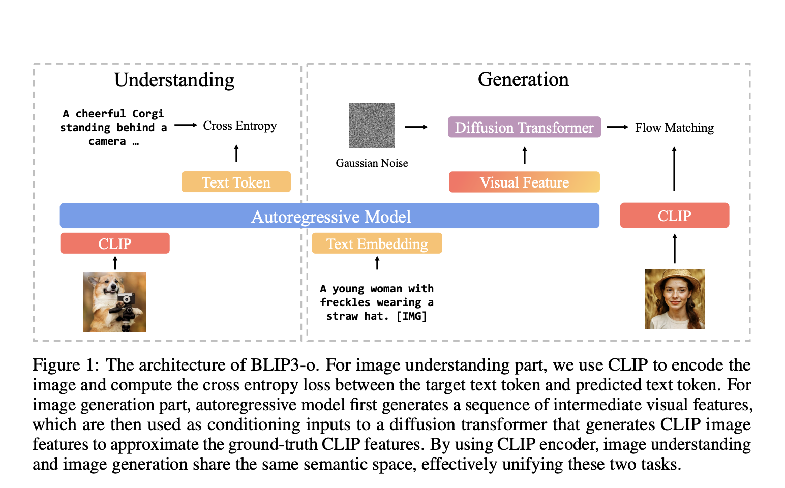

# Salesforce AI Releases BLIP3-o: A Fully Open-Source Unified Multimodal Model Built with CLIP Embeddings and Flow Matching for Image Understanding and Generation

> Multimodal modeling focuses on building systems to understand and generate content across visual and textual formats. These models are designed to interpret visual scenes and produce new images using natural language prompts. With growing interest in bridging vision and language, researchers are working toward integrating image recognition and image generation capabilities into a unified system. […]

Multimodal modeling focuses on building systems to understand and generate content across visual and textual formats. These models are designed to interpret visual scenes and produce new images using natural language prompts. With growing interest in bridging vision and language, researchers are working toward integrating image recognition and image generation capabilities into a unified system. This approach eliminates the need for separate pipelines and opens the path to more coherent and intelligent interactions across modalities.

A key challenge in this field is to develop architectures that handle both understanding and generation without compromising the quality of either. Models need to grasp complex visual concepts and produce high-quality images matching user prompts. The difficulty lies in identifying suitable picture representations and training procedures that support both tasks. This problem becomes more evident when the same model is expected to interpret detailed text descriptions and generate visually accurate outputs based on them. It requires alignment of semantic understanding and pixel-level synthesis.

Previous approaches have generally used Variational Autoencoders (VAEs) or CLIP-based encoders to represent images. VAEs are efficient for reconstruction but encode lower-level features, often leading to less informative representations. CLIP-based encoders provide high-level semantic embeddings by learning from large-scale image-text pairs. However, CLIP was not built for image reconstruction, making it challenging to use for generation unless paired with models like diffusion decoders. In terms of training, Mean Squared Error (MSE) is widely used for simplicity but tends to produce deterministic outputs. To improve generation diversity and quality, researchers have turned to Flow Matching, which introduces controlled stochasticity and better models the continuous nature of image features.

Researchers from Salesforce Research, in collaboration with the University of Maryland and several academic institutions, introduced BLIP3-o, a family of unified multimodal models. The model adopts a dual-stage training strategy where image understanding is learned first, followed by image generation. The proposed system leverages CLIP embeddings to represent images and integrates them with a diffusion transformer to synthesize new visual outputs. Unlike previous joint training methods, the sequential approach maintains the strength of each task independently. The diffusion module is trained while keeping the autoregressive backbone frozen, avoiding task interference. To improve alignment and visual fidelity, the team also curated BLIP3o-60k, a high-quality instruction-tuning dataset created by prompting GPT-4o across varied visual categories, including scenes, objects, gestures, and text. They developed two model versions: an 8-billion parameter model trained with proprietary and public data, and a 4-billion version using only open-source data.

The image generation pipeline of BLIP3-o is built on Qwen2.5-VL large language models. Prompts are processed to produce visual features refined through a Flow Matching diffusion transformer. This transformer is based on the Lumina-Next architecture, optimized for speed and quality with 3D rotary position embedding and grouped-query attention. The model encodes each image into 64 fixed-length semantic vectors, regardless of resolution, which supports compact storage and efficient decoding. The research team used a large-scale dataset of 25 million images from sources like CC12M, SA-1B, and JourneyDB to train the models. They extended it with 30 million proprietary samples for the 8B model. They also included 60k instruction-tuning samples covering challenging prompts such as complex gestures and landmarks, generated via GPT-4o.

In terms of performance, BLIP3-o demonstrated top scores across multiple benchmarks. The 8B model achieved a GenEval score of 0.84 for image generation alignment and a WISE score of 0.62 for reasoning ability. Image understanding scored 1682.6 on MME-Perception, 647.1 on MME-Cognition, 50.6 on MMMU, and 83.1 on both VQAv2 and TextVQA datasets. A human evaluation comparing BLIP3-o 8B with Janus Pro 7B showed that BLIP3-o was preferred 50.4% of the time for visual quality and 51.5% for prompt alignment. These results are supported by statistically significant p-values (5.05e-06 and 1.16e-05), indicating the superiority of BLIP3-o in subjective quality assessments.

This research outlines a clear solution to the dual challenge of image understanding and generation. CLIP embeddings, Flow Matching, and a sequential training strategy demonstrate how the problem can be approached methodically. The BLIP3-o model delivers state-of-the-art results and introduces an efficient and open approach to unified multimodal modeling.

---

**Check out the [Paper](https://arxiv.org/abs/2505.09568), [GitHub Page](https://github.com/JiuhaiChen/BLIP3o) and [Model on Hugging Face](https://huggingface.co/BLIP3o/BLIP3o-Model)_._** All credit for this research goes to the researchers of this project. Also, feel free to follow us on **[Twitter](https://x.com/intent/follow?screen_name=marktechpost)** and don’t forget to join our **[90k+ ML SubReddit](https://www.reddit.com/r/machinelearningnews/)**.
