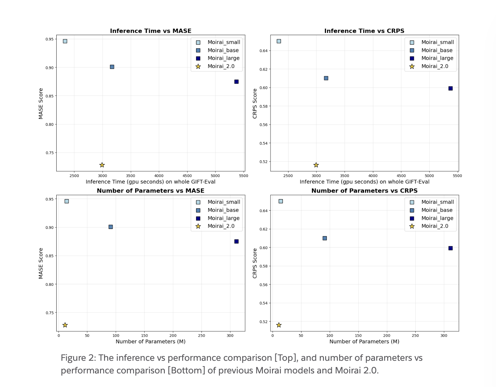

# Salesforce AI Releases Moirai 2.0: Salesforce’s Latest Time Series Foundation Model Built on a Decoder‑only Transformer Architecture

> Salesforce AI Research has unveiled Moirai 2.0, the latest advancement in the world of time series foundation models. Built atop a decoder-only transformer architecture, Moirai 2.0 sets a new bar for performance and efficiency, claiming the #1 spot on the GIFT-Eval benchmark-the gold standard for time-series forecasting model evaluation. Not only is it 44% faster […]

Salesforce AI Research has unveiled **[Moirai 2.0](https://huggingface.co/Salesforce/moirai-2.0-R-small)**, the latest advancement in the world of time series foundation models. Built atop a **decoder-only transformer architecture**, Moirai 2.0 sets a new bar for performance and efficiency, claiming the #1 spot on the [GIFT-Eval benchmark](https://huggingface.co/spaces/Salesforce/GIFT-Eval)-the gold standard for time-series forecasting model evaluation. Not only is it **44% faster in inference and 96% smaller in size** compared to its predecessor, but this substantial leap comes **without sacrificing accuracy**—making it a game-changer for both research and enterprise environments.

## What Makes Moirai 2.0 Special?

### Architecture Innovations

- **Decoder-only Transformer:** The switch from a masked encoder to a decoder-only transformer empowers Moirai 2.0 to better model autoregressive forecast generation, enhancing scalability and performance on larger, more complex datasets.

- **Efficient Multi-Token Prediction:** By predicting multiple tokens at a time (rather than just one), the model achieves greater efficiency and stability during forecasting.

- **Advanced Data Filtering:** Low-quality, non-forecastable time series are automatically filtered out during training, improving robustness.

- **Patch Token Embedding & Random Masking:** New techniques in encoding missing value information and robustness to incomplete data during inference.

### Expanded Dataset for Pretraining

Moirai 2.0 leverages a **richer mix of training data**:

- Real-world sets like **GIFT-Eval Pretrain** and **Train**

- **Chronos mixup:** Synthetic time series blending for diversity

- **KernelSynth** procedures from Chronos research

- Internal operational data from Salesforce IT systems

This broad data foundation enables Moirai 2.0 to generalize across countless forecasting tasks and domains.

### Performance: Breaking New Ground

Moirai 2.0 is a leap beyond its predecessors:

- **Best MASE Score** on GIFT-Eval for non-data-leaking models (industry-accepted metric for forecast accuracy)

- **CRPS Performance** matches previous state-of-the-art

- **Compared to Moirai_large:**

16% better on MASE

- 13% better on CRPS

- 44% faster in inference

- 96% smaller parameter size

*https://www.salesforce.com/blog/moirai-2-0/*

These results make high-performance, scalable forecasting more accessible to a broader audience.

## Why Moirai 2.0 Matters for Practitioners

**Moirai 2.0’s capabilities extend beyond academic benchmarks into enterprise-critical domains** such as:

- **IT Operations**: Proactive capacity scaling, anomaly detection

- **Sales Forecasting**: Accurate, scalable revenue predictions

- **Demand Forecasting**: Optimized inventory management

- **Supply Chain Planning**: Better scheduling, reduced waste

- And many more data-driven business processes

With dramatically reduced model size and improved speed, high-quality forecasting can now be applied at scale—empowering businesses to make smarter, faster decisions regardless of their data infrastructure.

## Getting Started: Moirai 2.0 in Practice

Integration is seamless for developers and data scientists. Here’s a typical workflow, leveraging open-source modules available on Hugging Face:

### Sample Python Workflow

**Import Libraries**

Copy CodeCopiedUse a different Browser
```
import matplotlib.pyplot as plt
from gluonts.dataset.repository import dataset_recipes
from uni2ts.eval_util.data import get_gluonts_test_dataset
from uni2ts.model.moirai2 import Moirai2Forecast, Moirai2Module

```

**Load Moirai 2.0**

Copy CodeCopiedUse a different Browser
```
model = Moirai2Forecast(
    module=Moirai2Module.from_pretrained("Salesforce/moirai-2.0-R-small"),
    prediction_length=100,
    context_length=1680,
    target_dim=1,
    feat_dynamic_real_dim=0,
    past_feat_dynamic_real_dim=0
)

```

**Load Dataset & Generate Forecasts**

Copy CodeCopiedUse a different Browser
```
test_data, metadata = get_gluonts_test_dataset("electricity", prediction_length=None, regenerate=False)
predictor = model.create_predictor(batch_size=32)
forecasts = predictor.predict(test_data.input)

```

**Visualize Results**

Copy CodeCopiedUse a different Browser
```
# Example visualization
fig, axes = plt.subplots(nrows=2, ncols=3, figsize=(25, 10))
# Use Moirai plotting utility to display forecasts

```

Full examples and notebook links are provided by[ Salesforce for deeper experimentation.](https://github.com/SalesforceAIResearch/uni2ts/blob/main/example/moirai_forecast.ipynb)

## Universal, Scalable, Robust

By democratizing access to cutting-edge, general-purpose forecasting technology, Moirai 2.0 is poised to reshape the landscape of time series modeling. With flexibility across domains, better robustness, faster inference, and lower computational demands, Salesforce AI Research’s model paves the way for businesses and researchers globally to harness the power of forecasting for transformative decision making.

Check out the **[Technical details](https://www.salesforce.com/blog/moirai-2-0/) **and** [Hugging Face (Model)](https://huggingface.co/Salesforce/moirai-2.0-R-small)**. Feel free to check out our **[GitHub Page for Tutorials, Codes and Notebooks](https://github.com/Marktechpost/AI-Tutorial-Codes-Included)**. Also, feel free to follow us on **[Twitter](https://x.com/intent/follow?screen_name=marktechpost)** and don’t forget to join our **[100k+ ML SubReddit](https://www.reddit.com/r/machinelearningnews/)** and Subscribe to **[our Newsletter](https://www.aidevsignals.com/)**.
