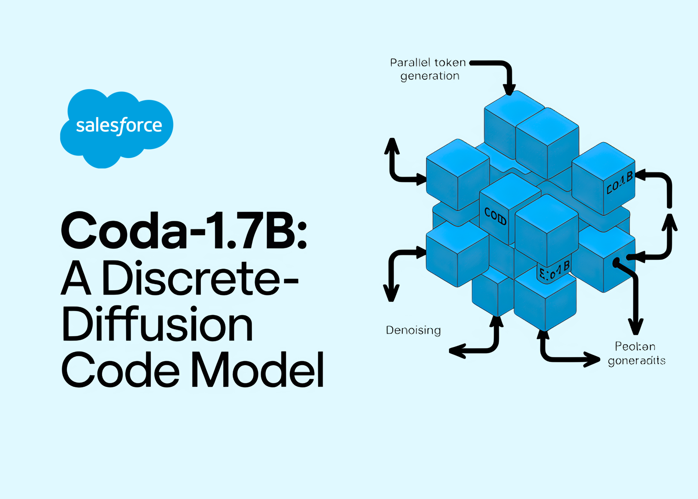

# Salesforce AI Research Releases CoDA-1.7B: a Discrete-Diffusion Code Model with Bidirectional, Parallel Token Generation

> Salesforce AI Research released CoDA-1.7B, a diffusion-based language model for code that generates by denoising whole sequences with bidirectional context, updating multiple tokens in parallel rather than left-to-right next-token prediction. The research team published both Base and Instruct checkpoints and an end-to-end training/evaluation/serving stack. Understanding the architecture and training CoDA adapts a 1.7B-parameter backbone to […]

Salesforce AI Research released **CoDA-1.7B**, a diffusion-based language model for code that generates by **denoising whole sequences with bidirectional context**, updating **multiple tokens in parallel** rather than left-to-right next-token prediction. The research team published both **Base** and **Instruct** checkpoints and an end-to-end training/evaluation/serving stack.

### Understanding the architecture and training

CoDA adapts a 1.7B-parameter backbone to **discrete diffusion** for text: masked sequences are iteratively denoised using full-sequence attention, enabling native infilling and non-autoregressive decoding. The model card documents a **three-stage pipeline** (pre-training with bidirectional masking, supervised post-training, and progressive denoising at inference) plus reproducible scripts for TPU pre-training, GPU fine-tuning, and evaluation.

**Key features surfaced in the release:**

- **Bidirectional context** via diffusion denoising (no fixed generation order).

- **Confidence-guided sampling** (entropy-style decoding) to trade quality vs. speed.

- **Open training pipeline** with deploy scripts and CLI.

### How do they perform on Benchmarks?

On standard code-gen suites, **CoDA-1.7B-Instruct** reports: **HumanEval 54.3%**, **HumanEval+ 47.6%**, **MBPP 47.2%**, **MBPP+ 63.2%**, **EvalPlus aggregate 55.4%** (pass@1). For context, the model card compares against diffusion baselines including Dream-7B-Instruct (**57.9% HumanEval**), indicating CoDA’s **1.7B** footprint is competitive with some **7B** diffusion models on several metrics while using fewer parameters.

*https://huggingface.co/Salesforce/CoDA-v0-Instruct*

### Inference behavior

Generation cost is governed by the **number of diffusion steps**; CoDA exposes knobs such as `STEPS`, `ALG="entropy"`, `ALG_TEMP`, and block length to tune **latency/quality trade-offs**. Because tokens are updated in parallel under full attention, CoDA targets lower **wall-clock latency** at small scale compared with larger diffusion models, at comparable step budgets. ([Hugging Face](https://huggingface.co/Salesforce/CoDA-v0-Base))

### Deployment and licensing

The repository provides a **FastAPI server with OpenAI-compatible APIs** and an interactive CLI for local inference; instructions include environment setup and a `start_server.sh` launcher. Model cards and a **Hugging Face collection** centralize artifacts. The checkpoints are published under **CC BY-NC 4.0** on [Hugging Face](https://huggingface.co/Salesforce/CoDA-v0-Instruct).

### Our Comments

CoDA-1.7B stands as a clean reference for discrete-diffusion code generation at small scale: 1.7B parameters, bidirectional denoising with parallel token updates, and a reproducible pipeline from pre-training to SFT and serving. The reported pass@1 results—HumanEval 54.3, HumanEval+ 47.6, MBPP 47.2, MBPP+ 63.2, EvalPlus aggregate 55.4—place it competitive with some 7B diffusion baselines (e.g., Dream-7B HumanEval 57.9) while using fewer parameters. Inference latency is explicitly governed by step count and decoding knobs (`STEPS`, entropy-style guidance), which is operationally useful for tuning throughput/quality. The release includes weights on Hugging Face and a FastAPI server/CLI for local deployment.

---

Check out the **[Paper](https://github.com/SalesforceAIResearch/CoDA/blob/main/technical_report.pdf), [GitHub Repo](https://github.com/SalesforceAIResearch/CoDA) **and** [Model on Hugging Face](https://huggingface.co/Salesforce/CoDA-v0-Instruct)**. Feel free to check out our **[GitHub Page for Tutorials, Codes and Notebooks](https://github.com/Marktechpost/AI-Tutorial-Codes-Included)**. Also, feel free to follow us on **[Twitter](https://x.com/intent/follow?screen_name=marktechpost)** and don’t forget to join our **[100k+ ML SubReddit](https://www.reddit.com/r/machinelearningnews/)** and Subscribe to **[our Newsletter](https://www.aidevsignals.com/)**. Wait! are you on telegram? **[now you can join us on telegram as well.](https://t.me/machinelearningresearchnews)**
