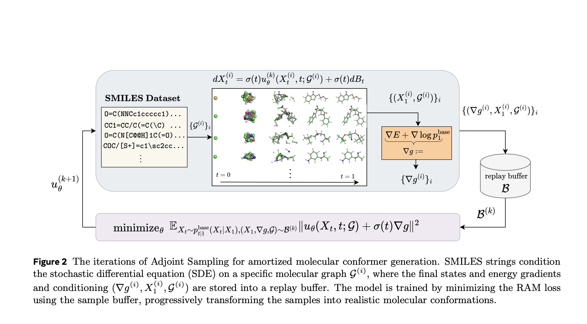

# Sampling Without Data is Now Scalable: Meta AI Releases Adjoint Sampling for Reward-Driven Generative Modeling

> Data Scarcity in Generative Modeling Generative models traditionally rely on large, high-quality datasets to produce samples that replicate the underlying data distribution. However, in fields like molecular modeling or physics-based inference, acquiring such data can be computationally infeasible or even impossible. Instead of labeled data, only a scalar reward—typically derived from a complex energy function—is […]

### Data Scarcity in Generative Modeling

Generative models traditionally rely on large, high-quality datasets to produce samples that replicate the underlying data distribution. However, in fields like molecular modeling or physics-based inference, acquiring such data can be computationally infeasible or even impossible. Instead of labeled data, only a scalar reward—typically derived from a complex energy function—is available to judge the quality of generated samples. This presents a significant challenge: how can one train generative models effectively without direct supervision from data?

### Meta AI Introduces Adjoint Sampling, a New Learning Algorithm Based on Scalar Rewards

Meta AI tackles this challenge with _Adjoint Sampling_, a novel learning algorithm designed for training generative models using only scalar reward signals. Built on the theoretical framework of stochastic optimal control (SOC), Adjoint Sampling reframes the training process as an optimization task over a controlled diffusion process. Unlike standard generative models, it does not require explicit data. Instead, it learns to generate high-quality samples by iteratively refining them using a reward function—often derived from physical or chemical energy models.

Adjoint Sampling excels in scenarios where only an unnormalized energy function is accessible. It produces samples that align with the target distribution defined by this energy, bypassing the need for corrective methods like importance sampling or MCMC, which are computationally intensive.

*Source: https://arxiv.org/abs/2504.11713*

### Technical Details

The foundation of Adjoint Sampling is a stochastic differential equation (SDE) that models how sample trajectories evolve. The algorithm learns a control drift u(x,t)u(x, t)u(x,t) such that the final state of these trajectories approximates a desired distribution (e.g., Boltzmann). A key innovation is its use of _Reciprocal Adjoint Matching (RAM)_—a loss function that enables gradient-based updates using only the initial and final states of sample trajectories. This sidesteps the need to backpropagate through the entire diffusion path, greatly improving computational efficiency.

By sampling from a known base process and conditioning on terminal states, Adjoint Sampling constructs a replay buffer of samples and gradients, allowing multiple optimization steps per sample. This on-policy training method provides scalability unmatched by previous approaches, making it suitable for high-dimensional problems like molecular conformer generation.

Moreover, Adjoint Sampling supports geometric symmetries and periodic boundary conditions, enabling models to respect molecular invariances like rotation, translation, and torsion. These features are crucial for physically meaningful generative tasks in chemistry and physics.

### Performance Insights and Benchmark Results

Adjoint Sampling achieves state-of-the-art results in both synthetic and real-world tasks. On synthetic benchmarks such as the Double-Well (DW-4), Lennard-Jones (LJ-13 and LJ-55) potentials, it significantly outperforms baselines like DDS and PIS, especially in energy efficiency. For example, where DDS and PIS require 1000 evaluations per gradient update, Adjoint Sampling only uses three, with similar or better performance in Wasserstein distance and effective sample size (ESS).

In a practical setting, the algorithm was evaluated on large-scale molecular conformer generation using the eSEN energy model trained on the SPICE-MACE-OFF dataset. Adjoint Sampling, especially its Cartesian variant with pretraining, achieved up to 96.4% recall and 0.60 Å mean RMSD, surpassing RDKit ETKDG—a widely used chemistry-based baseline—across all metrics. The method generalizes well to the GEOM-DRUGS dataset, showing substantial improvements in recall while maintaining competitive precision.

The algorithm’s ability to explore the configuration space broadly, aided by its stochastic initialization and reward-based learning, results in greater conformer diversity—critical for drug discovery and molecular design.

### Conclusion: A Scalable Path Forward for Reward-Driven Generative Models

Adjoint Sampling represents a major step forward in generative modeling without data. By leveraging scalar reward signals and an efficient on-policy training method grounded in stochastic control, it enables scalable training of diffusion-based samplers with minimal energy evaluations. Its integration of geometric symmetries and its ability to generalize across diverse molecular structures position it as a foundational tool in computational chemistry and beyond.

---

**Check out the [Paper](https://arxiv.org/abs/2504.11713), [Model on Hugging Face](https://huggingface.co/facebook/adjoint_sampling) and [GitHub Page](https://github.com/facebookresearch/adjoint_sampling)_._** All credit for this research goes to the researchers of this project. Also, feel free to follow us on **[Twitter](https://x.com/intent/follow?screen_name=marktechpost)** and don’t forget to join our **[95k+ ML SubReddit](https://www.reddit.com/r/machinelearningnews/)** and Subscribe to **[our Newsletter](https://www.airesearchinsights.com/subscribe)**.
