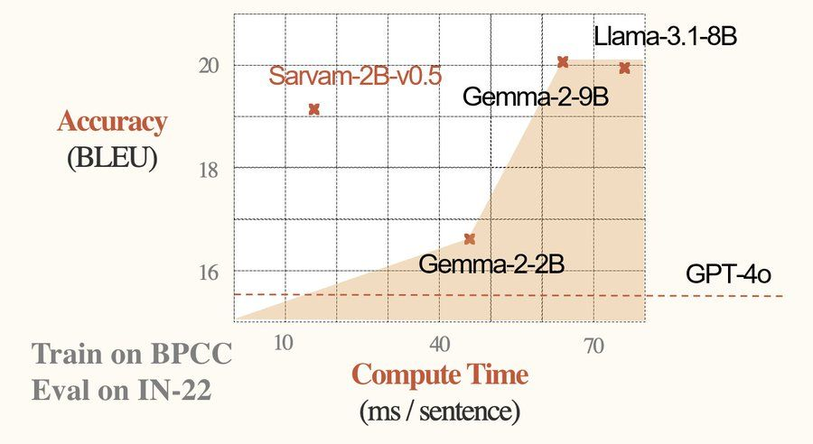

# Sarvam AI Releases Samvaad-Hi-v1 Dataset and Sarvam-2B: A 2 Billion Parameter Language Model with 4 Trillion Tokens Focused on 10 Indic Languages for Enhanced NLP

> Sarvam AI has recently unveiled its cutting-edge language model, Sarvam-2B. This powerful model, boasting 2 billion parameters, represents a significant stride in Indic language processing. With a focus on inclusivity and cultural representation, Sarvam-2B is pre-trained from scratch on a massive dataset of 4 trillion high-quality tokens, with an impressive 50% dedicated to Indic languages. […]

Sarvam AI has recently unveiled its cutting-edge language model,[ **Sarvam-2B**](https://huggingface.co/sarvamai/sarvam-2b-v0.5). This powerful model, boasting 2 billion parameters, represents a significant stride in Indic language processing. With a focus on inclusivity and cultural representation, Sarvam-2B is pre-trained from scratch on a massive dataset of 4 trillion high-quality tokens, with an impressive 50% dedicated to Indic languages. This development, particularly their ability to understand and generate text in languages, is historically underrepresented in AI research.

They have also introduced the [**Samvaad-Hi-v1 dataset**](https://huggingface.co/datasets/sarvamai/samvaad-hi-v1), a meticulously curated collection of 100,000 high-quality English, Hindi, and Hinglish conversations. This dataset is uniquely designed with an Indic context, making it an invaluable resource for researchers and developers working on multilingual and culturally relevant AI models. Samvaad-Hi-v1 is poised to enhance the training of conversational AI systems that can understand and engage with users more naturally and contextually appropriately across different languages and dialects prevalent in India.

**The Vision Behind Sarvam-2B**

Sarvam AI’s vision with Sarvam-2B is clear: to create a robust and versatile language model that excels in English and champions Indic languages. This is especially important in a country like India, where linguistic diversity is vast, and the need for AI models that can effectively process and generate text in multiple languages is paramount.

The model supports 10 Indic languages, including Bengali, Gujarati, Hindi, Kannada, Malayalam, Marathi, Oriya, Punjabi, Tamil, and Telugu. This broad language support ensures the model is accessible to many users across different linguistic backgrounds. The model’s architecture and training process have been meticulously designed to ensure it performs well across all supported languages, making it a versatile tool for developers and researchers.

**Technical Excellence and Implementation**

Sarvam-2B has been trained on a balanced mix of English and Indic language data, each contributing 2 trillion tokens to the training process. This careful balance ensures that the model is equally proficient in English and the supported Indic languages. The training process involved sophisticated techniques to enhance the model’s understanding and generation capabilities, making it one of the most advanced models in its category.

**Expanding the Horizon: Complementary Models**

In addition to Sarvam-2B, Sarvam AI has also introduced three other remarkable models that complement its capabilities:

- **Bulbul 1.0:** A Text-to-Speech (TTS) model that supports combinations of 10 languages and six voices. This model generates natural-sounding speech, making it a valuable tool for applications requiring multilingual voice output.

- **Saaras 1.0: **A Speech-to-Text (STT) model that supports the same ten languages and includes automatic language identification. This model is particularly useful for transcribing spoken language into text, with the added advantage of detecting the language automatically.

- **Mayura 1.0:** A translation API designed to handle the complexities of translating between Indian languages and English. This model is tailored to address the nuances and unique challenges associated with Indian languages, providing more accurate and culturally relevant translations.

**Conclusion**

Sarvam AI launched Sarvam-2B, particularly in the context of language models designed for Indic languages. By dedicating half of its training data to these languages, Sarvam-2B stands out as a model that actively promotes linguistic diversity’s importance. The model’s versatility, combined with the complementary capabilities of Bulbul 1.0, Saaras 1.0, and Mayura 1.0, positions Sarvam AI as a leader in developing inclusive, innovative, and forward-thinking AI technologies.

---

Check out the **[Model Card](https://huggingface.co/sarvamai/sarvam-2b-v0.5) and [Dataset](https://huggingface.co/datasets/sarvamai/samvaad-hi-v1)**. All credit for this research goes to the researchers of this project. Also, don’t forget to follow us on **[Twitter](https://twitter.com/Marktechpost)** and join our **[Telegram Channel](https://pxl.to/at72b5j)** and [**LinkedIn Gr**](https://www.linkedin.com/groups/13668564/)[**oup**](https://www.linkedin.com/groups/13668564/). **If you like our work, you will love our**[** newsletter..**](https://marktechpost-newsletter.beehiiv.com/subscribe)

Don’t Forget to join our **[48k+ ML SubReddit](https://www.reddit.com/r/machinelearningnews/)**

**Find Upcoming [AI Webinars here](https://www.marktechpost.com/ai-webinars-list-llms-rag-generative-ai-ml-vector-database/)**

---

> [Arcee AI Released DistillKit: An Open Source, Easy-to-Use Tool Transforming Model Distillation for Creating Efficient, High-Performance Small Language Models](https://www.marktechpost.com/2024/08/01/arcee-ai-released-distillkit-an-open-source-easy-to-use-tool-transforming-model-distillation-for-creating-efficient-high-performance-small-language-models/)
