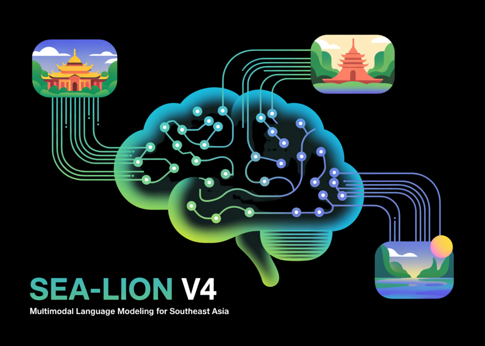

# SEA-LION v4: Multimodal Language Modeling for Southeast Asia

> AI Singapore (AISG) has released SEA-LION v4, an open-source multimodal language model developed in collaboration with Google and based on the Gemma 3 (27B) architecture. The model is designed to support Southeast Asian languages, including those with limited digital resources, and provides both text and image understanding capabilities. SEA-LION v4 uses a commercially permissive license […]

AI Singapore (AISG) has released SEA-LION v4, an open-source multimodal language model developed in collaboration with Google and based on the Gemma 3 (27B) architecture. The model is designed to support Southeast Asian languages, including those with limited digital resources, and provides both text and image understanding capabilities. SEA-LION v4 uses a commercially permissive license and is intended for straightforward deployment on standard hardware platforms.

*https://leaderboard.sea-lion.ai/*

### Benchmark Results: “Small” but State-of-the-Art

Performance evaluations on the **SEA-HELM benchmark**—a rigorous multilingual suite designed specifically to test Southeast Asian (SEA) languages—confirm SEA-LION v4’s capabilities. Across tasks in **Burmese, Filipino, Indonesian, Malay, Tamil, Thai, and Vietnamese**, v4 achieves a **top ranking among models under 200B parameters**, and globally places #5 out of 55 models tested.

This result is striking: the model is not only outperforming open-source peers like Llama 3, Qwen 3, and Gemma 3, but also holding its own against proprietary giants with parameter counts several times larger.

- **Filipino:** 74.53 (v4) vs. 74.09 (Gemma 3-27B)

- **Malay:** 71.31 (v4) vs. 71.20 (Gemma 3-27B)

- **Tamil:** 68.47 (v4) vs. 68.45 (Gemma 3-27B)

- **Burmese:** 57.18 (v4) just behind Gemma 3’s 57.78, outperforming Llama 4 MoE (109B).

In many languages, SEA-LION v4 performs on par with or better than models over 3–10x its size. This balance of efficiency and capability makes it one of the strongest openly available multilingual models for both research and industry use.

### What’s New in SEA-LION v4

The fourth-generation model introduces several **major technical advancements** that make it uniquely suited for both regional and global applications:

#### 1. Open Sourced

Unlike many closed models, SEA-LION v4 is released under the **commercially permissive Gemma license**, lowering adoption barriers for startups, researchers, and enterprises. Distribution is supported across multiple ecosystems:

- **Hugging Face** (fine-tuned and base models)

- **Google Cloud Vertex AI**

- **AWS SageMaker**

- **Kaggle** for lightweight experimentation

- **NVIDIA NIM and Ollama** for edge deployment

This openness ensures SEA-LION v4 can be integrated into workflows across both cloud-scale enterprises and on-device environments.

#### 2. Efficiency and Portability at Scale

Despite its 27B parameters, SEA-LION v4 is designed to run practically anywhere. With **quantized versions in FP4 and FP8**, users can achieve:

- **[GitHub Page for Tutorials, Codes and Notebooks](https://github.com/Marktechpost/AI-Tutorial-Codes-Included)**. Also, feel free to follow us on **[Twitter](https://x.com/intent/follow?screen_name=marktechpost)** and don’t forget to join our **[100k+ ML SubReddit](https://www.reddit.com/r/machinelearningnews/)** and Subscribe to **[our Newsletter](https://www.aidevsignals.com/)**.
