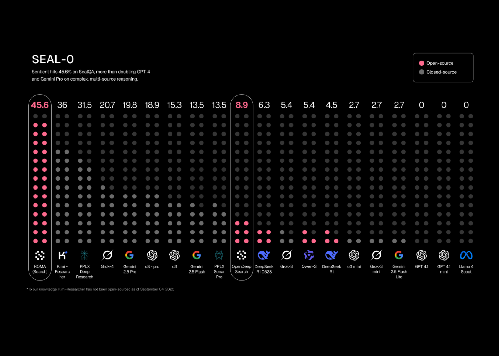

# Sentient AI Releases ROMA: An Open-Source and AGI Focused Meta-Agent Framework for Building AI Agents with Hierarchical Task Execution

> Sentient AI has released ROMA (Recursive Open Meta-Agent), an open-source meta-agent framework for building high-performance multi-agent systems. ROMA structures agentic workflows as a hierarchical, recursive task tree: parent nodes break a complex goal into subtasks, pass them down to child nodes as context, and later aggregate their solutions as results flow back up—making the context […]

[Sentient AI ](https://www.sentient.xyz/)has released **[ROMA (Recursive Open Meta-Agent)](https://github.com/sentient-agi/ROMA?tab=readme-ov-file)**, an open-source meta-agent framework for building high-performance multi-agent systems. ROMA structures agentic workflows as a **hierarchical, recursive task tree**: parent nodes break a complex goal into **subtasks**, pass them down to child nodes **as context**, and later **aggregate** their solutions **as results flow back up**—making the **context flow transparent and fully traceable** across node transitions.

### Architecture: Atomize → Plan → Execute → Aggregate

ROMA defines a minimal, recursive control loop. A node first **atomizes** a request (atomic or not). If non-atomic, a **planner** decomposes it into subtasks; otherwise, an **executor** runs the task via an LLM, a tool/API, or even a nested agent. An **aggregator** then merges child outputs into the parent’s answer. This decision loop repeats for each subtask, producing a dependency-aware tree that executes independent branches in parallel and enforces left-to-right ordering when a subtask depends on a previous sibling.

*https://blog.sentient.xyz/posts/recursive-open-meta-agent*

Information moves **top-down** as tasks are broken down and **bottom-up** as results are aggregated. ROMA also permits **human checkpoints** at any node (e.g., to confirm a plan or fact-check a critical hop) and surfaces **stage tracing**—inputs/outputs per node—so developers can debug and refine prompts, tools, and routing policies with visibility into every transition. This addresses the common observability gap in agent frameworks.

### Developer Surface and Stack

ROMA provides a `setup.sh` quick start with **Docker Setup (Recommended)** or **Native Setup**, plus flags for **E2B sandbox integration** (`--e2b`, `--test-e2b`). The stack lists **Backend: Python 3.12+ with FastAPI/Flask**, **Frontend: React + TypeScript with real-time WebSocket**, **LLM Support: any provider via LiteLLM**, and **Code Execution: E2B sandboxes**. Data paths support **enterprise S3 mounting** with **goofys FUSE**, path-injection checks, and secure AWS credential handling, keeping leaf skills swappable while the meta-architecture manages the task graph and dependencies.

In development, you can wire ROMA to closed or open LLMs, local models, deterministic tools, or other agents without touching the meta-layer; inputs/outputs are defined with **Pydantic** for structured, auditable I/O during runs and tracing.

### Why the Recursion Matters?

ROMA structures work as a **hierarchical, recursive task tree**: parent nodes **break a complex goal into subtasks**, pass them **down as context**, and later **aggregate** child solutions **as results flow back up**. This recursive breakdown confines context to what each node requires, curbing prompt sprawl, while **stage-level tracing** (with structured Pydantic I/O) makes the flow **transparent and fully traceable**, so failures are diagnosable rather than black-box. Independent siblings can run **in parallel** and dependency edges impose sequencing, turning model/prompt/tool choices into controlled, observable components within the plan-execute-aggregate loop.

### Benchmarks: ROMA Search

To validate the architecture, Sentient built **ROMA Search**, an internet search agent implemented on the ROMA scaffold (no domain-specific “deep research” heuristics claimed). On **SEALQA (Seal-0)**—a subset designed to stress multi-source reasoning—ROMA Search is reported at **45.6%** accuracy, exceeding Kimi Researcher (**36%**) and Gemini 2.5 Pro (**19.8%**). The ROMA also reports **state-of-the-art on FRAMES** (multi-step reasoning) and **near-SOTA on SimpleQA** (factual retrieval). As with all vendor-published results, treat these as directional until independently reproduced, but they show the architecture is competitive across reasoning-heavy and fact-centric tasks.

*https://blog.sentient.xyz/posts/recursive-open-meta-agent*

*https://blog.sentient.xyz/posts/recursive-open-meta-agent*

*https://blog.sentient.xyz/posts/recursive-open-meta-agent*

For additional context on SEALQA, the benchmark targets search-augmented reasoning where web results can be conflicting or noisy. Seal-0 focuses on questions that challenge current systems, aligning with ROMA’s emphasis on robust decomposition and verification steps.

### Where ROMA Fits?

ROMA positions itself as the backbone for open-source meta-agents: it provides a **hierarchical, recursive task tree** in which parent nodes decompose goals into subtasks, pass **context** down to child nodes (agents/tools), and later **aggregate** results as they flow back up. The design emphasizes **transparency** via **stage tracing** and supports **human-in-the-loop checkpoints**, while its modular nodes let builders plug in any model, tool, or agent and exploit **parallelization** for independent branches. This makes multi-step workloads—ranging from **financial analysis** to creative generation—easier to engineer with explicit context flow and observable execution.

### Editorial Comments

ROMA is not another “agent wrapper,” but it looks like a  disciplined recursive scaffold: **Atomizer → Planner → Executor → Aggregator**, traced at every hop, parallel where safe, sequential where required. The early ROMA Search results are promising and align with the framework’s goals, but the more important outcome is developer control—clear task graphs, typed interfaces, and transparent context flow—so teams can iterate quickly and verify each stage. With Apache-2.0 licensing and an implementation that already includes FastAPI/React tooling, LiteLLM integration, and sandboxed execution paths, ROMA is a practical base for building long-horizon agent systems with measurable, inspectable behavior.

---

Check out the **[Codes](https://github.com/sentient-agi/ROMA?tab=readme-ov-file) **and** [Technical Details](https://blog.sentient.xyz/posts/recursive-open-meta-agent).**. Feel free to check out our **[GitHub Page for Tutorials, Codes and Notebooks](https://github.com/Marktechpost/AI-Tutorial-Codes-Included)**. Also, feel free to follow us on **[Twitter](https://x.com/intent/follow?screen_name=marktechpost)** and don’t forget to join our **[100k+ ML SubReddit](https://www.reddit.com/r/machinelearningnews/)** and Subscribe to **[our Newsletter](https://www.aidevsignals.com/)**. Wait! are you on telegram? **[now you can join us on telegram as well.](https://t.me/machinelearningresearchnews)**
