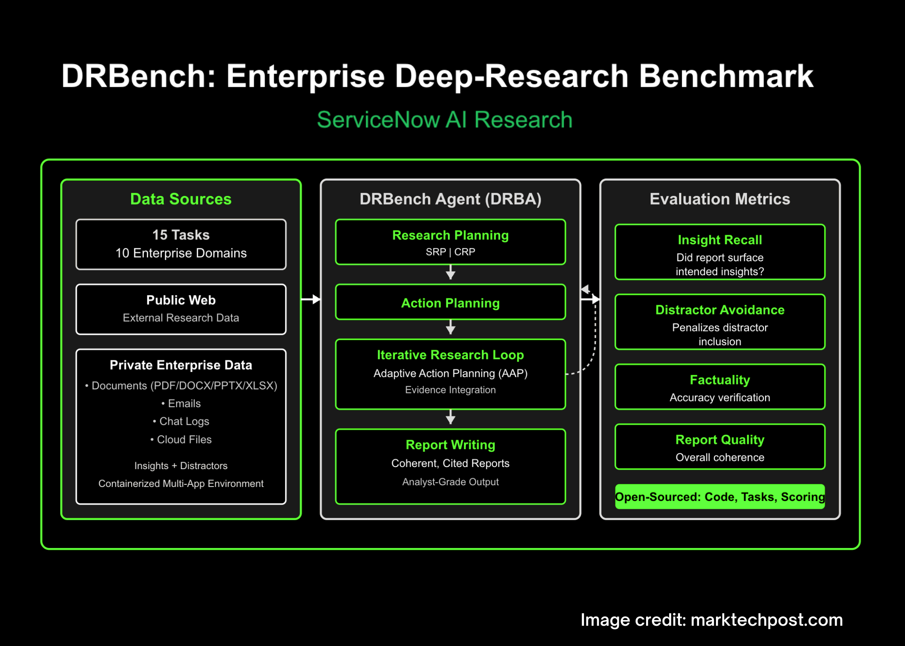

# ServiceNow AI Research Releases DRBench, a Realistic Enterprise Deep-Research Benchmark

> ServiceNow Research has released DRBench, a benchmark and runnable environment to evaluate “deep research” agents on open-ended enterprise tasks that require synthesizing facts from both public web and private organizational data into properly cited reports. Unlike web-only testbeds, DRBench stages heterogeneous, enterprise-style workflows—files, emails, chat logs, and cloud storage—so agents must retrieve, filter, and attribute […]

ServiceNow Research has released **DRBench**, a benchmark and runnable environment to evaluate “deep research” agents on open-ended enterprise tasks that require synthesizing facts from both **public web** and **private organizational data** into properly cited reports. Unlike web-only testbeds, DRBench stages heterogeneous, enterprise-style workflows—files, emails, chat logs, and cloud storage—so agents must retrieve, filter, and attribute insights across multiple applications before writing a coherent research report.

*https://arxiv.org/abs/2510.00172*

### What DRBench contains?

The initial release provides **15 deep research tasks across 10 enterprise domains** (e.g., Sales, Cybersecurity, Compliance). Each task specifies a **deep research question**, a **task context** (company and persona), and a set of **groundtruth insights** spanning three classes: **public insights** (from dated, time-stable URLs), **internal relevant insights**, and **internal distractor insights**. The benchmark explicitly embeds these insights within realistic enterprise files and applications, forcing agents to surface the relevant ones while avoiding distractors. The dataset construction pipeline combines LLM generation with human verification and totals **114 groundtruth insights** across tasks.

*https://arxiv.org/abs/2510.00172*

### Enterprise environment

A core contribution is the **containerized enterprise environment** that integrates commonly used services behind authentication and app-specific APIs. DRBench’s Docker image orchestrates: **Nextcloud** (shared documents, WebDAV), **Mattermost** (team chat, REST API), **Roundcube** with SMTP/IMAP (enterprise email), **FileBrowser** (local filesystem), and a **VNC/NoVNC** desktop for GUI interaction. Tasks are initialized by **distributing data across these services** (documents to Nextcloud and FileBrowser, chats to Mattermost channels, threaded emails to the mail system, and provisioned users with consistent credentials). Agents can operate through **web interfaces** or **programmatic APIs** exposed by each service. This setup is intentionally “needle-in-a-haystack”: relevant and distractor insights are injected into realistic files (PDF/DOCX/PPTX/XLSX, chats, emails) and padded with plausible but irrelevant content.

### Evaluation: what gets scored

DRBench evaluates four axes aligned to analyst workflows: **Insight Recall**, **Distractor Avoidance**, **Factuality**, and **Report Quality**. Insight Recall decomposes the agent’s report into atomic insights with citations, matches them against groundtruth injected insights using an LLM judge, and scores recall (not precision). Distractor Avoidance penalizes inclusion of injected distractor insights. Factuality and Report Quality assess the correctness and structure/clarity of the final report under a rubric specified in the report.

*https://arxiv.org/abs/2510.00172*

### Baseline agent and research loop

The research team introduces a task-oriented baseline, **DRBench Agent (DRBA)**, designed to operate natively inside the DRBench environment. DRBA is organized into four components: **research planning**, **action planning**, a **research loop with Adaptive Action Planning (AAP)**, and **report writing**. Planning supports two modes: **Complex Research Planning (CRP)**, which specifies investigation areas, expected sources, and success criteria; and **Simple Research Planning (SRP)**, which produces lightweight sub-queries. The research loop iteratively selects tools, processes content (including storage in a vector store), identifies gaps, and continues until completion or a max-iteration budget; the report writer synthesizes findings with citation tracking.

### Why this is important for enterprise agents?

Most “deep research” agents look compelling on public-web question sets, but production usage hinges on reliably **finding the right internal needles**, **ignoring plausible internal distractors**, and **citing** both public and private sources under enterprise constraints (login, permissions, UI friction). DRBench’s design directly targets this gap by: (1) grounding tasks in realistic company/persona contexts; (2) distributing evidence across multiple enterprise apps plus the web; and (3) scoring whether the agent actually extracted **the intended insights** and **wrote a coherent, factual report**. This combination makes it a practical benchmark for system builders who need end-to-end evaluation rather than single-tool micro-scores.

*https://arxiv.org/abs/2510.00172*

### Key Takeaways

- DRBench evaluates deep research agents on complex, open-ended **enterprise** tasks that require combining public web and private company data.

- The initial release covers **15 tasks across 10 domains**, each grounded in realistic user personas and organizational context.

- Tasks span heterogeneous enterprise artifacts—productivity software, cloud file systems, emails, chat—plus the open web, going beyond web-only setups.

- Reports are scored for **insight recall**, **factual accuracy**, and **coherent, well-structured reporting** using rubric-based evaluation.

- Code and benchmark assets are open-sourced on GitHub for reproducible evaluation and extension.

### Editorial comments

From an enterprise evaluation standpoint, **DRBench** is a useful step toward standardized, end-to-end testing of “deep research” agents: the tasks are open-ended, grounded in realistic personas, and require integrating evidence from the **public web** and a **private company knowledge base**, then producing a coherent, well-structured report—precisely the workflow most production teams care about. The release also clarifies what’s being measured—**recall of relevant insights**, **factual accuracy**, and report quality—while explicitly moving beyond web-only setups that overfit to browsing heuristics. The **15 tasks across 10 domains** are modest in scale but sufficient to expose system bottlenecks (retrieval across heterogeneous artifacts, citation discipline, and planning loops).

---

Check out the **[Paper](https://arxiv.org/abs/2510.00172) **and** [GitHub page](https://github.com/ServiceNow/drbench)**. Feel free to check out our **[GitHub Page for Tutorials, Codes and Notebooks](https://github.com/Marktechpost/AI-Tutorial-Codes-Included)**. Also, feel free to follow us on **[Twitter](https://x.com/intent/follow?screen_name=marktechpost)** and don’t forget to join our **[100k+ ML SubReddit](https://www.reddit.com/r/machinelearningnews/)** and Subscribe to **[our Newsletter](https://www.aidevsignals.com/)**. Wait! are you on telegram? **[now you can join us on telegram as well.](https://t.me/machinelearningresearchnews)**
