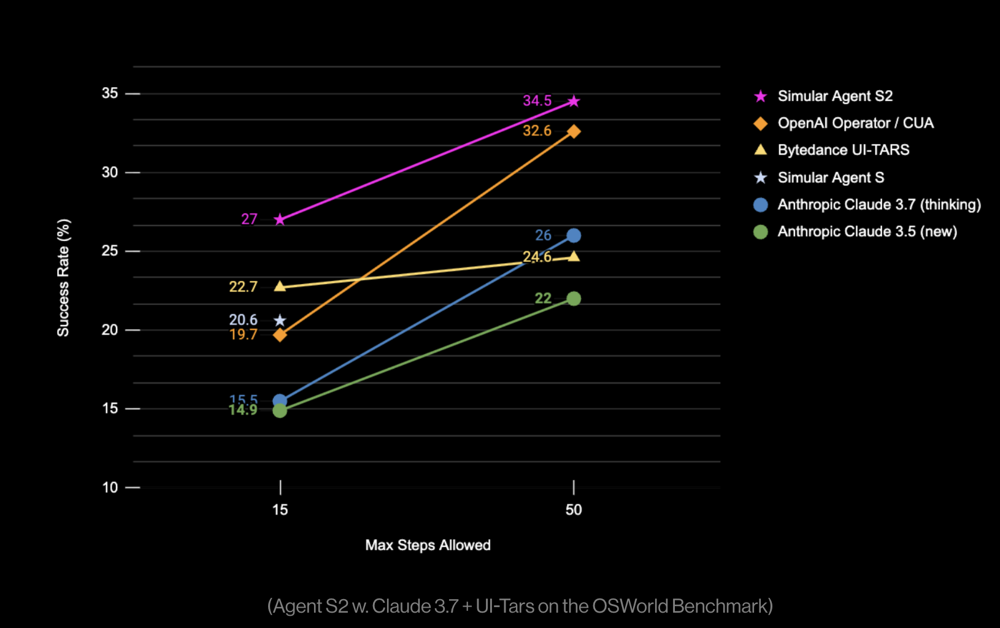

# Simular Releases Agent S2: An Open, Modular, and Scalable AI Framework for Computer Use Agents

> In today’s digital landscape, interacting with a wide variety of software and operating systems can often be a tedious and error-prone experience. Many users face challenges when navigating through complex interfaces and performing routine tasks that demand precision and adaptability. Existing automation tools frequently fall short in adapting to subtle interface changes or learning from […]

In today’s digital landscape, interacting with a wide variety of software and operating systems can often be a tedious and error-prone experience. Many users face challenges when navigating through complex interfaces and performing routine tasks that demand precision and adaptability. Existing automation tools frequently fall short in adapting to subtle interface changes or learning from past mistakes, leaving users to manually oversee processes that could otherwise be streamlined. This persistent gap between user expectations and the capabilities of traditional automation calls for a system that not only performs tasks reliably but also learns and adjusts over time.

_Simular has introduced Agent S2, an open, modular, and scalable framework designed to assist with computer use agents._ Agent S2 builds upon the foundation laid by its predecessor, offering a refined approach to automating tasks on computers and smartphones. By integrating a modular design with both general-purpose and specialized models, the framework can be adapted to a variety of digital environments. Its design is inspired by the human brain’s natural modularity, where different regions work together harmoniously to handle complex tasks, thereby fostering a system that is both flexible and robust.

### Technical Details and Benefits

At its core, Agent S2 employs experience-augmented hierarchical planning. This method involves breaking down long and intricate tasks into smaller, more manageable subtasks. The framework continuously refines its strategy by learning from previous experiences, thereby improving its execution over time. An important aspect of Agent S2 is its visual grounding capability, which allows it to interpret raw screenshots for precise interaction with graphical user interfaces. This eliminates the need for additional structured data and enhances the system’s ability to correctly identify and interact with UI elements. Moreover, Agent S2 utilizes an advanced Agent-Computer Interface that delegates routine, low-level actions to expert modules. Complemented by an adaptive memory mechanism, the system retains useful experiences to guide future decision-making, resulting in a more measured and effective performance.

### Results and Insights

Evaluations on real-world benchmarks indicate that Agent S2 performs reliably in both computer and smartphone environments. On the OSWorld benchmark—which tests the execution of multi-step computer tasks—Agent S2 achieved a success rate of 34.5% on a 50-step evaluation, reflecting a modest yet consistent improvement over earlier models. Similarly, on the AndroidWorld benchmark, the framework reached a 50% success rate in executing smartphone tasks. These results underscore the practical benefits of a system that can plan ahead and adapt to dynamic conditions, ensuring that tasks are completed with improved accuracy and minimal manual intervention.

### Conclusion

Agent S2 represents a thoughtful approach to enhancing everyday digital interactions. By addressing common challenges in computer automation through a modular design and adaptive learning, the framework provides a practical solution for managing routine tasks more efficiently. Its balanced combination of proactive planning, visual understanding, and expert delegation makes it well-suited for both complex computer tasks and mobile applications. In an era where digital workflows continue to evolve, Agent S2 offers a measured, reliable means of integrating automation into daily routines—helping users achieve better outcomes while reducing the need for constant manual oversight.

---

Check out **_the [Technical details](https://www.simular.ai/agent-s2) and [GitHub Page](https://github.com/simular-ai/agent-s)._** All credit for this research goes to the researchers of this project. Also, feel free to follow us on **[Twitter](https://x.com/intent/follow?screen_name=marktechpost)** and don’t forget to join our **[80k+ ML SubReddit](https://www.reddit.com/r/machinelearningnews/)**.

**🚨 [Meet Parlant: An LLM-first conversational AI framework designed to provide developers with the control and precision they need over their AI customer service agents, utilizing behavioral guidelines and runtime supervision. 🔧 🎛️ It’s operated using an easy-to-use CLI 📟 and native client SDKs in Python and TypeScript 📦.](https://pxl.to/6p7dm6p)**
