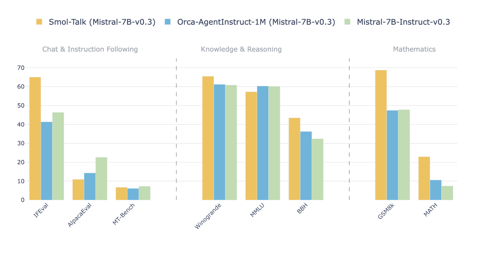

# SmolTalk Released: The Dataset Recipe Behind the Best-in-Class Performance of SmolLM2

> Recent advancements in natural language processing (NLP) have introduced new models and training datasets aimed at addressing the increasing demands for efficient and accurate language models. However, these advancements also present significant challenges. Many large language models (LLMs) struggle to balance performance with efficiency, often relying on enormous datasets and infrastructure that make them impractical […]

Recent advancements in natural language processing (NLP) have introduced new models and training datasets aimed at addressing the increasing demands for efficient and accurate language models. However, these advancements also present significant challenges. Many large language models (LLMs) struggle to balance performance with efficiency, often relying on enormous datasets and infrastructure that make them impractical for many users. Developing fine-tuned, reliable models for real-world tasks while maintaining scalability and affordability remains a pressing issue for developers and organizations. This situation calls for innovative ways to create language models that are both powerful and accessible.

SmolTalk—a new synthetic dataset—has been designed to address many of the challenges currently faced in the NLP landscape. SmolTalk is a one-million-sample synthetically generated dataset that forms the backbone of the SmolLM2 model. Released under the Apache 2.0 license and hosted on Hugging Face, SmolTalk combines newly generated datasets with publicly available ones to create a cohesive collection that serves various facets of language modeling. This dataset marks a significant release in the open-text dataset space, showcasing the integration of both synthetic and public datasets to optimize learning and model training.

SmolTalk consists of various datasets aimed at instruction tuning, precise output generation, and improving summarization and rewriting capabilities. Specifically, SmolTalk includes the new Smol-Magpie-Ultra (400K samples) for instruction tuning, Smol-constraints (36K) for ensuring precise output, Smol-rewrite (50K), and Smol-summarize (100K) for enhancing rewriting and summarization tasks. Additionally, SmolTalk integrates several well-known public datasets such as OpenHermes2.5 (100K), MetaMathQA, NuminaMath-CoT, Self-Oss-Starcoder2-Instruct, and LongAlign & SystemChats2.0. These diverse datasets collectively enhance SmolLM2’s capabilities across multiple domains of natural language understanding, offering a balanced mix of diversity and targeted specificity.

### Technical Details

The SmolLM2 model, trained using the SmolTalk dataset, achieves strong performance through a carefully designed synthetic generation pipeline. It outperforms comparable models, such as Orca-AgenInstruct 1M, across multiple benchmarks when trained with both 1.7B and 7B parameter versions. The use of Argilla’s Distilabel technology played a crucial role in generating the synthetic datasets, ensuring both quality and diversity. This diverse yet cohesive dataset equips SmolLM2 with capabilities for instruction following, logical reasoning, mathematical problem-solving, and dialogue-based interactions. The model’s architecture benefits from these varied training inputs, resulting in a refined and scalable language model that retains accuracy and consistency while being computationally efficient.

SmolTalk’s significance is evident when examining its impact on performance metrics and overall usability in NLP tasks. The dataset allows SmolLM2 to outperform models trained solely on other popular datasets, such as OpenHermes and Magpie Pro, in benchmarks like IFEval and MT-Bench. This improvement demonstrates that synthetic data, when carefully curated and integrated with publicly available high-quality datasets, can significantly enhance a model’s performance without requiring prohibitively large computational resources. The dataset’s modularity—combining instruction tuning, precise constraint handling, and rewriting/summarization tasks—makes SmolLM2 a versatile tool that can adapt to a variety of practical applications in AI-driven tasks.

### Conclusion

The release of SmolTalk and the subsequent success of SmolLM2 mark an important milestone in the ongoing evolution of NLP technologies. By leveraging a balanced approach that combines synthetic generation with the robustness of public dataset integration, SmolTalk demonstrates what is achievable with smaller, more efficient models. This approach not only highlights the potential of synthetic datasets but also helps democratize AI by making advanced models more accessible to researchers and developers who may lack the resources to work with enormous data volumes or compute infrastructure. SmolTalk’s release, complete with synthetic generation pipelines and training code, provides a valuable resource for the NLP community and sets the stage for future developments in efficient language modeling.

---

Check out the[ **Dataset here**](https://huggingface.co/datasets/HuggingFaceTB/smoltalk). All credit for this research goes to the researchers of this project. Also, don’t forget to follow us on **[Twitter](https://twitter.com/Marktechpost)** and join our **[Telegram Channel](https://github.com/XGenerationLab/XiYan-SQL)** and [**LinkedIn Gr**](https://www.linkedin.com/groups/13668564/)[**oup**](https://www.linkedin.com/groups/13668564/). **If you like our work, you will love our**[** newsletter..**](https://marktechpost-newsletter.beehiiv.com/subscribe) Don’t Forget to join our **[55k+ ML SubReddit](https://www.reddit.com/r/machinelearningnews/)**.

**[[FREE AI VIRTUAL CONFERENCE](https://predibase.com/smallcon?utm_medium=3rdparty&utm_source=marktechpost)] ****[SmallCon: Free Virtual GenAI Conference ft. Meta, Mistral, Salesforce, Harvey AI & more](https://predibase.com/smallcon?utm_medium=3rdparty&utm_source=marktechpost)**. _[Join us on Dec 11th for this free virtual event to learn what it takes to build big with small models from AI trailblazers like Meta, Mistral AI, Salesforce, Harvey AI, Upstage, Nubank, Nvidia, Hugging Face, and more.](https://predibase.com/smallcon?utm_medium=3rdparty&utm_source=marktechpost)_
