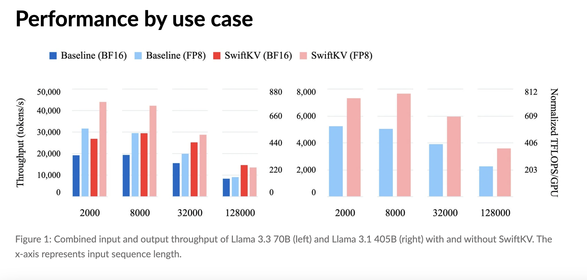

# Snowflake AI Research Open-Sources SwiftKV: A Novel AI Approach that Reduces Inference Costs of Meta Llama LLMs up to 75% on Cortex AI

> Large Language Models (LLMs) have become pivotal in artificial intelligence, powering a variety of applications from chatbots to content generation tools. However, their deployment at scale presents notable challenges. High computational costs, latency, and energy consumption often limit their wider use. Organizations face the difficulty of balancing high throughput with reasonable operating expenses. Additionally, as […]

Large Language Models (LLMs) have become pivotal in artificial intelligence, powering a variety of applications from chatbots to content generation tools. However, their deployment at scale presents notable challenges. High computational costs, latency, and energy consumption often limit their wider use. Organizations face the difficulty of balancing high throughput with reasonable operating expenses. Additionally, as models grow larger, the need for more efficient solutions becomes increasingly urgent. Addressing these issues is essential to making LLMs more practical and accessible.

Snowflake [AI](https://www.marktechpost.com/2025/01/13/what-is-artificial-intelligence-ai-2/) Research team introduces SwiftKV, a solution designed to enhance LLM inference throughput while reducing associated costs. SwiftKV uses key-value caching techniques to reuse intermediate computations during inference. By eliminating redundant calculations, it streamlines the inference process and makes LLM deployments more efficient.

SwiftKV’s design targets the computational intensity of LLMs. Conventional inference pipelines often recompute identical operations for multiple requests, resulting in inefficiencies. SwiftKV introduces a caching layer that identifies and stores reusable computational results. This approach accelerates inference and reduces resource requirements, making it a practical choice for organizations aiming to optimize their AI operations.

### Technical Details and Key Benefits of SwiftKV

SwiftKV incorporates a key-value memory system into the LLM inference architecture. Its operation can be summarized as follows:

- **Key-Value Caching**: During inference, SwiftKV captures intermediate activations (keys) and their corresponding results (values). For similar queries, it retrieves the precomputed values rather than recalculating them.

- **Efficient Storage Management**: The caching mechanism employs strategies such as least recently used (LRU) eviction to manage memory effectively, ensuring that the cache remains useful without excessive resource consumption.

- **Seamless Integration**: SwiftKV is compatible with existing LLM frameworks, such as Hugging Face’s Transformers and Meta’s LLaMA, enabling easy adoption without significant changes to existing pipelines.

### The benefits of SwiftKV include:

- **Cost Reduction**: By avoiding redundant computations, SwiftKV significantly cuts inference costs. Snowflake AI Research reports up to a 75% reduction in costs in some scenarios.

- **Enhanced Throughput**: The caching mechanism reduces inference time, improving response speed.

- **Energy Savings**: Lower computational demands translate into reduced energy consumption, supporting sustainable AI practices.

- **Scalability**: SwiftKV is well-suited for large-scale deployments, meeting the needs of enterprises expanding their AI capabilities.

*https://www.snowflake.com/en/blog/up-to-75-lower-inference-cost-llama-meta-llm/*

### Results

Snowflake AI Research’s evaluations of SwiftKV provide valuable insights into its effectiveness. For example, integrating SwiftKV with Meta’s LLaMA models led to up to a 75% reduction in inference costs without any compromise in accuracy or performance. These outcomes highlight the efficiency gains possible with this approach.

Additionally, tests demonstrate significant reductions in inference latency, even for larger models. The caching system ensures that complex queries benefit from faster processing times. This combination of cost efficiency and performance optimization makes SwiftKV a compelling choice for organizations aiming to scale AI solutions affordably.

The open-sourcing of SwiftKV encourages collaboration within the AI community. By sharing this technology, Snowflake AI Research invites developers, researchers, and enterprises to explore and enhance its capabilities, fostering innovation in LLM efficiency.

*https://www.snowflake.com/en/blog/up-to-75-lower-inference-cost-llama-meta-llm/*

### Conclusion: A Step Forward in LLM Efficiency

SwiftKV offers a thoughtful solution to the challenges of deploying LLMs at scale. By tackling high computational costs and latency, it helps make AI applications more practical and accessible. The incorporation of key-value caching into inference pipelines showcases how targeted optimizations can drive significant improvements.

As the field of AI progresses, tools like SwiftKV will continue to shape the development of efficient and sustainable technologies. Its open-source nature ensures that the broader community can contribute to its growth and application. By enabling more cost-effective and scalable use of LLMs, SwiftKV underscores the importance of innovation in making AI truly transformative for businesses and developers alike.

---

Check out **_the [Details](https://www.snowflake.com/en/blog/up-to-75-lower-inference-cost-llama-meta-llm/) and [GitHub Page](https://github.com/snowflakedb/ArcticTraining/tree/main/projects/swiftkv)._** All credit for this research goes to the researchers of this project. Also, don’t forget to follow us on **[Twitter](https://x.com/intent/follow?screen_name=marktechpost)** and join our **[Telegram Channel](https://arxiv.org/abs/2406.09406)** and [**LinkedIn Gr**](https://www.linkedin.com/groups/13668564/)[**oup**](https://www.linkedin.com/groups/13668564/). Don’t Forget to join our **[65k+ ML SubReddit](https://www.reddit.com/r/machinelearningnews/)**.

**🚨[ [Recommended Read] Nebius AI Studio expands with vision models, new language models, embeddings and LoRA](https://nebius.com/blog/posts/studio-embeddings-vision-and-language-models?utm_medium=newsletter&utm_source=marktechpost&utm_campaign=embedding-post-ai-studio) **_(Promoted)_
