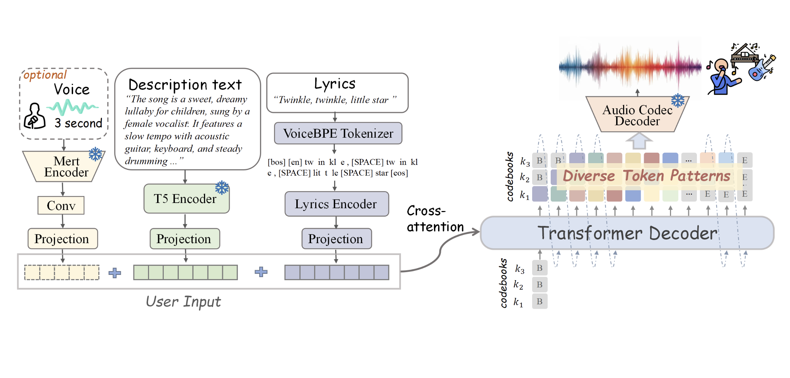

# SongGen: A Fully Open-Source Single-Stage Auto-Regressive Transformer Designed for Controllable Song Generation

> Creating songs from text is difficult because it involves generating vocals and instrumental music together. Songs are unique as they combine lyrics and melodies to express emotions, making the process more complex than generating speech or instrumental music alone. The challenge is intensified by the insufficient availability of quality open-source data, which restrains research and […]

**Creating songs **from text is difficult because it involves generating vocals and instrumental music together. Songs are unique as they combine lyrics and melodies to express emotions, making the process more complex than generating speech or instrumental music alone. The challenge is intensified by the insufficient availability of quality open-source data, which restrains research and development in the area. Some approaches incorporate several steps, with vocals generated in the first place and the accompaniment generated separately. Such a method hinders the process of training and prediction and lessens the control of the final song. A major challenge is whether a single-step model can simplify this process while maintaining quality and flexibility.

Currently, text-to-music generation models use descriptive text to create music, but most methods struggle to generate realistic vocals. Transformer-based models process audio as discrete tokens and diffusion models produce high-quality instrumental music, but both approaches face issues with vocal generation. Song generation, which combines vocals with instrumental music, relies on multi-stage methods like **Jukebox**, **Melodist**, and **MelodyLM**. These methods produce vocals and accompaniment independently, so the process is complicated and hard to manage. Without a common strategy, flexibility is restricted, and inefficiencies in training and inference are enhanced.

To generate a song from text descriptions, lyrics, and optional reference voice, researchers proposed **SongGen**, an auto-regressive transformer decoder with an integrated neural audio codec. The model predicts audio token sequences, which are synthesized into songs. **SongGen **supports two generation modes: Mixed Mode and **Dual-Track Mode**. In **Mixed Mode**, X**-Codec** encodes raw audio into discrete tokens, with training loss emphasizing earlier codebooks to improve vocal clarity. A variant, Mixed Pro, introduces an auxiliary loss for vocals to enhance their quality. Dual-Track Mode separately generates vocals and accompaniment, synchronizing them through Parallel or Interleaving patterns. Parallel mode aligns tokens frame-by-frame, while Interleaving mode enhances interaction between vocals and accompaniment across layers.

For conditioning, lyrics are processed using a **VoiceBPE tokenizer**, voice features are extracted via a frozen **MERT encoder**, and text attributes are encoded using **FLAN-T5**. These embeddings guide song generation via cross-attention. Due to the lack of public text-to-song datasets, an automated pipeline processes** 8,000 hours **of audio from multiple sources, ensuring quality data through filtering strategies.

Researchers evaluated SongGen with Stable Audio Open, MusicGen, Parler-tts, and Suno for text-to-song generation. MusicGen produced only instrumental music, while Stable Audio Open generated unclear vocal sounds, and fine-tuning Parler-tts for singing proved ineffective. Despite using only **2,000 **hours of labeled data, SongGen outperformed these models in text relevance and vocal control. Among its modes, the “**Mixed Pro**” approach enhanced **vocal quality **(**VQ**) and **phoneme error rate (PER)**, while the “Interleaving (A-V)” dual-track method excelled in vocal quality but had slightly lower harmony (HAM). Attention analysis revealed that SongGen effectively captured musical structures. The model maintained coherence with minor performance drops even without a reference voice. Ablation studies confirmed that **high-quality fine-tuning** (HQFT), **curriculum learning **(CL), and **VoiceBPE**-based lyric tokenization improved stability and accuracy.

In conclusion, the proposed model simplified text-to-song generation by introducing a single-stage, auto-regressive transformer that supported mixed and dual-track modes, demonstrating strong performance. Its open-source feature made it more accessible so that beginners and experts could produce music with precision control over voice and instrument components. However, the model’s capability to mimic voices is ethically problematic, calling for protection from abuse. As a foundational work in controllable text-to-song generation, SongGen can serve as a baseline for future research, guiding improvements in audio quality, lyric alignment, and expressive singing synthesis while addressing ethical and legal challenges.

---

Check out **_the [Technical Details](https://liuzh-19.github.io/SongGen/) and [GitHub Page](https://github.com/LiuZH-19/SongGen)._** All credit for this research goes to the researchers of this project. Also, feel free to follow us on **[Twitter](https://x.com/intent/follow?screen_name=marktechpost)** and don’t forget to join our **[80k+ ML SubReddit](https://www.reddit.com/r/machinelearningnews/)**.

**🚨 [Recommended Read- LG AI Research Releases NEXUS: An Advanced System Integrating Agent AI System and Data Compliance Standards to Address Legal Concerns in AI Datasets](https://www.marktechpost.com/2025/02/16/lg-ai-research-releases-nexus-an-advanced-system-integrating-agent-ai-system-and-data-compliance-standards-to-address-legal-concerns-in-ai-datasets/)**
