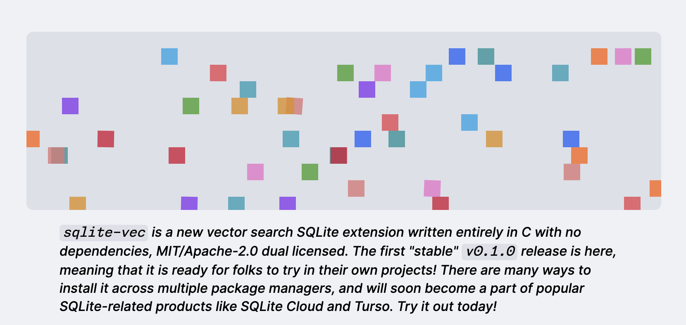

# sqlite-vec v0.1.0 Released: Portable Vector Database Extension for SQLite with Support for 1 Million 128-Dimensional Vectors, Binary Quantization, and Extensive SDKs

> Alex Garcia announced the much-anticipated release of sqlite-vec v0.1.0. This new SQLite extension, written entirely in C, introduces a powerful vector search capability to the SQLite database system. Released under the MIT/Apache-2.0 dual license, sqlite-vec aims to be a versatile and accessible tool for developers across various platforms and environments. Overview of sqlite-vec The sqlite-vec […]

Alex Garcia announced the much-anticipated release of** **[**sqlite-vec v0.1.0**](https://alexgarcia.xyz/blog/2024/sqlite-vec-stable-release/index.html). This new SQLite extension, written entirely in C, introduces a powerful vector search capability to the SQLite database system. Released under the MIT/Apache-2.0 dual license, sqlite-vec aims to be a versatile and accessible tool for developers across various platforms and environments.

**Overview of sqlite-vec**

The sqlite-vec extension enables vector search functionality within SQLite by allowing the creation of virtual tables with vector columns. Users can insert data using standard SQL commands and perform vector searches using SELECT statements. This integration means that vector data can be stored and queried within the same SQLite database, making it an efficient solution for applications requiring vector search capabilities.

**Installation and Compatibility**

The sqlite-vec extension is designed to be highly portable and easy to install. It supports various programming languages and environments, including Python, Node.js, Ruby, Rust, and Go. Installation is straightforward, with commands such as ‘pip install sqlite-vec’ for Python and ‘npm install sqlite-vec’ for Node.js. The extension is compatible with various OS, including macOS, Linux, and Windows, and it can even run in web browsers through WebAssembly.

*[**Image Source**](https://alexgarcia.xyz/blog/2024/sqlite-vec-stable-release/index.html)*

**Functionality and Use Cases**

At its core, sqlite-vec enables KNN-style queries, allowing users to find the closest vectors to a given query. This is particularly useful for applications involving natural language processing, recommendation systems, and other AI-driven tasks. For example, users can create a virtual table for articles with embedded vectors and perform searches to find the most relevant articles based on vector similarity.

A notable feature of sqlite-vec is its support for vector quantization, which compresses vector data to reduce storage space and improve query performance. This is achieved through techniques like converting float vectors to binary vectors, which can significantly reduce the storage footprint with minimal loss in accuracy. The extension supports Matryoshka embeddings, allowing users to truncate vectors without losing much quality, further optimizing storage and search efficiency.

**Performance and Benchmarks**

Garcia has provided detailed benchmarks demonstrating the performance of sqlite-vec compared to other vector search tools. The benchmarks show that sqlite-vec performs well in both build and query times, particularly in brute-force search scenarios. While it does not currently support approximate nearest neighbors (ANN) indexing, which can be crucial for handling large datasets, sqlite-vec excels in scenarios with smaller datasets typical of local AI applications. The benchmarks indicate that sqlite-vec is competitive with other in-process vector search tools like Faiss and DuckDB. For instance, in tests with the GIST1M dataset, sqlite-vec static mode outperformed usearch and Faiss in query times, highlighting its efficiency in certain use cases.

*[**Image Source**](https://alexgarcia.xyz/blog/2024/sqlite-vec-stable-release/index.html)*

**Future Development and Community Support**

Looking ahead, Garcia has outlined several features that are planned for future releases of sqlite-vec. These include metadata filtering, partitioned storage, and the introduction of ANN indexes to handle larger datasets more efficiently. There are also plans to integrate sqlite-vec into cloud services like Turso and SQLite Cloud, expanding its accessibility and utility.

Several sponsors, including Mozilla Builders, Fly.io, and SQLite Cloud, support the development of sqlite-vec. This support has been instrumental in advancing the project and fostering a community of users and contributors. Garcia encourages interested companies to reach out if they wish to sponsor the project and contribute to its ongoing development.

**Conclusion**

The release of sqlite-vec v0.1.0 by bringing vector search capabilities to SQLite, Garcia, has opened up new possibilities for developers working on AI and machine learning projects. With its portability, ease of installation, and robust performance, sqlite-vec is poised to become a valuable tool for various applications. For developers and organizations looking to leverage vector search within their existing SQLite databases, sqlite-vec offers a powerful and efficient solution. 

---

Check out the **[GitHub](https://github.com/asg017/sqlite-vec/tree/main), [Documentation](https://alexgarcia.xyz/sqlite-vec/python.html), **and **[Details.](https://alexgarcia.xyz/blog/2024/sqlite-vec-stable-release/index.html)** All credit for this research goes to the researchers of this project. Also, don’t forget to follow us on **[Twitter](https://twitter.com/Marktechpost)** and join our **[Telegram Channel](https://pxl.to/at72b5j)** and [**LinkedIn Gr**](https://www.linkedin.com/groups/13668564/)[**oup**](https://www.linkedin.com/groups/13668564/). **If you like our work, you will love our**[** newsletter..**](https://marktechpost-newsletter.beehiiv.com/subscribe)

Don’t Forget to join our **[47k+ ML SubReddit](https://www.reddit.com/r/machinelearningnews/)**

**Find Upcoming [AI Webinars here](https://www.marktechpost.com/ai-webinars-list-llms-rag-generative-ai-ml-vector-database/)**

---

> [Arcee AI Released DistillKit: An Open Source, Easy-to-Use Tool Transforming Model Distillation for Creating Efficient, High-Performance Small Language Models](https://www.marktechpost.com/2024/08/01/arcee-ai-released-distillkit-an-open-source-easy-to-use-tool-transforming-model-distillation-for-creating-efficient-high-performance-small-language-models/)
