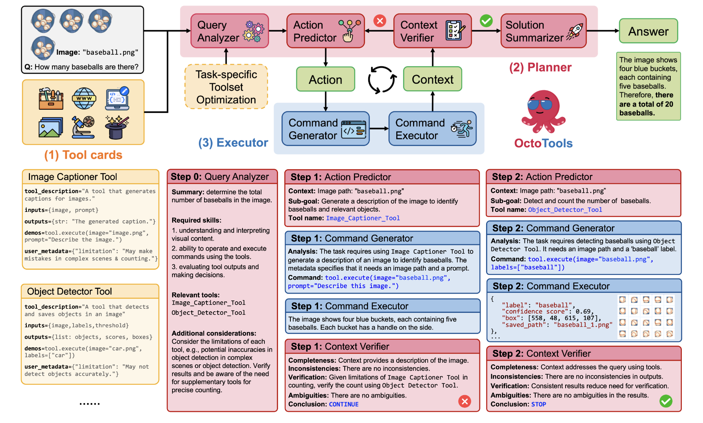

# Stanford Researchers Introduce OctoTools: A Training-Free Open-Source Agentic AI Framework Designed to Tackle Complex Reasoning Across Diverse Domains

> Large language models (LLMs) are limited by complex reasoning tasks that require multiple steps, domain-specific knowledge, or external tool integration. To address these challenges, researchers have explored ways to enhance LLM capabilities through external tool usage. By leveraging pre-built tools, AI systems can handle more intricate problem-solving scenarios, including real-world decision-making, multi-step reasoning, and specialized […]

Large language models (LLMs) are limited by complex reasoning tasks that require multiple steps, domain-specific knowledge, or external tool integration. To address these challenges, researchers have explored ways to enhance LLM capabilities through external tool usage. By leveraging pre-built tools, AI systems can handle more intricate problem-solving scenarios, including real-world decision-making, multi-step reasoning, and specialized domain applications.

Many approaches require fine-tuning or additional training to integrate tool use, making them rigid and difficult to adapt across various tasks. Existing methods either rely on static, predefined toolsets or lack an efficient tool selection and planning mechanism. This inefficiency leads to errors in task execution, increased computational costs, and limited adaptability when applied to new domains.

Traditional approaches to enhancing LLMs include few-shot prompting, chain-of-thought reasoning, and function-calling APIs that allow AI to interface with external tools. Some frameworks, such as LangChain and AutoGen, enable LLMs to use external resources, but they often focus on specific applications or require extensive pre-configuration. These frameworks do not provide a unified method for multi-step planning and execution, making them less effective in handling complex reasoning problems. Also, most existing methods lack a structured approach to tool selection, leading to inefficiencies in execution.

Researchers from Stanford University introduced [**OctoTools**](https://github.com/octotools/octotools) to overcome the above limitations, a novel framework that enhances AI reasoning capabilities by enabling dynamic and structured external tool usage. OctoTools is a modular, training-free, and extensible framework that standardizes how AI models interact with external tools. Unlike previous frameworks that require predefined tool configurations, OctoTools introduces “tool cards,” which encapsulate tool functionalities and metadata. These tool cards define input-output formats, constraints, and best practices, making it easier for AI models to integrate and use tools efficiently. The framework is structured around a planner-executor system that determines which tools are required for a given task, executes commands, and verifies the accuracy of results.

The framework has three key phases: planning, execution, and verification. The planner first analyzes the user query and determines the appropriate tools based on metadata associated with each tool card. This metadata includes input requirements, output expectations, and constraints. Once the planner identifies the tools needed for a specific task, the executor translates high-level decisions into executable commands. The executor runs these commands sequentially, ensuring that intermediate results are processed correctly before moving to the next step. After execution, a context verifier assesses the consistency of outputs to ensure they align with the original query. This verification process helps reduce errors by confirming whether all necessary sub-goals have been met. Also, OctoTools employs a task-specific toolset optimization algorithm that selects the most relevant tools for each task, thereby improving efficiency and accuracy.

The research team extensively evaluated 16 benchmarks covering vision, mathematical reasoning, scientific analysis, and medical applications. These benchmarks included datasets such as AlgoPuzzleVQA, MathVista, GPQA, SciFIBench, MedQA, and GAIA-Text. The results demonstrated that OctoTools significantly outperformed existing AI frameworks. Specifically, OctoTools achieved an average accuracy improvement of 9.3% over GPT-4o and up to 10.6% over competing agentic frameworks such as LangChain and AutoGen. In vision-based reasoning tasks, OctoTools improved accuracy by 7.4% over GPT-4o and 11.3% over zero-shot prompting methods. Mathematical reasoning tasks achieved a 22.5% improvement over the baseline. The framework also demonstrated substantial gains in medical and scientific domains, with a 20.7% accuracy boost in pathology image classification and 17.2% in medical question answering. The task-specific toolset optimization algorithm enhanced efficiency, reducing unnecessary computations and improving overall performance.

**Main Highlights from the Research include the following:**

- OctoTools significantly improves AI reasoning accuracy, achieving an average 9.3% improvement over GPT-4o and 10.6% over other agentic frameworks.

- The framework supports 16 diverse reasoning tasks, including vision-based analysis, mathematical computations, medical reasoning, and scientific data interpretation.

- OctoTools’ modular tool card system enables seamless tool integration, reducing the need for predefined tool configurations and making the framework adaptable to new domains.

- The planner-executor system optimizes decision-making, dynamically selecting the most relevant tools for each task while ensuring accurate execution.

- The toolset optimization algorithm improves efficiency, reduces computational overhead, and ensures that only the most beneficial tools are used for a given problem.

- OctoTools achieved a 20.7% accuracy improvement in medical applications, demonstrating its effectiveness in real-world AI-assisted diagnostics.

- OctoTools outperformed traditional prompting methods in multi-step reasoning tasks by 22.5%, highlighting its superior performance in structured problem-solving.

- Unlike other frameworks, OctoTools does not require additional model retraining, making it a cost-effective and scalable solution for AI-driven decision-making.

---

Check out **_the [Paper](https://arxiv.org/abs/2502.11271) and [GitHub Page](https://github.com/octotools/octotools)._** All credit for this research goes to the researchers of this project. Also, feel free to follow us on **[Twitter](https://x.com/intent/follow?screen_name=marktechpost)** and don’t forget to join our **[75k+ ML SubReddit](https://www.reddit.com/r/machinelearningnews/)**.

**🚨 [Recommended Read- LG AI Research Releases NEXUS: An Advanced System Integrating Agent AI System and Data Compliance Standards to Address Legal Concerns in AI Datasets](https://www.marktechpost.com/2025/02/16/lg-ai-research-releases-nexus-an-advanced-system-integrating-agent-ai-system-and-data-compliance-standards-to-address-legal-concerns-in-ai-datasets/)**
