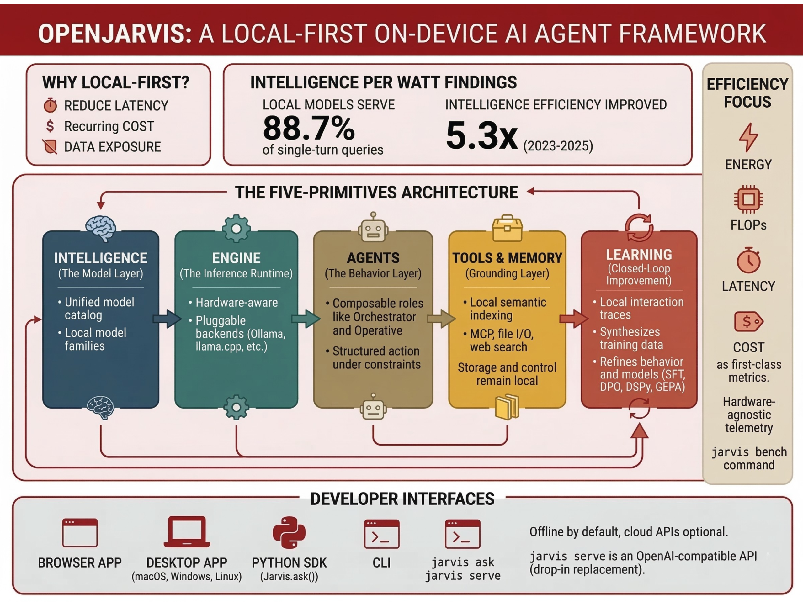

# Stanford Researchers Release OpenJarvis: A Local-First Framework for Building On-Device Personal AI Agents with Tools, Memory, and Learning

> Stanford researchers have introduced OpenJarvis, an open-source framework for building personal AI agents that run entirely on-device. The project comes from Stanford’s Scaling Intelligence Lab and is presented as both a research platform and deployment-ready infrastructure for local-first AI systems. Its focus is not only model execution, but also the broader software stack required to […]

Stanford researchers have introduced **OpenJarvis**, an open-source framework for building **personal AI agents that run entirely on-device**. The project comes from Stanford’s Scaling Intelligence Lab and is presented as both a research platform and deployment-ready infrastructure for local-first AI systems. Its focus is not only model execution, but also the broader software stack required to make on-device agents usable, measurable, and adaptable over time.

### Why OpenJarvis?

According to the Stanford research team, most current personal AI projects still keep the local component relatively thin while routing core reasoning through external cloud APIs. That design introduces latency, recurring cost, and data exposure concerns, especially for assistants/agents that operate over personal files, messages, and persistent user context. OpenJarvis is designed to shift that balance by making local execution the default and cloud usage optional.

The research team ties this release to its earlier **[Intelligence Per Watt](https://arxiv.org/abs/2511.07885)** research. In that work, they report that local language models and local accelerators can accurately serve **88.7% of single-turn chat and reasoning queries at interactive latencies**, while **intelligence efficiency improved 5.3× from 2023 to 2025**. OpenJarvis is positioned as the software layer that follows from that result: if models and consumer hardware are becoming practical for more local workloads, then developers need a standard stack for building and evaluating those systems.

*https://scalingintelligence.stanford.edu/blogs/openjarvis/*

### The Five-Primitives Architecture

At the architectural level, OpenJarvis is organized around **five primitives**: **Intelligence, Engine, Agents, Tools & Memory, and Learning**. The research team describes these as composable abstractions that can be benchmarked, substituted, and optimized independently or used together as an integrated system. This matters because local AI projects often mix inference, orchestration, tools, retrieval, and adaptation logic into a single hard-to-reproduce application. OpenJarvis instead tries to give each layer a more explicit role.

#### Intelligence: The Model Layer

The **Intelligence** primitive is the model layer. It sits above a changing set of local model families and provides a unified model catalog so developers do not have to manually track parameter counts, hardware fit, or memory tradeoffs for every release. The goal is to make model choice easier to study separately from other parts of the system, such as the inference backend or agent logic.

#### Engine: The Inference Runtime

The **Engine** primitive is the inference runtime. It is a common interface over backends such as **Ollama, vLLM, SGLang, llama.cpp, and cloud APIs**. The engine layer is framed more broadly as hardware-aware execution, where commands such as `jarvis init` detect available hardware and recommend a suitable engine and model configuration, while `jarvis doctor` helps maintain that setup. For developers, this is one of the more practical parts of the design: the framework does not assume a single runtime, but treats inference as a pluggable layer.

#### Agents: The Behavior Layer

The **Agents** primitive is the behavior layer. Stanford describes it as the part that turns model capability into structured action under real device constraints such as bounded context windows, limited working memory, and efficiency limits. Rather than relying on one general-purpose agent, OpenJarvis supports composable roles. The Stanford article specifically mentions roles such as the **Orchestrator**, which breaks complex tasks into subtasks, and the **Operative**, which is intended as a lightweight executor for recurring personal workflows. The docs also describe the agent harness as handling the system prompt, tools, context, retry logic, and exit logic.

#### Tools & Memory: Grounding the Agent

The **Tools & Memory** primitive is the grounding layer. This primitive includes support for **MCP (Model Context Protocol)** for standardized tool use, **Google A2A** for agent-to-agent communication, and **semantic indexing** for local retrieval over notes, documents, and papers. It also support for messaging platforms, webchat, and webhooks. It also covers a narrower tools view that includes web search, calculator access, file I/O, code interpretation, retrieval, and external MCP servers. OpenJarvis is not just a local chat interface; it is intended to connect local models to tools and persistent personal context while keeping storage and control local by default.

#### Learning: Closed-Loop Improvement

The fifth primitive, **Learning**, is what gives the framework a closed-loop improvement path. Stanford researchers describe it as a layer that uses local interaction traces to synthesize training data, refine agent behavior, and improve model selection over time. OpenJarvis supports optimization across **four layers** of the stack: **model weights**, **LM prompts**, **agentic logic**, and the **inference engine**. Examples listed by the research team include **SFT, GRPO, DPO**, prompt optimization with **DSPy**, agent optimization with **GEPA**, and engine-level tuning such as quantization selection and batch scheduling.

### Efficiency as a First-Class Metric

A major technical point in OpenJarvis is its emphasis on **efficiency-aware evaluation**. The framework treats **energy, FLOPs, latency, and dollar cost** as first-class constraints alongside task quality. It also emphasizes on a hardware-agnostic telemetry system for profiling energy on **NVIDIA GPUs via NVML**, **AMD GPUs**, and **Apple Silicon via `powermetrics`**, with **50 ms sampling intervals**. The `jarvis bench` command is meant to standardize benchmarking for latency, throughput, and energy per query. This is important because local deployment is not only about whether a model can answer a question, but whether it can do so within real limits on power, memory, and response time.

### Developer Interfaces and Deployment Options

From a developer perspective, OpenJarvis exposes several entry points. The[ official docs](https://open-jarvis.github.io/OpenJarvis/) show a **browser app**, a **desktop app**, a **Python SDK**, and a **CLI**. The browser-based interface can be launched with `./scripts/quickstart.sh`, which installs dependencies, starts **Ollama** and a local model, launches the backend and frontend, and opens the local UI. The desktop app is available for **macOS, Windows, and Linux**, with the backend still running on the user’s machine. The Python SDK exposes a `Jarvis()` object and methods such as `ask()` and `ask_full()`, while the CLI includes commands like `jarvis ask`, `jarvis serve`, `jarvis memory index`, and `jarvis memory search`.

The docs also state that **all core functionality works without a network connection**, while cloud APIs are optional. For dev teams building local applications, another practical feature is `jarvis serve`, which starts a **FastAPI server with SSE streaming** and is described as a **drop-in replacement for OpenAI clients**. That lowers the migration cost for developers who want to prototype against an API-shaped interface while still keeping inference local.

---

Check out **[Repo](https://github.com/open-jarvis/OpenJarvis), [Docs](https://open-jarvis.github.io/OpenJarvis/) **and** [Technical details](https://scalingintelligence.stanford.edu/blogs/openjarvis/). **Also, feel free to follow us on **[Twitter](https://x.com/intent/follow?screen_name=marktechpost)** and don’t forget to join our **[120k+ ML SubReddit](https://www.reddit.com/r/machinelearningnews/)** and Subscribe to **[our Newsletter](https://www.aidevsignals.com/)**. Wait! are you on telegram? **[now you can join us on telegram as well.](https://t.me/machinelearningresearchnews)**
