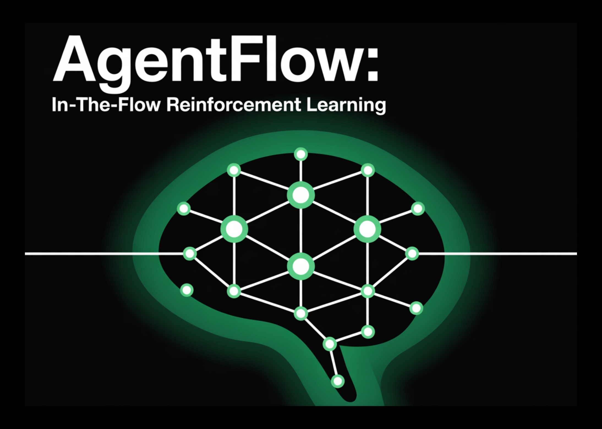

# Stanford Researchers Released AgentFlow: In-the-Flow Reinforcement Learning RL for Modular, Tool-Using AI Agents

> TL;DR: AgentFlow is a trainable agent framework with four modules—Planner, Executor, Verifier, Generator—coordinated by an explicit memory and toolset. The planner is optimized in the loop with a new on-policy method, Flow-GRPO, which broadcasts a trajectory-level outcome reward to every turn and applies token-level PPO-style updates with KL regularization and group-normalized advantages. On ten benchmarks, […]

**TL;DR:** AgentFlow is a trainable agent framework with four modules—Planner, Executor, Verifier, Generator—coordinated by an explicit memory and toolset. The planner is optimized **in the loop** with a new on-policy method, **Flow-GRPO**, which broadcasts a trajectory-level outcome reward to every turn and applies token-level PPO-style updates with KL regularization and group-normalized advantages. On ten benchmarks, a 7B backbone tuned with Flow-GRPO reports +14.9% (search), +14.0% (agentic), +14.5% (math), and +4.1% (science) over strong baselines.

### What is AgentFlow?

AgentFlow formalizes multi-turn, tool-integrated reasoning as an Markov Decision Process (MDP). At each turn, the **Planner** proposes a sub-goal and selects a tool plus context; the **Executor** calls the tool; the **Verifier** signals whether to continue; the **Generator** emits the final answer on termination. A structured, evolving memory records states, tool calls, and verification signals, constraining context growth and making trajectories auditable. Only the planner is trained; other modules can be fixed engines.

The public implementation showcases a modular toolkit (e.g., `base_generator`, `python_coder`, `google_search`, `wikipedia_search`, `web_search`) and ships quick-start scripts for inference, training, and benchmarking. The repository is MIT-licensed.

*https://arxiv.org/pdf/2510.05592*

### Training method: Flow-GRPO

**Flow-GRPO (Flow-based Group Refined Policy Optimization)** converts long-horizon, sparse-reward optimization into tractable single-turn updates:

- **Final-outcome reward broadcast:** a single, verifiable trajectory-level signal (LLM-as-judge correctness) is assigned to **every turn**, aligning local planning steps with global success.

- **Token-level clipped objective:** importance-weighted ratios are computed per token, with PPO-style clipping and a KL penalty to a reference policy to prevent drift.

- **Group-normalized advantages:** variance reduction across groups of on-policy rollouts stabilizes updates.

*https://arxiv.org/pdf/2510.05592*

### Understanding the results and benchmarks

**Benchmarks.** The research team evaluates four task types: knowledge-intensive search (Bamboogle, 2Wiki, HotpotQA, Musique), agentic reasoning (GAIA textual split), math (AIME-24, AMC-23, Game of 24), and science (GPQA, MedQA). GAIA is a tooling-oriented benchmark for general assistants; the textual split excludes multimodal requirements.

**Main numbers (7B backbone after Flow-GRPO).** Average gains over strong baselines: **+14.9%** (search), **+14.0%** (agentic), **+14.5%** (math), **+4.1%** (science). The research team state their 7B system **surpasses GPT-4o** on the reported suite. The project page also reports training effects such as improved planning quality, reduced tool-calling errors (up to **28.4%** on GAIA), and positive trends with larger turn budgets and model scale.

**Ablations.** Online Flow-GRPO improves performance by **+17.2%** vs. a frozen-planner baseline, while offline supervised fine-tuning of the planner degrades performance by **−19.0%** on their composite metric.

*https://arxiv.org/pdf/2510.05592*

### Key Takeaways

- **Modular agent, planner-only training.** AgentFlow structures an agent into Planner–Executor–Verifier–Generator with an explicit memory; only the Planner is trained in-loop.

- **Flow-GRPO converts long-horizon RL to single-turn updates.** A trajectory-level outcome reward is broadcast to every turn; updates use token-level PPO-style clipping with KL regularization and group-normalized advantages.

- **The research team-reported gains on 10 benchmarks.** With a 7B backbone, AgentFlow reports average improvements of +14.9% (search), +14.0% (agentic/GAIA textual), +14.5% (math), +4.1% (science) over strong baselines, and states surpassing GPT-4o on the same suite.

- **Tool-use reliability improves.** The research team report reduced tool-calling errors (e.g., on GAIA) and better planning quality under larger turn budgets and model scale.

### Editorial Comments

AgentFlow formalizes tool-using agents into four modules (planner, executor, verifier, generator) and trains only the planner in-loop via Flow-GRPO, which broadcasts a single trajectory-level reward to every turn with token-level PPO-style updates and KL control. Reported results on ten benchmarks show average gains of +14.9% (search), +14.0% (agentic/GAIA textual split), +14.5% (math), and +4.1% (science); the research team additionally state the 7B system surpasses GPT-4o on this suite. Implementation, tools, and quick-start scripts are MIT-licensed in the GitHub repo.

---

Check out the **[Technical Paper](https://arxiv.org/abs/2510.05592), [GitHub Page](https://github.com/lupantech/AgentFlow) and [Project Page](https://agentflow.stanford.edu/)**. Feel free to check out our **[GitHub Page for Tutorials, Codes and Notebooks](https://github.com/Marktechpost/AI-Tutorial-Codes-Included)**. Also, feel free to follow us on **[Twitter](https://x.com/intent/follow?screen_name=marktechpost)** and don’t forget to join our **[100k+ ML SubReddit](https://www.reddit.com/r/machinelearningnews/)** and Subscribe to **[our Newsletter](https://www.aidevsignals.com/)**. Wait! are you on telegram? **[now you can join us on telegram as well.](https://t.me/machinelearningresearchnews)**
