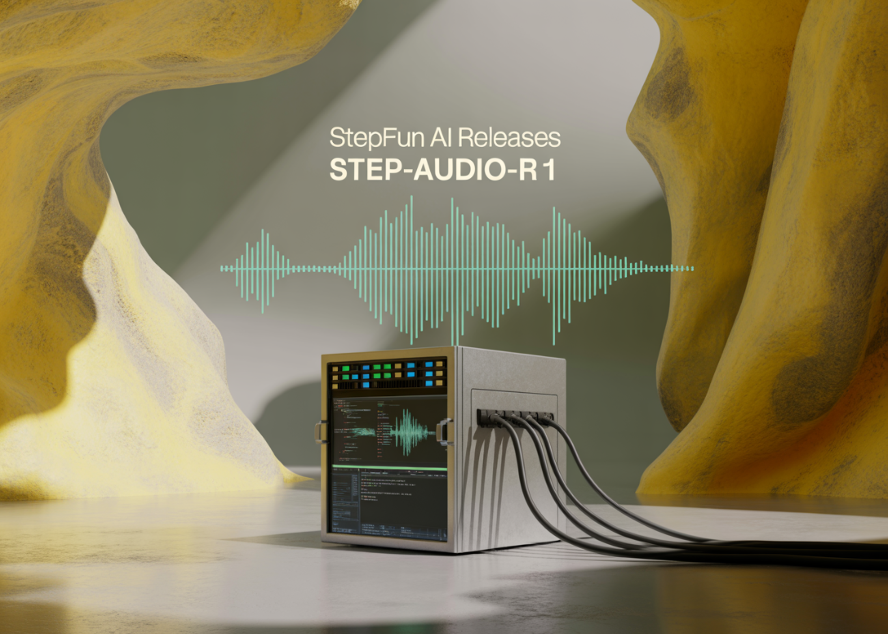

# StepFun AI Releases Step-Audio-R1: A New Audio LLM that Finally Benefits from Test Time Compute Scaling

> Why do current audio AI models often perform worse when they generate longer reasoning instead of grounding their decisions in the actual sound. StepFun research team releases Step-Audio-R1, a new audio LLM designed for test time compute scaling, address this failure mode by showing that the accuracy drop with chain of thought is not an […]

Why do current audio AI models often perform worse when they generate longer reasoning instead of grounding their decisions in the actual sound. StepFun research team releases Step-Audio-R1, a new audio LLM designed for test time compute scaling, address this failure mode by showing that the accuracy drop with chain of thought is not an audio limitation but a training and modality grounding problem?

*https://arxiv.org/pdf/2511.15848*

### The Core Problem, Audio Models Reason over Text Surrogates

Most current audio models inherit their reasoning behavior from text training. They learn to reason as if they read transcripts, not as if they listen. The StepFun team calls this Textual Surrogate Reasoning. The model uses imagined words and descriptions instead of acoustic cues such as pitch contour, rhythm, timbre or background noise patterns.

This mismatch explains why longer chain of thought often hurts performance in audio. The model spends more tokens elaborating wrong or modality irrelevant assumptions. Step-Audio-R1 attacks this by forcing the model to justify answers using acoustic evidence. The training pipeline is organized around Modality Grounded Reasoning Distillation, MGRD, which selects and distills reasoning traces that explicitly reference audio features.

### Architecture

**The architecture stays close to the previous Step Audio systems**:

- A Qwen2 based audio encoder processes raw waveforms at 25 Hz.

- An audio adaptor downsamples the encoder output by a factor of 2, to 12.5 Hz, and aligns frames to the language token stream.

- A Qwen2.5 32B decoder consumes the audio features and generates text.

The decoder always produces an explicit reasoning block inside `<think>` and `</think>` tags, followed by the final answer. This separation lets training objectives shape the structure and content of reasoning without losing focus on task accuracy. The model is released as a 33B parameter audio text to text model on [Hugging Face under Apache 2.0](https://huggingface.co/stepfun-ai/Step-Audio-R1).

*https://arxiv.org/pdf/2511.15848*

### Training Pipeline, from Cold Start to Audio Grounded RL

The pipeline has a supervised cold start stage and a reinforcement learning stage that both mix text and audio tasks.

Cold start uses about 5 million examples, covering 1 billion tokens of text only data and 4 billion tokens from audio paired data. Audio tasks include automatic speech recognition, paralinguistic understanding and audio question text answer style dialogs. A fraction of the audio data carries audio chain of thought traces generated by an earlier model. Text data covers multi turn dialog, knowledge question answering, math and code reasoning. All samples share a format where reasoning is wrapped in `<think>` tags, even when the reasoning block is initially empty.

Supervised learning trains Step-Audio-R1 to follow this format and to generate useful reasoning for both audio and text. This gives a baseline chain of thought behavior, but it is still biased toward text based reasoning.

### Modality Grounded Reasoning Distillation MGRD

MGRD is applied in several iterations. For each round, the research team samples audio questions where the label depends on real acoustic properties. For example, questions about speaker emotion, background events in sound scenes or musical structure. The current model produces multiple reasoning and answer candidates per question. **A filter keeps only chains that meet three constraints:**

- They reference acoustic cues, not just textual descriptions or imagined transcripts.

- They are logically coherent as short step by step explanations.

- Their final answers are correct according to labels or programmatic checks.

These accepted traces form a distilled audio chain of thought dataset. The model is fine tuned on this dataset together with the original text reasoning data. This is followed by Reinforcement Learning with Verified Rewards, RLVR. For text questions, rewards are based on answer correctness. For audio questions, the reward mixes answer correctness and reasoning format, with a typical weighting of 0.8 for accuracy and 0.2 for reasoning. Training uses PPO with about 16 responses sampled per prompt and supports sequences up to around 10 240 tokens to allow long deliberation.

*https://arxiv.org/pdf/2511.15848*

### Benchmarks, closing the gap to Gemini 3 Pro

On a combined speech to text benchmark suite that includes Big Bench Audio, Spoken MQA, MMSU, MMAU and Wild Speech, Step-Audio-R1 reaches an average score of about 83.6 percent. Gemini 2.5 Pro reports about 81.5 percent and Gemini 3 Pro reaches about 85.1 percent. On Big Bench Audio alone, Step-Audio-R1 reaches about 98.7 percent, which is higher than both Gemini versions.

For speech to speech reasoning, the Step-Audio-R1 Realtime variant adopts listen while thinking and think while speaking style streaming. On Big Bench Audio speech to speech, it reaches about 96.1 percent reasoning accuracy with first packet latency around 0.92 seconds. This score surpasses GPT based realtime baselines and Gemini 2.5 Flash style native audio dialogs while keeping sub second interaction.

*https://arxiv.org/pdf/2511.15848*

### Ablations, what matters for audio reasoning

**The ablation section provides several design signals for engineers:**

- A reasoning format reward is necessary. Without it, reinforcement learning tends to shorten or remove chain of thought, which lowers audio benchmark scores.

- RL data should target medium difficulty problems. Selecting questions where pass at 8 lies in a middle band gives more stable rewards and maintains long reasoning.

- Scaling RL audio data without such selection does not help. Quality of prompts and labels matters more than raw size.

The researchers also describe a self cognition correction pipeline that reduces the frequency of answers such as ‘I can only read text and cannot hear audio’ in a model that is trained to process sound. This uses Direct Preference Optimization on curated preference pairs where correct behavior is to acknowledge and use audio input.

### Key Takeaways

- Step-Audio-R1 is one of the first audio language model that turns longer chain of thought into a consistent accuracy gain for audio tasks, solving the inverted scaling failure seen in previous audio LLMs.

- The model explicitly targets Textual Surrogate Reasoning by using Modality Grounded Reasoning Distillation, which filters and distills only those reasoning traces that rely on acoustic cues such as pitch, timbre and rhythm instead of imagined transcripts.

- Architecturally, Step-Audio-R1 combines a Qwen2 based audio encoder with an adaptor and a Qwen2.5 32B decoder that always generates `` reasoning segments before answers, and is released as a 33B audio text to text model under Apache 2.0.

- Across comprehensive audio understanding and reasoning benchmarks covering speech, environmental sounds and music, Step-Audio-R1 surpasses Gemini 2.5 Pro and reaches performance comparable to Gemini 3 Pro, while also supporting a realtime variant for low latency speech to speech interaction.

- The training recipe combines large scale supervised chain of thought, modality grounded distillation and Reinforcement Learning with Verified Rewards, providing a concrete and reproducible blueprint for building future audio reasoning models that actually benefit from test time compute scaling.

### Editorial Notes

Step-Audio-R1 is an important release because it converts chain of thought from a liability into a useful tool for audio reasoning by directly addressing Textual Surrogate Reasoning with Modality Grounded Reasoning Distillation and Reinforcement Learning with Verified Rewards. It shows that test time compute scaling can benefit audio models when reasoning is anchored in acoustic features and delivers benchmark results comparable to Gemini 3 Pro while remaining open and practically usable for engineers. Overall this research work turns extended deliberation in audio LLMs from a consistent failure mode into a controllable and reproducible design pattern.

---

Check out the **[Paper](https://arxiv.org/pdf/2511.15848), [Repo](https://github.com/stepfun-ai/Step-Audio-R1), [Project Page](https://stepaudiollm.github.io/step-audio-r1/) **and** [Model Weights](https://huggingface.co/stepfun-ai/Step-Audio-R1)**. Feel free to check out our **[GitHub Page for Tutorials, Codes and Notebooks](https://github.com/Marktechpost/AI-Tutorial-Codes-Included)**. Also, feel free to follow us on **[Twitter](https://x.com/intent/follow?screen_name=marktechpost)** and don’t forget to join our **[100k+ ML SubReddit](https://www.reddit.com/r/machinelearningnews/)** and Subscribe to **[our Newsletter](https://www.aidevsignals.com/)**. Wait! are you on telegram? **[now you can join us on telegram as well.](https://t.me/machinelearningresearchnews)**
