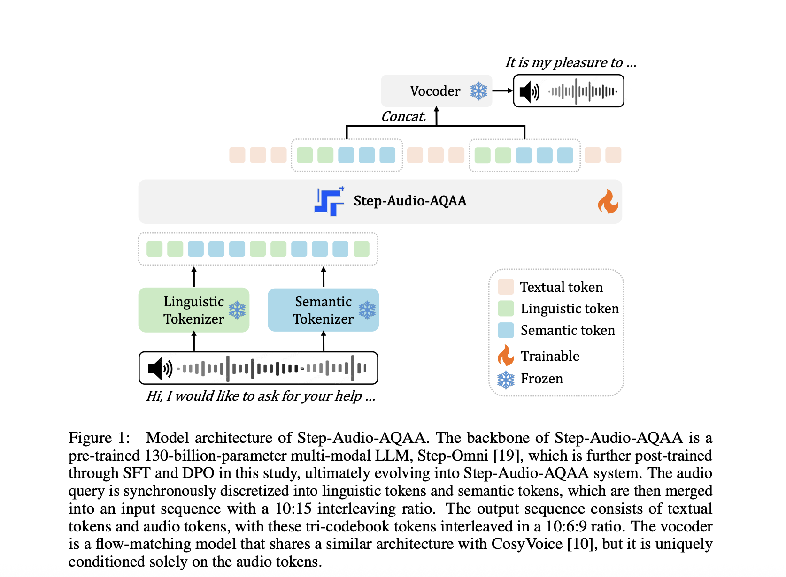

# StepFun Introduces Step-Audio-AQAA: A Fully End-to-End Audio Language Model for Natural Voice Interaction

> Rethinking Audio-Based Human-Computer Interaction Machines that can respond to human speech with equally expressive and natural audio have become a major goal in intelligent interaction systems. Audio-language modeling extends this vision by combining speech recognition, natural language understanding, and audio generation. Rather than relying on text conversions, models in this space aim to understand and […]

### Rethinking Audio-Based Human-Computer Interaction

Machines that can respond to human speech with equally expressive and natural audio have become a major goal in intelligent interaction systems. Audio-language modeling extends this vision by combining speech recognition, natural language understanding, and audio generation. Rather than relying on text conversions, models in this space aim to understand and reply using voice alone. This is crucial not only for accessibility and inclusiveness but also for achieving more fluid, human-like machine interactions in applications such as voice assistants, audio-based storytelling, and hands-free computing.

### Limitations of Cascaded Speech Pipelines

Despite advancements in audio understanding, a clear challenge remains: most systems still rely on a chain of separate modules for speech-to-text, text processing, and text-to-speech conversion. This modular approach can degrade performance and responsiveness due to accumulated errors and latency. Furthermore, these pipelines lack expressive control, rendering them unsuitable for nuanced tasks such as emotional dialogue or dynamic speech synthesis. An ideal solution would be a fully unified model capable of understanding an audio question and generating an expressive audio answer directly, thereby eliminating all text-based intermediation.

### From Token-Based Models to Fully Unified LALMs

Several methods have attempted to address this. Early approaches, such as HuggingGPT and AudioGPT, utilized cascaded architectures that combined separate speech and language models. While they expanded task coverage, these systems struggled with real-time voice interaction. Later works, such as VALL-E, SpeechGPT, AudioPaLM, and Qwen2-Audio, introduced token-based systems that convert audio into discrete representations. Yet, even these models mostly output text and require separate vocoders, limiting their ability to produce expressive, immediate audio responses.

### Introducing Step-Audio-AQAA: An End-to-End AQAA System

Researchers at StepFun introduced Step-Audio-AQAA, a fully end-to-end large audio-language model designed specifically for Audio Query–Audio Answer tasks. Unlike prior models, Step-Audio-AQAA directly transforms spoken input into expressive spoken output without converting it into intermediate text. This architecture combines a dual-codebook tokenizer, a 130-billion-parameter backbone LLM named Step-Omni, and a flow-matching vocoder for natural speech synthesis. The integration of these components enables seamless, low-latency interaction.

### Tokenization, Architecture, and Voice Control

The method begins with two separate audio tokenizers—one for linguistic features and another for semantic prosody. The linguistic tokenizer, based on Paraformer, extracts structured speech elements like phonemes at 16.7 Hz using a codebook of 1,024 tokens. Meanwhile, the semantic tokenizer (inspired by CosyVoice 1.0) encodes acoustic richness at 25 Hz with 4,096 tokens. These are interleaved in a 2:3 ratio and passed into Step-Omni, a multimodal decoder-only LLM trained on text, audio, and image data. After this, the model outputs tri-codebook sequences of audio and text tokens, which the vocoder transforms into fluid speech. This setup enables fine-grained voice control, including emotional tone and speech rate.

### Benchmark Evaluation and Results

The model was evaluated using the StepEval-Audio-360 benchmark, which comprises multilingual, multi-dialectal audio tasks across nine categories, including creativity, gaming, emotion control, role-playing, and voice understanding. In comparison to state-of-the-art models like Kimi-Audio and Qwen-Omni, Step-Audio-AQAA achieved the highest Mean Opinion Scores in most categories. Specifically, in text-audio token ratio experiments, the configuration with a 10:15 ratio achieved top performance with Chat (4.03), Relevance (0.65), and Factuality (0.67) scores. Among different audio interleaving techniques, marker-preserving concatenation performed best, with Chat (4.22), Relevance (0.57), and Factuality (0.57) scores. These numbers reflect its strength in generating semantically accurate, emotionally rich, and context-aware audio responses.

### Conclusion: Toward Expressive Machine Speech

Step-Audio-AQAA offers a robust solution to the limitations of modular speech processing pipelines. By combining expressive audio tokenization, a powerful multimodal LLM, and advanced post-training strategies such as Direct Preference Optimization and model merging, it succeeds in generating high-quality, emotionally resonant audio responses. This work marks a significant step forward in enabling machines to communicate with speech that is not only functional but expressive and fluid.

---

Check out the** [Paper](https://arxiv.org/abs/2506.08967) and [Model on Hugging Face](https://huggingface.co/stepfun-ai/Step-Audio-AQAA)_._** All credit for this research goes to the researchers of this project. Also, feel free to follow us on **[Twitter](https://x.com/intent/follow?screen_name=marktechpost)** and don’t forget to join our **[100k+ ML SubReddit](https://www.reddit.com/r/machinelearningnews/)** and Subscribe to **[our Newsletter](https://www.airesearchinsights.com/subscribe)**.
