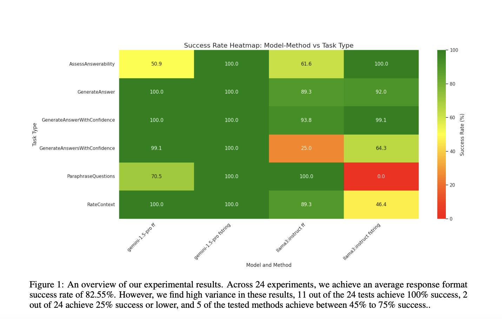

# StructuredRAG Released by Weaviate: A Comprehensive Benchmark to Evaluate Large Language Models’ Ability to Generate Reliable JSON Outputs for Complex AI Systems

> Large Language Models (LLMs) have become increasingly vital in artificial intelligence, particularly in tasks requiring no prior specific training data, known as Zero-Shot Learning. These models are evaluated on their ability to perform novel tasks and how well they generate outputs in a structured format, such as JSON. Structured outputs are critical for developing Compound […]

Large Language Models (LLMs) have become increasingly vital in artificial intelligence, particularly in tasks requiring no prior specific training data, known as Zero-Shot Learning. These models are evaluated on their ability to perform novel tasks and how well they generate outputs in a structured format, such as JSON. Structured outputs are critical for developing Compound AI Systems involving multiple LLM inferences or interactions with external tools. This research investigates the capability of LLMs to follow specific formatting instructions for JSON outputs, a crucial requirement for integrating these models into complex AI systems.

A significant challenge in employing LLMs in advanced AI systems is ensuring that their outputs conform to predefined formats, essential for seamless integration into multi-component systems. When outputs fail to meet these strict formatting requirements, it can cause significant disruptions in the overall operation of the system. This problem is particularly pronounced when LLMs use other tools or models, necessitating precise and consistent output formats. The research addresses this issue by evaluating the LLMs’ ability to generate JSON outputs that adhere to specific format instructions.

Current approaches to ensure the correctness of structured outputs include methods like structured decoding, such as the DOMINO algorithm. These methods are designed to improve the reliability of JSON output generation by enforcing stricter constraints during the generation process. However, these methods can introduce additional complexity, potentially reducing the speed of inference and complicating the integration of these models into existing systems. Moreover, the reliance on structured decoding can interfere with the benefits of prompt optimization and the inherent knowledge encoded within LLMs, making it challenging to balance accuracy and efficiency.

The research team from Weaviate introduced a novel benchmark called [**StructuredRAG**](https://github.com/weaviate/structured-rag), which consists of six different tasks designed to assess the ability of LLMs to generate structured outputs like JSON. The benchmark evaluated two state-of-the-art models: Gemini 1.5 Pro and Llama 3 8B-instruct, leading LLMs in the field. The researchers employed two distinct prompting strategies—f-String and Follow the Format (FF)—to measure the models’ proficiency in following response format instructions. These strategies were chosen to explore different approaches to prompting, aiming to identify which method yields better results in structured output generation.

The researchers conducted 24 experiments in their methodology, each designed to test the models’ ability to follow the specified JSON format instructions. The experiments covered a range of output complexities, from simple string values to more intricate composite objects that include multiple data types. The success of the models was measured by their ability to produce outputs that could be accurately parsed into the requested JSON format. The study also introduced OPRO prompt optimization, a technique to improve JSON response formatting without relying on structured decoding methods. This approach focuses on refining the prompts to enhance the likelihood of generating correctly formatted outputs.

The results of the experiments showed that the models achieved an average success rate of 82.55% across all tasks, with notable variations in performance based on the complexity of the tasks. Of the 24 tasks, 11 achieved a 100% success rate, while two had 25% or lower success rates. Notably, the Gemini 1.5 Pro model outperformed the Llama 3 8B-instruct model, with an average success rate of 93.4% compared to 71.7%. The research highlighted that while both models performed well on simpler tasks, they struggled with more complex outputs, particularly those involving lists or composite objects. For instance, the Llama 3 8B-instruct model achieved a 0% success rate on a task requiring the output of a list of strings in the ParaphraseQuestions test and only a 25% success rate on the GenerateAnswersWithConfidences task when using FF prompting.

The findings from this study underscore the significant variability in LLMs’ ability to generate structured outputs, especially in more challenging scenarios. The introduction of the StructuredRAG benchmark provides a valuable tool for evaluating and improving the performance of LLMs in generating JSON outputs. The study suggests that further research is needed to explore advanced techniques, such as ensembling, retry mechanisms, and prompt optimization, to enhance the reliability and consistency of structured output generation. The researchers also indicated that exploring these advanced methods could significantly improve LLMs’ ability to generate correctly formatted outputs without using structured decoding methods.

In conclusion, this research provides insights into the challenges and potential solutions for improving LLMs’ structured output generation capabilities. By introducing the StructuredRAG benchmark and evaluating two leading LLMs, the study highlights the importance of prompt optimization and the need for further advancements in this area. The results demonstrate that while current LLMs can achieve high success rates in certain tasks, there is still considerable room for improvement, particularly in generating more complex structured outputs.

---

Check out the **[Paper ](https://arxiv.org/abs/2408.11061)and [GitHub](https://github.com/weaviate/structured-rag).** All credit for this research goes to the researchers of this project. Also, don’t forget to follow us on **[Twitter](https://twitter.com/Marktechpost)** and join our **[Telegram Channel](https://arxiv.org/abs/2408.08231)** and [**LinkedIn Gr**](https://www.linkedin.com/groups/13668564/)[**oup**](https://www.linkedin.com/groups/13668564/). **If you like our work, you will love our**[** newsletter..**](https://marktechpost-newsletter.beehiiv.com/subscribe)

Don’t Forget to join our **[49k+ ML SubReddit](https://www.reddit.com/r/machinelearningnews/)**

**Find Upcoming [AI Webinars here](https://www.marktechpost.com/ai-webinars-list-llms-rag-generative-ai-ml-vector-database/)**
