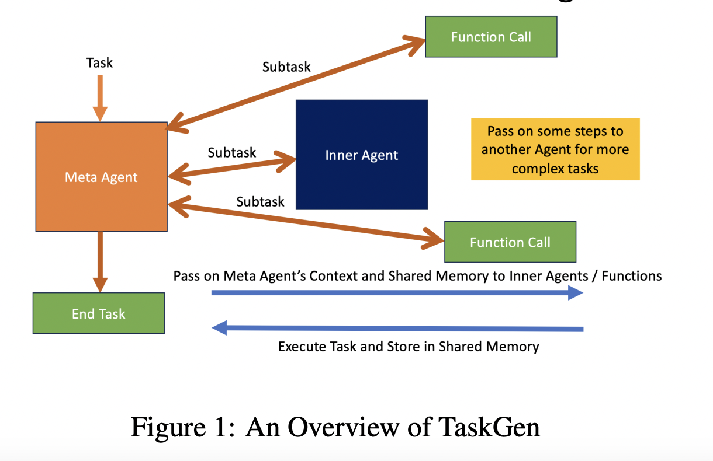

# TaskGen: An Open-Sourced Agentic Framework that Uses an AI Agent to Solve an Arbitrary Task by Breaking it Down into Subtasks

> Current AI task management methods, such as AutoGPT, BabyAGI, and LangChain, typically rely on free-text outputs, which can be lengthy and less efficient. These frameworks often face challenges in maintaining context and managing the vast action space associated with arbitrary tasks. This research paper addresses the limitations of existing agentic frameworks in natural language processing […]

Current AI task management methods, such as AutoGPT, BabyAGI, and LangChain, typically rely on free-text outputs, which can be lengthy and less efficient. These frameworks often face challenges in maintaining context and managing the vast action space associated with arbitrary tasks. This research paper addresses the limitations of existing agentic frameworks in natural language processing (NLP) tasks, particularly the inefficiencies in handling dynamic and complex queries that require context refinement and interactive problem-solving. The authors propose a new system, TaskGen, designed to enhance the performance of large language models (LLMs) by dynamically refining context and improving interactive retrieval capabilities.

TaskGen proposes a novel approach by employing a structured output format called StrictJSON, which ensures concise and extractable JSON outputs from large language models (LLMs). TaskGen enhances the agent’s ability to operate independently while sharing relevant information through a Shared Memory system by breaking down complex tasks into subtasks mapped to specific Equipped Functions or Inner Agents. This design philosophy reduces verbosity and improves processing speed and accuracy.

The proposed solution, TaskGen, introduces an interactive retrieval method that dynamically fetches and refines context based on ongoing user query interaction. This method leverages the strengths of Retrieval-Augmented Generation (RAG) systems to incorporate additional information in successive retrieval steps adaptively. TaskGen is designed to operate without the need for conversational context, focusing directly on solving tasks by equipping agents with specific functions and utilizing a modular approach for better performance.

The core technology of TaskGen revolves around its modular architecture, which includes components like Equipped Functions, Inner Agents, and a Memory Bank. Equipped Functions perform specific tasks, while Inner Agents can handle subtasks independently, allowing for a hierarchical structure that increases processing capability. The Shared Memory system facilitates communication among agents, ensuring that only relevant information is shared on a need-to-know basis, thereby reducing cognitive load. TaskGen’s performance has been empirically validated across various environments, achieving notable success rates in tasks such as maze navigation (100% solve rate) and web browsing (69% success rate). Using StrictJSON significantly decreases token usage and processing latency, contributing to a more efficient overall system. 

TaskGen’s design offers several practical advantages in terms of task execution. By utilizing a structured output format minimizes the verbosity typically associated with free-form text outputs, leading to a more streamlined approach. The modular architecture ensures that each component operates with only the necessary context, improving performance in task execution. The Shared Memory system enhances the agent’s awareness of completed subtasks and allows for dynamic updates to variables, which is crucial in rapidly changing environments. The Memory Bank stores various forms of information that can be retrieved based on semantic similarity to the task, further augmenting the agent’s capabilities. Overall, TaskGen’s design enhances the efficiency and effectiveness of task management in AI systems, making it a significant advancement in the field.

In conclusion, TaskGen effectively addresses the problem of verbosity and inefficiency in traditional agentic frameworks by introducing a structured, memory-infused approach to task management. Its innovative use of StrictJSON and modular architecture enhances the agent’s ability to execute complex tasks efficiently while maintaining relevant context. This framework represents a promising advancement in artificial intelligence, offering a robust solution to the challenges posed by arbitrary task execution.

---

Check out the **[Paper](https://arxiv.org/abs/2407.15734)** and [**GitHub**.](https://github.com/simbianai/taskgen) All credit for this research goes to the researchers of this project. Also, don’t forget to follow us on **[Twitter](https://twitter.com/Marktechpost)** and join our **[Telegram Channel](https://pxl.to/at72b5j)** and [**LinkedIn Gr**](https://www.linkedin.com/groups/13668564/)[**oup**](https://www.linkedin.com/groups/13668564/). **If you like our work, you will love our**[** newsletter..**](https://marktechpost-newsletter.beehiiv.com/subscribe)

Don’t Forget to join our **[47k+ ML SubReddit](https://www.reddit.com/r/machinelearningnews/)**

**Find Upcoming [AI Webinars here](https://www.marktechpost.com/ai-webinars-list-llms-rag-generative-ai-ml-vector-database/)**
