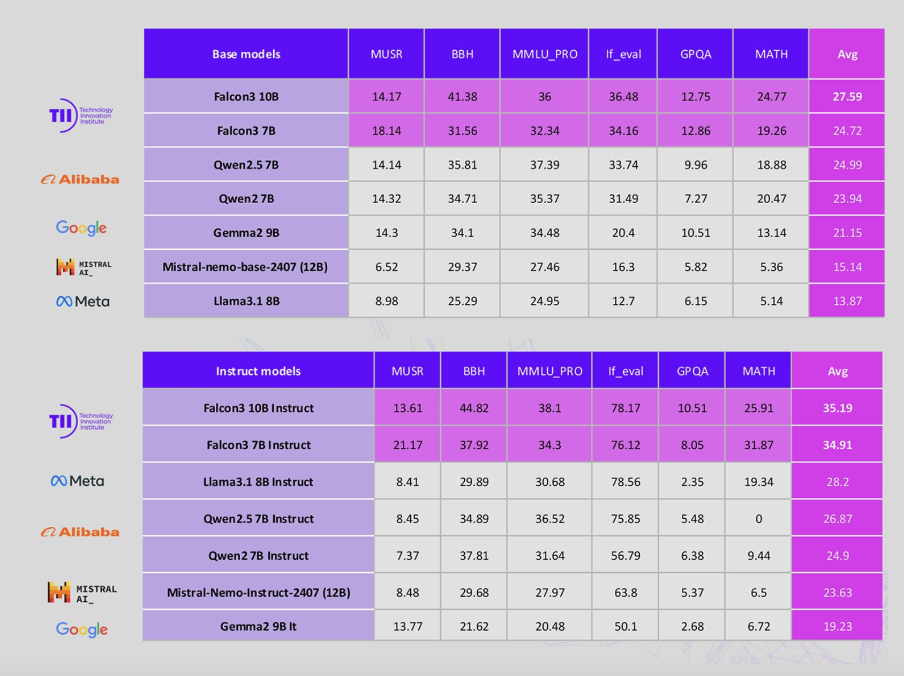

# Technology Innovation Institute TII-UAE Just Released Falcon 3: A Family of Open-Source AI Models with 30 New Model Checkpoints from 1B to 10B

> The advancements in large language models (LLMs) have created opportunities across industries, from automating content creation to improving scientific research. However, significant challenges remain. High-performing models are often proprietary, restricting transparency and access for researchers and developers. Open-source alternatives, while promising, frequently struggle with balancing computational efficiency and performance at scale. Furthermore, limited language diversity […]

The advancements in large language models (LLMs) have created opportunities across industries, from automating content creation to improving scientific research. However, significant challenges remain. High-performing models are often proprietary, restricting transparency and access for researchers and developers. Open-source alternatives, while promising, frequently struggle with balancing computational efficiency and performance at scale. Furthermore, limited language diversity in many models reduces their broader usability. These hurdles highlight the need for open, efficient, and versatile LLMs capable of performing well across a range of applications without excessive costs.

### Technology Innovation Institute UAE Just Released Falcon 3

The Technology Innovation Institute (TII) UAE has addressed these challenges with the release of **[Falcon 3](https://huggingface.co/collections/tiiuae/falcon3-67605ae03578be86e4e87026)**, the newest version of their open-source LLM series. Falcon 3 introduces **30 model checkpoints** ranging from 1B to 10B parameters. These include **base and instruction-tuned models**, as well as **quantized versions** like GPTQ-Int4, GPTQ-Int8, AWQ, and an innovative **1.58-bit variant** for efficiency. A notable addition is the inclusion of **Mamba-based models**, which leverage state-space models (SSMs) to improve inference speed and performance.

By releasing Falcon 3 under the **TII Falcon-LLM License 2.0**, TII continues to support open, commercial usage, ensuring broad accessibility for developers and businesses. The models are also compatible with the **Llama architecture**, which makes it easier for developers to integrate Falcon 3 into existing workflows without additional overhead.

### Technical Details and Key Benefits

Falcon 3 models are trained on a large-scale dataset of **14 trillion tokens**, a significant leap over earlier iterations. This extensive training improves the models’ ability to generalize and perform consistently across tasks. Falcon 3 supports a **32K context length** (8K for the 1B variant), enabling it to handle longer inputs efficiently—a crucial benefit for tasks like summarization, document processing, and chat-based applications.

The models retain a **Transformer-based architecture** with **40 decoder blocks** and employ **grouped-query attention (GQA)** featuring **12 query heads**. These design choices optimize computational efficiency and reduce latency during inference without sacrificing accuracy. The introduction of **1.58-bit quantized versions** allows the models to run on devices with limited hardware resources, offering a practical solution for cost-sensitive deployments.

Falcon 3 also addresses the need for multilingual capabilities by supporting **four languages**: English, French, Spanish, and Portuguese. This enhancement ensures the models are more inclusive and versatile, catering to diverse global audiences.

### Results and Insights

Falcon 3’s benchmarks reflect its strong performance across evaluation datasets:

- **83.1%** on GSM8K, which measures mathematical reasoning and problem-solving abilities.

- **78%** on IFEval, showcasing its instruction-following capabilities.

- **71.6%** on MMLU, highlighting solid general knowledge and understanding across domains.

These results demonstrate Falcon 3’s competitiveness with other leading LLMs, while its open availability sets it apart. The upscaling of parameters from 7B to 10B has further optimized performance, particularly for tasks requiring reasoning and multitask understanding. The quantized versions offer similar capabilities while reducing memory requirements, making them well-suited for deployment in resource-limited environments.

Falcon 3 is available on **Hugging Face**, enabling developers and researchers to experiment, fine-tune, and deploy the models with ease. Compatibility with formats like GGUF and GPTQ ensures smooth integration into existing toolchains and workflows.

### Conclusion

Falcon 3 represents a thoughtful step forward in addressing the limitations of open-source LLMs. With its range of 30 model checkpoints—including base, instruction-tuned, quantized, and Mamba-based variants—Falcon 3 offers flexibility for a variety of use cases. The model’s strong performance across benchmarks, combined with its efficiency and multilingual capabilities, makes it a valuable resource for developers and researchers.

By prioritizing accessibility and commercial usability, the Technology Innovation Institute UAE has solidified Falcon 3’s role as a practical, high-performing LLM for real-world applications. As the adoption of AI continues to expand, Falcon 3 stands as a strong example of how open, efficient, and inclusive models can drive innovation and create broader opportunities across industries.

---

Check out **the _[Models on Hugging Face](https://huggingface.co/collections/tiiuae/falcon3-67605ae03578be86e4e87026)_** and **_[Details](https://falconllm.tii.ae/falcon3/index.html)._** All credit for this research goes to the researchers of this project. Also, don’t forget to follow us on **[Twitter](https://twitter.com/Marktechpost)** and join our **[Telegram Channel](https://github.com/XGenerationLab/XiYan-SQL)** and [**LinkedIn Gr**](https://www.linkedin.com/groups/13668564/)[**oup**](https://www.linkedin.com/groups/13668564/). Don’t Forget to join our **[60k+ ML SubReddit](https://www.reddit.com/r/machinelearningnews/)**.

**[🚨 Trending: LG AI Research Releases EXAONE 3.5: Three Open-Source Bilingual Frontier AI-level Models Delivering Unmatched Instruction Following and Long Context Understanding for Global Leadership in Generative AI Excellence….](https://www.marktechpost.com/2024/12/11/lg-ai-research-releases-exaone-3-5-three-open-source-bilingual-frontier-ai-level-models-delivering-unmatched-instruction-following-and-long-context-understanding-for-global-leadership-in-generative-a/)**
