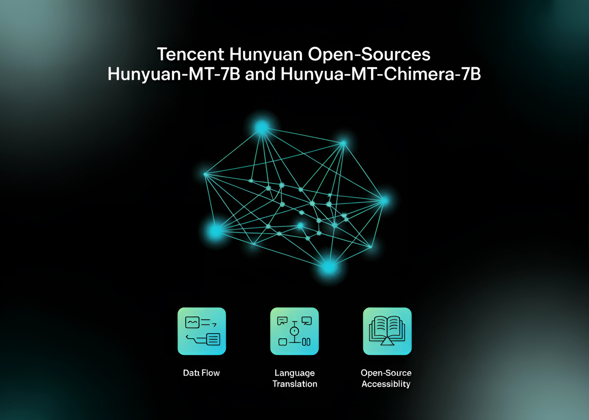

# Tencent Hunyuan Open-Sources Hunyuan-MT-7B and Hunyuan-MT-Chimera-7B: A State-of-the-Art Multilingual Translation Models

> Introduction Tencent’s Hunyuan team has released Hunyuan-MT-7B (a translation model) and Hunyuan-MT-Chimera-7B (an ensemble model). Both models are designed specifically for multilingual machine translation and were introduced in conjunction with Tencent’s participation in the WMT2025 General Machine Translation shared task, where Hunyuan-MT-7B ranked first in 30 out of 31 language pairs. Model Overview Hunyuan-MT-7B Hunyuan-MT-Chimera-7B […]

## Introduction

Tencent’s Hunyuan team has released **Hunyuan-MT-7B** (a translation model) and **Hunyuan-MT-Chimera-7B** (an ensemble model). Both models are designed specifically for multilingual machine translation and were introduced in conjunction with Tencent’s participation in the **WMT2025 General Machine Translation shared task**, where Hunyuan-MT-7B ranked first in **30 out of 31 language pairs**.

*https://github.com/Tencent-Hunyuan/Hunyuan-MT/blob/main/Hunyuan_MT_Technical_Report.pdf*

## Model Overview

### Hunyuan-MT-7B

- A **7B parameter translation model**.

- Supports **mutual translation across 33 languages**, including **Chinese ethnic minority languages** such as Tibetan, Mongolian, Uyghur, and Kazakh.

- Optimized for both **high-resource and low-resource translation tasks**, achieving state-of-the-art results among models of comparable size.

### Hunyuan-MT-Chimera-7B

- An **integrated weak-to-strong fusion model**.

- Combines multiple translation outputs at inference time and produces a refined translation using reinforcement learning and aggregation techniques.

- Represents the **first open-source translation model of this type**, improving translation quality beyond single-system outputs.

*https://github.com/Tencent-Hunyuan/Hunyuan-MT/blob/main/Hunyuan_MT_Technical_Report.pdf*

## Training Framework

The models were trained using a **five-stage framework** designed for translation tasks:

- **General Pre-training**

1.3 trillion tokens covering 112 languages and dialects.

- Multilingual corpora assessed for knowledge value, authenticity, and writing style.

- Diversity maintained through disciplinary, industry, and thematic tagging systems.

- **MT-Oriented Pre-training**

Monolingual corpora from mC4 and OSCAR, filtered using fastText (language ID), minLSH (deduplication), and KenLM (perplexity filtering).

- Parallel corpora from OPUS and ParaCrawl, filtered with CometKiwi.

- Replay of general pre-training data (20%) to avoid catastrophic forgetting.

- **Supervised Fine-Tuning (SFT)**

Stage I: ~3M parallel pairs (Flores-200, WMT test sets, curated Mandarin–minority data, synthetic pairs, instruction-tuning data).

- Stage II: ~268k high-quality pairs selected through automated scoring (CometKiwi, GEMBA) and manual verification.

- **Reinforcement Learning (RL)**

Algorithm: **GRPO**.

- Reward functions:

XCOMET-XXL and DeepSeek-V3-0324 scoring for quality.

- Terminology-aware rewards (TAT-R1).

- Repetition penalties to avoid degenerate outputs.

- **Weak-to-Strong RL**

Multiple candidate outputs generated and aggregated through reward-based output

- Applied in **Hunyuan-MT-Chimera-7B**, improving translation robustness and reducing repetitive errors.

## Benchmark Results

### Automatic Evaluation

- **WMT24pp (English⇔XX)**: Hunyuan-MT-7B achieved **0.8585 (XCOMET-XXL)**, surpassing larger models like Gemini-2.5-Pro (0.8250) and Claude-Sonnet-4 (0.8120).

- **FLORES-200 (33 languages, 1056 pairs)**: Hunyuan-MT-7B scored **0.8758 (XCOMET-XXL)**, outperforming open-source baselines including Qwen3-32B (0.7933).

- **Mandarin⇔Minority Languages**: Scored **0.6082 (XCOMET-XXL)**, higher than Gemini-2.5-Pro (0.5811), showing significant improvements in low-resource settings.

### Comparative Results

- Outperforms **Google Translator** by 15–65% across evaluation categories.

- Outperforms specialized translation models such as **Tower-Plus-9B** and **Seed-X-PPO-7B** despite having fewer parameters.

- **Chimera-7B** adds ~2.3% improvement on FLORES-200, particularly in Chinese⇔Other and non-English⇔non-Chinese translations.

## Human Evaluation

A custom evaluation set (covering social, medical, legal, and internet domains) compared Hunyuan-MT-7B with state-of-the-art models:

- **Hunyuan-MT-7B**: Avg. **3.189**

- **Gemini-2.5-Pro**: Avg. **3.223**

- **DeepSeek-V3**: Avg. **3.219**

- **Google Translate**: Avg. **2.344**

This shows that Hunyuan-MT-7B, despite being smaller at 7B parameters, approaches the quality of much larger proprietary models.

## Case Studies

The report highlights several real-world cases:

- **Cultural References**: Correctly translates “小红薯” as the platform “REDnote,” unlike Google Translate’s “sweet potatoes.”

- **Idioms**: Interprets “You are killing me” as “你真要把我笑死了” (expressing amusement), avoiding literal misinterpretation.

- **Medical Terms**: Translates “uric acid kidney stones” precisely, while baselines generate malformed outputs.

- **Minority Languages**: For Kazakh and Tibetan, Hunyuan-MT-7B produces coherent translations, where baselines fail or output nonsensical text.

- **Chimera Enhancements**: Adds improvements in gaming jargon, intensifiers, and sports terminology.

## Conclusion

Tencent’s release of **Hunyuan-MT-7B** and **Hunyuan-MT-Chimera-7B** establishes a new standard for open-source translation. By combining a carefully designed training framework with specialized focus on **low-resource and minority language translation**, the models achieve quality on par with or exceeding larger closed-source systems. The launch of these 2 models provides the AI research community with accessible, high-performance tools for multilingual translation research and deployment.

---

Check out the **[Paper](https://github.com/Tencent-Hunyuan/Hunyuan-MT/blob/main/Hunyuan_MT_Technical_Report.pdf), [GitHub Page](https://github.com/Tencent-Hunyuan/Hunyuan-MT/), and [Model on Hugging Face](https://huggingface.co/collections/tencent/hunyuan-mt-68b42f76d473f82798882597)_._** All credit for this research goes to the researchers of this project. Feel free to check out our **[GitHub Page for Tutorials, Codes and Notebooks](https://github.com/Marktechpost/AI-Tutorial-Codes-Included)**. Also, feel free to follow us on **[Twitter](https://x.com/intent/follow?screen_name=marktechpost)** and don’t forget to join our **[100k+ ML SubReddit](https://www.reddit.com/r/machinelearningnews/)** and Subscribe to **[our Newsletter](https://www.aidevsignals.com/)**.
