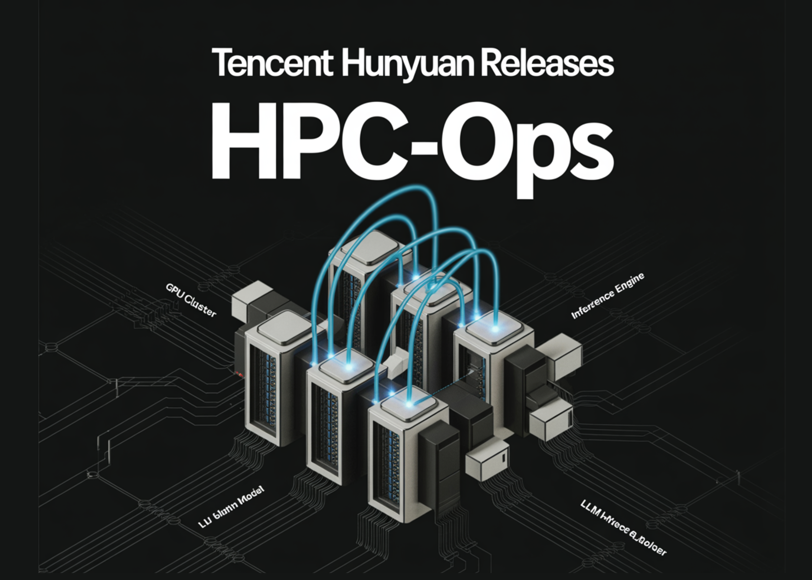

# Tencent Hunyuan Releases HPC-Ops: A High Performance LLM Inference Operator Library

> Tencent Hunyuan has open sourced HPC-Ops, a production grade operator library for large language model inference architecture devices. HPC-Ops focuses on low level CUDA kernels for core operators such as Attention, Grouped GEMM, and Fused MoE, and exposes them through a compact-C and Python API for integration into existing inference stacks. HPC-Ops runs in large […]

Tencent Hunyuan has open sourced [HPC-Ops](https://github.com/Tencent/hpc-ops), a production grade operator library for large language model inference architecture devices. HPC-Ops focuses on low level CUDA kernels for core operators such as Attention, Grouped GEMM, and Fused MoE, and exposes them through a compact-C and Python API for integration into existing inference stacks.

HPC-Ops runs in large scale internal services. In those deployments it delivers about 30 percent queries per minute improvement for Tencent-HY models and about 17 percent improvement for DeepSeek models on mainstream inference cards. These gains are reported at the service level, so they reflect the cumulative effect of faster kernels inside a real inference pipeline.

### Scope and design of HPC-Ops

HPC-Ops is a production grade, high performance, and easy to use operator library for LLM inference, developed by the Tencent Hunyuan AI Infra team. The project does not try to replace serving frameworks. Instead it provides kernels and clean APIs that can be called from systems that already handle scheduling, KV cache management, batching, and transport.

The API is designed for seamless use inside popular inference frameworks such as vLLM and SGLang. That means the framework team can swap in HPC-Ops kernels behind their own abstractions without changing the external behavior of their servers.

HPC-Ops uses C++ and CUDA with CuTe and CUTLASS as building blocks. Kernels are written as relatively small examples that also serve as a modern CUDA tutorial.

### Kernel performance characteristics

The project publishes maximum observed speedup numbers for each operator relative to established baselines. These are microbenchmarks, and the research team stress that performance varies across shapes and workloads, but they show the optimization ceiling.

For Attention in bf16, compared with FlashInfer, FlashAttention two, FlashAttention three, and TensorRT LLM, HPC Ops reports up to 1.33 times speedup in prefill and up to 2.22 times in decode. For Attention in fp8, compared with FlashInfer, FlashAttention three, and TensorRT LLM, it reports up to 1.12 times in prefill and up to 2.0 times in decode.

For FusedMoE fp8, compared with TensorRT LLM and vLLM, maximum observed speedup is up to 1.49 times in prefill and 1.14 times in decode. For GroupGEMM fp8, compared with DeepGEMM, the reported gains are up to 1.1 times in prefill and 1.88 times in decode.

These numbers matter because decode is usually the latency bottleneck in autoregressive generation, where batch sizes shrink and memory traffic dominates. The fact that Attention and GroupGEMM show the largest relative gains in decode suggests that HPC-Ops focuses on the part of the pipeline that most users notice.

### Supported kernels and precision

**The current release groups its functionality into three operator families:**

- Attention kernels cover both prefill and decode and include support for paged attention. Paged attention is the memory layout that frameworks like vLLM use to place key and value cache blocks in a paged structure, which improves memory reuse for long sequences.

- Grouped GEMM is implemented as quantized GroupGEMM with fp8 weights. HPC-Ops supports block wise and per tensor scaling, so teams can trade off quantization granularity against parameter storage and calibration cost.

- Fused-MoE combines mixture of experts routing and expert computation in a single quantized operator. It also uses fp8 expert weights and supports block wise and per tensor scaling strategies.

Across these kernels, HPC-Ops provides native support for bf16 and fp8 data types. That matches the current production trend to move inference toward lower precision formats that preserve accuracy while reducing memory bandwidth and improving tensor core utilization.

### Key Takeaways

- Tencent Hunyuan open-sourced HPC-Ops as a production grade operator library for LLM inference on NVIDIA SM90 GPUs, including H20, with C++ and CUDA kernels built on CuTe and CUTLASS.

- In production deployments HPC-Ops reports about 30 percent QPM gain for Tencent-HY models and about 17 percent QPM gain for DeepSeek models on mainstream inference cards.

- Operator microbenchmarks show maximum speedups up to 2.22 times for bf16 Attention decode, up to 2.0 times for fp8 Attention decode, up to 1.49 times for fp8 FusedMoE prefill, and up to 1.88 times for fp8 GroupGEMM decode compared with strong baselines like FlashInfer, FlashAttention, TensorRT LLM, and DeepGEMM.

- The library focuses on three operator families, Attention with paged attention support, quantized GroupGEMM with fp8 weights, and quantized Fused MoE with fp8 expert weights, with both block wise and per tensor scaling, and native bf16 plus fp8 precision support.

- HPC-Ops is designed as an operator layer that integrates into existing inference frameworks such as vLLM and SGLang, and the roadmap targets sparse attention for long context LLMs, extended quantization including 4 bit and 8 bit strategies, and kernels that better overlap computation with multi GPU communication.

---

Check out the **[Repo here](https://github.com/Tencent/hpc-ops)**. Also, feel free to follow us on **[Twitter](https://x.com/intent/follow?screen_name=marktechpost)** and don’t forget to join our **[100k+ ML SubReddit](https://www.reddit.com/r/machinelearningnews/)** and Subscribe to **[our Newsletter](https://www.aidevsignals.com/)**. Wait! are you on telegram? **[now you can join us on telegram as well.](https://t.me/machinelearningresearchnews)**
