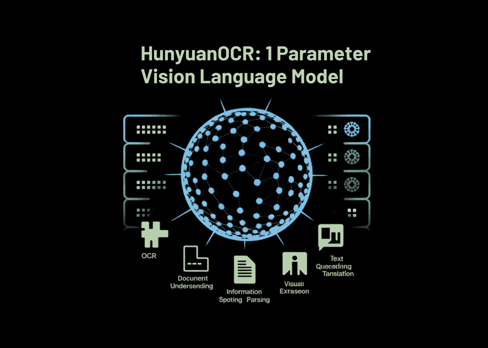

# Tencent Hunyuan Releases HunyuanOCR: a 1B Parameter End to End OCR Expert VLM

> Tencent Hunyuan has released HunyuanOCR, a 1B parameter vision language model that is specialized for OCR and document understanding. The model is built on Hunyuan’s native multimodal architecture and runs spotting, parsing, information extraction, visual question answering, and text image translation through a single end to end pipeline. HunyuanOCR is a lightweight alternative to general […]

Tencent Hunyuan has released HunyuanOCR, a 1B parameter vision language model that is specialized for OCR and document understanding. The model is built on Hunyuan’s native multimodal architecture and runs spotting, parsing, information extraction, visual question answering, and text image translation through a single end to end pipeline.

HunyuanOCR is a lightweight alternative to general VLMs such as Gemini 2.5 and Qwen3 VL that still matches or surpasses them on OCR centric tasks. It targets production use cases like document parsing, card and receipt extraction, video subtitle extraction, and multilingual document translation.

*https://github.com/Tencent-Hunyuan/HunyuanOCR/blob/main/HunyuanOCR_Technical_Report.pdf*

### Architecture, Native Resolution ViT plus Lightweight LLM

HunyuanOCR uses **3 main modules**, a Native Resolution Visual Encoder called Hunyuan ViT, an Adaptive MLP Connector, and a Lightweight Language Model. The encoder is based on SigLIP-v2-400M and is extended to support arbitrary input resolutions through adaptive patching that preserves the original aspect ratio. Images are split into patches according to their native proportions and processed with global attention, which improves recognition on long text lines, long documents, and low quality scans.

The Adaptive MLP Connector performs learnable pooling on the spatial dimension. It compresses the dense visual tokens into a shorter sequence, while keeping information from text dense regions. This reduces sequence length passed to the language model and lowers compute, while preserving OCR relevant details.

The language model is based on the densely architected Hunyuan 0.5B model and uses XD RoPE. XD RoPE splits rotary position embeddings into 4 subspaces for text, height, width, and time. This gives the model a native way to align 1D token order with 2D layout and 3D spatiotemporal structure. As a result, the same stack can handle multi column pages, cross page flows, and sequences of video frames.

Training and inference follow a fully end to end paradigm. There is no external layout analysis or post processing model in the loop. All tasks are expressed as natural language prompts and handled in a single forward pass. This design removes error propagation across pipeline stages and simplifies deployment.

### Data and Pre Training Recipe

The data pipeline builds more than 200M image text pairs, across 9 real world scenarios, including street views, documents, advertisements, handwritten text, screenshots, cards and certificates and invoices, game interfaces, video frames, and artistic typography. The corpus covers more than 130 languages.

Synthetic data comes from a multilingual generator that supports right to left scripts and paragraph level rendering. The pipeline controls font, language, rotation, and RGB values, and applies warping, blur, and local lighting changes to simulate mobile captures and other hard conditions.

*https://github.com/Tencent-Hunyuan/HunyuanOCR/blob/main/HunyuanOCR_Technical_Report.pdf*

Pre training follows 4 stages. Stage-1 performs vision language alignment with pure text, synthetic parsing and recognition data, and general caption data, using 50B tokens and 8k context. Stage-2 runs multimodal pre training on 300B tokens that mix pure text with synthetic spotting, parsing, translation, and VQA samples. Stage-3 extends context length to 32k with 80B tokens focused on long documents and long text. Stage-4 is application oriented supervised fine tuning on 24B tokens of human annotated and hard negative data, keeping 32k context and unified instruction templates.

### Reinforcement Learning with Verifiable Rewards

After supervised training, HunyuanOCR is further optimized with reinforcement learning. The research team use Group Relative Policy Optimization GRPO and a Reinforcement Learning with Verifiable Rewards setup for structured tasks. For text spotting, the reward is based on intersection over union matching of boxes combined with normalized edit distance over text. For document parsing, the reward uses normalized edit distance between the generated structure and the reference.

For VQA and translation, the system uses an LLM as a judge. VQA uses a binary reward that checks semantic match. Translation uses a COMET style scoring LLM with scores in [0, 5], normalized to [0, 1]. The training framework enforces length limits and strict formats, and assigns zero reward when outputs overflow or break schema, which stabilizes optimization and encourages valid JSON or structured outputs.

### Benchmark Results, a 1B Model Competing with Larger VLMs

On the internal text spotting benchmark of 900 images across 9 categories, HunyuanOCR reaches an overall score of 70.92. It outperforms traditional pipeline methods like PaddleOCR and BaiduOCR and also general VLMs such as Gemini 2.5 Pro, Qwen3 VL 2B, Qwen3 VL 235B, and Seed 1.6 Vision, despite using far fewer parameters.

On OmniDocBench, HunyuanOCR achieves 94.10 overall, with 94.73 on formulas and 91.81 on tables. On the Wild OmniDocBench variant, which prints and recaptures documents under folds and lighting changes, it scores 85.21 overall. On DocML, a multilingual parsing benchmark across 14 non Chinese and non English languages, it reaches 91.03, and the paper reports state of the art results across all 14 languages.

For information extraction and VQA, HunyuanOCR reaches 92.29 accuracy on cards, 92.53 on receipts, and 92.87 on video subtitles. On OCRBench, it scores 860, higher than DeepSeek OCR at similar scale and close to larger general VLMs like Qwen3 VL 2B Instruct and Gemini 2.5 Pro.

In text image translation, HunyuanOCR uses the DoTA benchmark and a DocML based internal set. It achieves a strong COMET score on DoTA for English to Chinese document translation, and the model wins first place in Track 2.2 OCR free Small Model of the ICDAR 2025 DIMT competition.

*https://github.com/Tencent-Hunyuan/HunyuanOCR/blob/main/HunyuanOCR_Technical_Report.pdf*

### Key Takeaways

- **Compact end to end OCR VLM**: HunyuanOCR is a 1B parameter OCR focused vision language model that connects a 0.4B native resolution ViT to a 0.5B Hunyuan language model through an MLP adapter, and runs spotting, parsing, information extraction, VQA and translation in one end to end instruction driven pipeline without external layout or detection modules.

- **Unified support for diverse OCR scenarios**: The model is trained on more than 200M image text pairs across 9 scenarios, including documents, street views, advertisements, handwritten content, screenshots, cards and invoices, game interfaces and video frames, with coverage of over 130 languages in training and support for more than 100 languages in deployment.

- **Data pipeline plus reinforcement learning**: Training uses a 4 stage recipe, vision language alignment, multimodal pre training, long context pre training and application oriented supervised fine tuning, followed by reinforcement learning with group relative policy optimization and verifiable rewards for spotting, parsing, VQA and translation.

- **Strong benchmark results for sub 3B models**HunyuanOCR reaches 94.1 on OmniDocBench for document understanding, and achieves 860 on OCRBench, which is reported as state of the art among vision language models with fewer than 3B parameters, while also outperforming several commercial OCR APIs and larger open models such as Qwen3 VL 4B on core OCR benchmarks.

### Editorial Notes

HunyuanOCR is a strong signal that OCR specific VLMs are maturing into practical infrastructure, not just benchmarks. Tencent combines a 1B parameter end to end architecture with Native Vision Transformer, Adaptive MLP Connector and RL with verifiable rewards to deliver a single model that covers spotting, parsing, IE, VQA and translation across more than 100 languages, and it does so while reaching leading scores on OCRBench for sub 3B models and 94.1 on OmniDocBench. Overall, HunyuanOCR marks an important shift toward compact, instruction driven OCR engines that are realistic for production deployment.

---

Check out the **[Paper](https://github.com/Tencent-Hunyuan/HunyuanOCR/blob/main/HunyuanOCR_Technical_Report.pdf), [Model weight](https://huggingface.co/tencent/HunyuanOCR) and [Repo](https://github.com/Tencent-Hunyuan/HunyuanOCR)**. Feel free to check out our **[GitHub Page for Tutorials, Codes and Notebooks](https://github.com/Marktechpost/AI-Tutorial-Codes-Included)**. Also, feel free to follow us on **[Twitter](https://x.com/intent/follow?screen_name=marktechpost)** and don’t forget to join our **[100k+ ML SubReddit](https://www.reddit.com/r/machinelearningnews/)** and Subscribe to **[our Newsletter](https://www.aidevsignals.com/)**. Wait! are you on telegram? **[now you can join us on telegram as well.](https://t.me/machinelearningresearchnews)**
