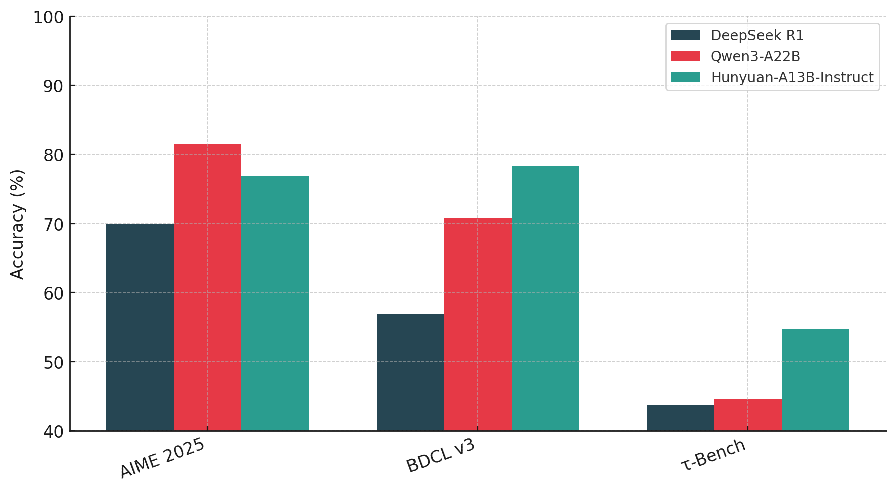

# Tencent Open Sources Hunyuan-A13B: A 13B Active Parameter MoE Model with Dual-Mode Reasoning and 256K Context

> Tencent’s Hunyuan team has introduced Hunyuan-A13B, a new open-source large language model built on a sparse Mixture-of-Experts (MoE) architecture. While the model consists of 80 billion total parameters, only 13 billion are active during inference, offering a highly efficient balance between performance and computational cost. It supports Grouped Query Attention (GQA), 256K context length, and […]

Tencent’s Hunyuan team has introduced **Hunyuan-A13B**, a new open-source [large language model](https://www.marktechpost.com/2025/01/11/what-are-large-language-model-llms/) built on a sparse **Mixture-of-Experts (MoE)** architecture. While the model consists of 80 billion total parameters, only 13 billion are active during inference, offering a highly efficient balance between performance and computational cost. It supports **Grouped Query Attention (GQA)**, **256K context length**, and a **dual-mode reasoning framework** that toggles between fast and slow thinking.

Designed for efficient deployment and robust reasoning, Hunyuan-A13B achieves top-tier performance across agentic benchmarks including **BFCL-v3**, **τ-Bench**, **C3-Bench**, and **ComplexFuncBench**, often outperforming larger models in tool-calling and long-context scenarios.

### Architecture: Sparse MoE with 13B Active Parameters

At its core, Hunyuan-A13B follows a fine-grained MoE design comprising **1 shared expert** and **64 non-shared experts**, with **8 experts activated per forward pass**. This architecture, backed by scaling experiments, ensures performance consistency while keeping inference costs low. The model includes 32 layers, uses **SwiGLU** activations, a vocabulary size of 128K, and integrates GQA for enhanced memory efficiency during long-context inference.

The model’s MoE setup is paired with an optimized **training curriculum**: a 20T-token pretraining phase, followed by fast annealing and long-context adaptation. This last phase scales the context window first to 32K and then to 256K tokens using NTK-aware positional encoding, ensuring stable performance at large sequence lengths.

### Dual-Mode Reasoning: Fast and Slow Thinking

A standout feature of Hunyuan-A13B is its **dual-mode Chain-of-Thought (CoT)** capability. It supports both a low-latency **fast-thinking** mode for routine queries and a more elaborate **slow-thinking** mode for multi-step reasoning. These modes are controlled through a simple tag system: `/no think` for fast inference and `/think` for reflective reasoning. This flexibility allows users to adapt computational cost to task complexity.

### Post-Training: Reinforcement Learning with Task-Specific Reward Models

The post-training pipeline of Hunyuan-A13B includes **multi-stage supervised fine-tuning (SFT)** and **reinforcement learning (RL)** across both reasoning-specific and general tasks. The RL stages incorporate **outcome-based rewards** and **tool-specific feedback**, including sandbox execution environments for code and rule-based checks for agents.

In the agent training phase, the team synthesized diverse tool-use scenarios with planner, checker, and tool roles, generating over **20,000 format combinations**. This reinforced Hunyuan-A13B’s ability to execute real-world workflows such as spreadsheet processing, information search, and structured reasoning.

### Evaluation: State-of-the-Art Agentic Performance

Hunyuan-A13B shows **strong benchmark results** across diverse NLP tasks:

- On **MATH**, **CMATH**, and **GPQA**, it scores on par or above larger dense and MoE models.

- It surpasses **Qwen3-A22B** and **DeepSeek R1** in **logical reasoning** (BBH: 89.1; ZebraLogic: 84.7).

- In coding, it holds its own with 83.9 on MBPP and 69.3 on MultiPL-E.

- For **agent tasks**, it leads on **BFCL-v3 (78.3)** and **ComplexFuncBench (61.2)**, validating its tool-usage capabilities.

Long-context comprehension is another highlight. On **PenguinScrolls**, it scores 87.7—just shy of Gemini 2.5 Pro. On **RULER**, it sustains high performance (73.9) even at **64K–128K context**, outperforming larger models like Qwen3-A22B and DeepSeek R1 in context resilience.

### Inference Optimization and Deployment

Hunyuan-A13B is fully integrated with popular inference frameworks like **vLLM**, **SGLang**, and **TensorRT-LLM**. It supports precision formats such as **W16A16**, **W8A8**, and **KV Cache FP8**, along with features like **Auto Prefix Caching** and **Chunk Prefill**. It achieves up to **1981.99 tokens/sec** throughput on a 32-batch input (2048 input, 14336 output length), making it practical for real-time applications.

### Open Source and Industry Relevance

Available on [Hugging Face](https://huggingface.co/tencent/Hunyuan-A13B-Instruct) and [GitHub](https://github.com/Tencent-Hunyuan/Hunyuan-A13B), Hunyuan-A13B is released with permissive open-source licensing. It’s engineered for efficient research and production use, especially in latency-sensitive environments and long-context tasks.

By combining **MoE scalability**, **agentic reasoning**, and **open-source accessibility**, Tencent’s Hunyuan-A13B offers a compelling alternative to heavyweight LLMs, enabling broader experimentation and deployment without sacrificing capability.

---

Check out the** _[Paper](https://github.com/Tencent-Hunyuan/Hunyuan-A13B/blob/main/report/Hunyuan_A13B_Technical_Report.pdf)._** All credit for this research goes to the researchers of this project. Also, feel free to follow us on **[Twitter](https://x.com/intent/follow?screen_name=marktechpost)** and don’t forget to join our **[100k+ ML SubReddit](https://www.reddit.com/r/machinelearningnews/)** and Subscribe to **[our Newsletter](https://www.airesearchinsights.com/subscribe)**.
