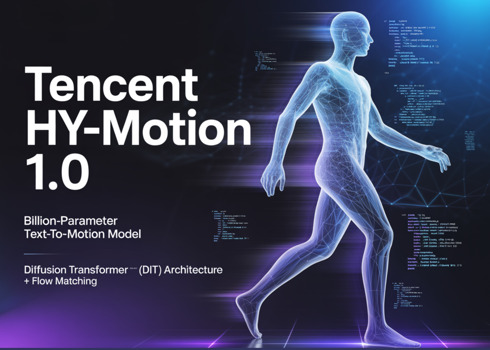

# Tencent Released Tencent HY-Motion 1.0: A Billion-Parameter Text-to-Motion Model Built on the Diffusion Transformer (DiT) Architecture and Flow Matching

> Tencent Hunyuan’s 3D Digital Human team has released HY-Motion 1.0, an open weight text-to-3D human motion generation family that scales Diffusion Transformer based Flow Matching to 1B parameters in the motion domain. The models turn natural language prompts plus an expected duration into 3D human motion clips on a unified SMPL-H skeleton and are available […]

Tencent Hunyuan’s 3D Digital Human team has released HY-Motion 1.0, an open weight text-to-3D human motion generation family that scales Diffusion Transformer based Flow Matching to 1B parameters in the motion domain. The models turn natural language prompts plus an expected duration into 3D human motion clips on a unified SMPL-H skeleton and are available on GitHub and Hugging Face with code, checkpoints and a Gradio interface for local use.

*https://arxiv.org/pdf/2512.23464*

### What HY-Motion 1.0 provides for developers?

HY-Motion 1.0 is a series of text-to-3D human motion generation models built on a Diffusion Transformer, DiT, trained with a Flow Matching objective. The model series showcases 2 variants, HY-Motion-1.0 with 1.0B parameters as the standard model and HY-Motion-1.0-Lite with 0.46B parameters as a lightweight option.

Both models generate skeleton based 3D character animations from simple text prompts. The output is a motion sequence on an SMPL-H skeleton that can be integrated into 3D animation or game pipelines, for example for digital humans, cinematics and interactive characters. The release includes inference scripts, a batch oriented CLI and a Gradio web app, and supports macOS, Windows and Linux.

### Data engine and taxonomy

The training data comes from 3 sources, in the wild human motion videos, motion capture data and 3D animation assets for game production. The research team starts from 12M high quality video clips from HunyuanVideo, runs shot boundary detection to split scenes and a human detector to keep clips with people, then applies the GVHMR algorithm to reconstruct SMPL X motion tracks. Motion capture sessions and 3D animation libraries contribute about 500 hours of additional motion sequences.

All data is retargeted onto a unified SMPL-H skeleton through mesh fitting and retargeting tools. A multi stage filter removes duplicate clips, abnormal poses, outliers in joint velocity, anomalous displacements, long static segments and artifacts such as foot sliding. Motions are then canonicalized, resampled to 30 fps and segmented into clips shorter than 12 seconds with a fixed world frame, Y axis up and the character facing the positive Z axis. The final corpus contains over 3,000 hours of motion, of which 400 hours are high quality 3D motion with verified captions.

On top of this, the research team defines a 3 level taxonomy. At the top level there are 6 classes, Locomotion, Sports and Athletics, Fitness and Outdoor Activities, Daily Activities, Social Interactions and Leisure and Game Character Actions. These expand into more than 200 fine grained motion categories at the leaves, which cover both simple atomic actions and concurrent or sequential motion combinations.

### Motion representation and HY-Motion DiT

HY-Motion 1.0 uses the SMPL-H skeleton with 22 body joints without hands. Each frame is a 201 dimensional vector that concatenates global root translation in 3D space, global body orientation in a continuous 6D rotation representation, 21 local joint rotations in 6D form and 22 local joint positions in 3D coordinates. Velocities and foot contact labels are removed because they slowed training and did not help final quality. This representation is compatible with animation workflows and close to the DART model representation.

The core network is a hybrid HY Motion DiT. It first applies dual stream blocks that process motion latents and text tokens separately. In these blocks, each modality has its own QKV projections and MLP, and a joint attention module allows motion tokens to query semantic features from text tokens while keeping modality specific structure. The network then switches to single stream blocks that concatenate motion and text tokens into one sequence and process them with parallel spatial and channel attention modules to perform deeper multimodal fusion.

For text conditioning, the system uses a dual encoder scheme. Qwen3 8B provides token level embeddings, while a CLIP-L model provides global text features. A Bidirectional Token Refiner fixes the causal attention bias of the LLM for non autoregressive generation. These signals feed the DiT through adaptive layer normalization conditioning. Attention is asymmetric, motion tokens can attend to all text tokens, but text tokens do not attend back to motion, which prevents noisy motion states from corrupting the language representation. Temporal attention inside the motion branch uses a narrow sliding window of 121 frames, which focuses capacity on local kinematics while keeping cost manageable for long clips. Full Rotary Position Embedding is applied after concatenating text and motion tokens to encode relative positions across the whole sequence.

### Flow Matching, prompt rewriting and training

HY-Motion 1.0 uses Flow Matching instead of standard denoising diffusion. The model learns a velocity field along a continuous path that interpolates between Gaussian noise and real motion data. During training, the objective is a mean squared error between predicted and ground truth velocities along this path. During inference, the learned ordinary differential equation is integrated from noise to a clean trajectory, which gives stable training for long sequences and fits the DiT architecture.

A separate Duration Prediction and Prompt Rewrite module improves instruction following. It uses Qwen3 30B A3B as the base model and is trained on synthetic user style prompts generated from motion captions with a VLM and LLM pipeline, for example Gemini 2.5 Pro. This module predicts a suitable motion duration and rewrites informal prompts into normalized text that is easier for the DiT to follow. It is trained first with supervised fine tuning and then refined with Group Relative Policy Optimization, using Qwen3 235B A22B as a reward model that scores semantic consistency and duration plausibility.

Training follows a 3 stage curriculum. Stage 1 performs large scale pretraining on the full 3,000 hour dataset to learn a broad motion prior and basic text motion alignment. Stage 2 fine tunes on the 400 hour high quality set to sharpen motion detail and improve semantic correctness with a smaller learning rate. Stage 3 applies reinforcement learning, first Direct Preference Optimization using 9,228 curated human preference pairs sampled from about 40,000 generated pairs, then Flow GRPO with a composite reward. The reward combines a semantic score from a Text Motion Retrieval model and a physics score that penalizes artifacts like foot sliding and root drift, under a KL regularization term to stay close to the supervised model.

### Benchmarks, scaling behavior and limitations

For evaluation, the team builds a test set of over 2,000 prompts that span the 6 taxonomy categories and include simple, concurrent and sequential actions. Human raters score instruction following and motion quality on a scale from 1 to 5. HY-Motion 1.0 reaches an average instruction following score of 3.24 and an SSAE score of 78.6 percent. Baseline text-to-motion systems such as DART, LoM, GoToZero and MoMask achieve scores between 2.17 and 2.31 with SSAE between 42.7 percent and 58.0 percent. For motion quality, HY-Motion 1.0 reaches 3.43 on average versus 3.11 for the best baseline.

Scaling experiments study DiT models with 0.05B, 0.46B, 0.46B trained only on 400 hours and 1B parameters. Instruction following improves steadily with model size, with the 1B model reaching an average of 3.34. Motion quality saturates around the 0.46B scale, where the 0.46B and 1B models reach similar averages between 3.26 and 3.34. Comparison of the 0.46B model trained on 3,000 hours and the 0.46B model trained only on 400 hours shows that larger data volume is key for instruction alignment, while high quality curation mainly improves realism.

### Key Takeaways

- **Billion scale DiT Flow Matching for motion**: HY-Motion 1.0 is the first Diffusion Transformer based Flow Matching model scaled to the 1B parameter level specifically for text to 3D human motion, targeting high fidelity instruction following across diverse actions.

- **Large scale, curated motion corpus**: The model is pretrained on over 3,000 hours of reconstructed, mocap and animation motion data and fine tuned on a 400 hour high quality subset, all retargeted to a unified SMPL H skeleton and organized into more than 200 motion categories.

- **Hybrid DiT architecture with strong text conditioning**: HY-Motion 1.0 uses a hybrid dual stream and single stream DiT with asymmetric attention, narrow band temporal attention and dual text encoders, Qwen3 8B and CLIP L, to fuse token level and global semantics into motion trajectories.

- **RL aligned prompt rewrite and training pipeline**: A dedicated Qwen3 30B based module predicts motion duration and rewrites user prompts, and the DiT is further aligned with Direct Preference Optimization and Flow GRPO using semantic and physics rewards, which improves realism and instruction following beyond supervised training.

---

Check out the **[Paper](https://arxiv.org/pdf/2512.23464)** and [**Full Codes here**.](https://github.com/Tencent-Hunyuan/HY-Motion-1.0) Also, feel free to follow us on **[Twitter](https://x.com/intent/follow?screen_name=marktechpost)** and don’t forget to join our **[100k+ ML SubReddit](https://www.reddit.com/r/machinelearningnews/)** and Subscribe to **[our Newsletter](https://www.aidevsignals.com/)**. Wait! are you on telegram? **[now you can join us on telegram as well.](https://t.me/machinelearningresearchnews)**
