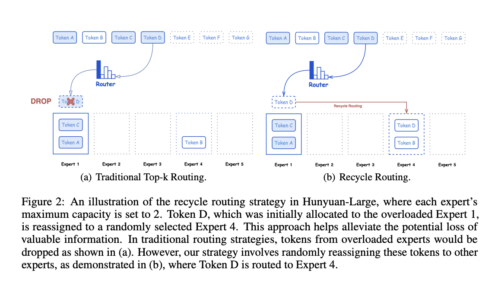

# Tencent Releases Hunyuan-Large (Hunyuan-MoE-A52B) Model: A New Open-Source Transformer-based MoE Model with a Total of 389 Billion Parameters and 52 Billion Active Parameters

> Large language models (LLMs) have become the backbone of many AI systems, contributing significantly to advancements in natural language processing (NLP), computer vision, and even scientific research. However, these models come with their own set of challenges. As the demand for better AI capabilities increases, so does the need for more sophisticated and larger models. […]

Large language models (LLMs) have become the backbone of many AI systems, contributing significantly to advancements in natural language processing (NLP), computer vision, and even scientific research. However, these models come with their own set of challenges. As the demand for better AI capabilities increases, so does the need for more sophisticated and larger models. The size and computational requirements of LLMs make training and inference costly, leading researchers to explore more efficient architectures. One solution that has gained popularity is the Mixture of Experts (MoE) model, which enhances performance through selective activation of specialized components. Despite its promise, very few large-scale MoE models have been open-sourced for community use, limiting innovation and practical applications.

Tencent has taken a significant step forward by releasing Hunyuan-Large, which is claimed to be the largest open Transformer-based MoE model currently available in the industry. With a total of 389 billion parameters, of which 52 billion are active, Hunyuan-Large is designed to handle extremely large contexts of up to 256K tokens. This model features an unprecedented combination of cutting-edge techniques to tackle NLP and general AI tasks, rivaling and, in some cases, outperforming other leading models such as LLama3.1-70B and LLama3.1-405B. Tencent’s contribution is vital for the AI community, as it provides a resource that combines high performance with scalability, helping both industry professionals and researchers push the boundaries of AI capabilities.

Hunyuan-Large achieves its impressive performance through a variety of technical advancements. The model is pre-trained on seven trillion tokens, including 1.5 trillion tokens of synthetic data that improve learning across diverse fields like mathematics, coding, and multilinguality. This vast and diverse data enables the model to generalize effectively, outperforming other models of comparable sizes. The use of a mixed expert routing strategy, combined with innovations like key-value (KV) cache compression and an expert-specific learning rate, sets Hunyuan-Large apart in terms of efficiency. The KV cache compression reduces memory overhead during inference, making it possible to efficiently scale the model while retaining high-quality responses. Additionally, the expert-specific learning rate allows different model components to train more optimally, balancing the load between shared and specialized experts.

The release of Hunyuan-Large is significant for a number of reasons. Not only does it present an opportunity to work with a truly large-scale MoE model, but it also comes with an open-source codebase and pre-trained checkpoints, making it accessible for further research and development. Benchmarks show that Hunyuan-Large outperforms existing models on key NLP tasks such as question answering, logical reasoning, coding, and reading comprehension. For instance, it surpasses the LLama3.1-405B model on the MMLU benchmark with a score of 88.4 compared to LLama’s 85.2. This achievement highlights the efficiency of Hunyuan-Large’s training and architecture, despite having fewer active parameters. By excelling in tasks that require long-context understanding, Hunyuan-Large also addresses a crucial gap in current LLM capabilities, making it particularly useful for applications that need to handle extended sequences of text.

Tencent’s Hunyuan-Large is a milestone in the development of Transformer-based MoE models. With 389 billion parameters and technical enhancements like KV cache compression and expert-specific learning rates, it provides the AI community with a powerful tool for further research and applications. The release of this model represents a step toward making large-scale AI more accessible and capable, driving innovation in various fields.

---

Check out the** [Paper](https://arxiv.org/pdf/2411.02265)**, **[Code](https://github.com/Tencent/Tencent-Hunyuan-Large)**, and **[Models](https://huggingface.co/tencent/Tencent-Hunyuan-Large)**. All credit for this research goes to the researchers of this project. Also, don’t forget to follow us on **[Twitter](https://twitter.com/Marktechpost)** and join our **[Telegram Channel](https://pxl.to/at72b5j)** and [**LinkedIn Gr**](https://www.linkedin.com/groups/13668564/)[**oup**](https://www.linkedin.com/groups/13668564/). **If you like our work, you will love our**[** newsletter..**](https://marktechpost-newsletter.beehiiv.com/subscribe) Don’t Forget to join our **[55k+ ML SubReddit](https://www.reddit.com/r/machinelearningnews/)**.

**[[Sponsorship Opportunity with us](https://95xaxi6d7td.typeform.com/to/jhs8ftBd)] ****[Promote Your Research/Product/Webinar with 1Million+ Monthly Readers and 500k+ Community Members](https://95xaxi6d7td.typeform.com/to/jhs8ftBd)**
