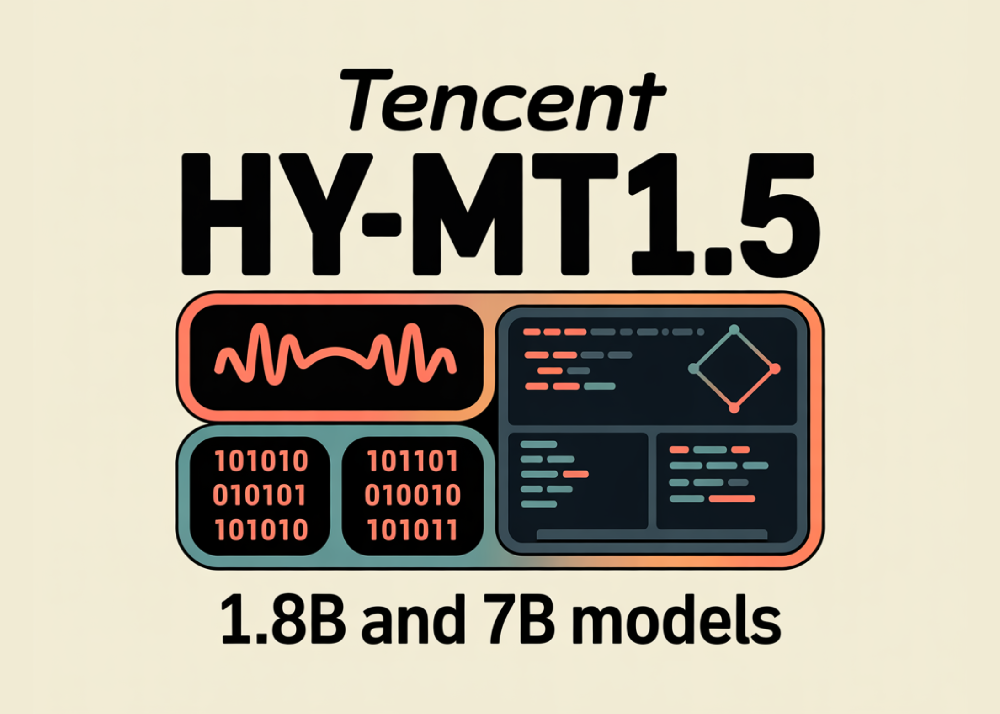

# Tencent Researchers Release Tencent HY-MT1.5: A New Translation Models Featuring 1.8B and 7B Models Designed for Seamless on-Device and Cloud Deployment

> Tencent Hunyuan researchers have released HY-MT1.5, a multilingual machine translation family that targets both mobile devices and cloud systems with the same training recipe and metrics. HY-MT1.5 consists of 2 translation models, HY-MT1.5-1.8B and HY-MT1.5-7B, supports mutual translation across 33 languages with 5 ethnic and dialect variations, and is available on GitHub and Hugging Face […]

Tencent Hunyuan researchers have released HY-MT1.5, a multilingual machine translation family that targets both mobile devices and cloud systems with the same training recipe and metrics. HY-MT1.5 consists of 2 translation models, HY-MT1.5-1.8B and HY-MT1.5-7B, supports mutual translation across 33 languages with 5 ethnic and dialect variations, and is available on GitHub and Hugging Face under open weights.

### Model family and deployment targets

HY-MT1.5-7B is an upgraded version of the WMT25 championship system Hunyuan-MT-7B. It is optimized for explanatory translation and mixed language scenarios, and adds native support for terminology intervention, contextual translation and formatted translation.

HY-MT1.5-1.8B is the compact variant. It has less than one third the parameters of HY-MT1.5-7B but delivers comparable translation performance in the reported benchmarks. After quantization, the 1.8B model can run on edge devices and support real time translation.

The quantized HY-MT1.5-1.8B operates on devices with about 1 GB of memory and reaches an average response time of about 0.18 seconds for Chinese inputs of around 50 tokens, while surpassing mainstream commercial translation APIs in quality. HY-MT1.5-7B targets server and high end edge deployment, where latency around 0.45 seconds is acceptable in exchange for higher quality.

### Holistic training framework

The research team defines HY-MT1.5 as a translation specific language model trained with a multi stage pipeline.

**The pipeline has 5 main components:**

- **General pre training**: The base model is first pre-trained on large scale multilingual text with a language modeling objective. This builds shared representations across languages.

- **MT oriented pre training**: The model is then exposed to parallel corpora and translation oriented objectives. This step aligns the generation distribution with real translation tasks rather than open ended text generation.

- **Supervised fine tuning**: High quality sentence and document level parallel data is used to fine tune the model with supervised loss. This stage sharpens literal correctness, domain coverage and direction specific behavior, such as ZH to EN versus EN to ZH.

- **On policy distillation from 7B to 1.8B**: HY-MT1.5-7B is used as a teacher for HY-MT1.5-1.8B. The research team collects about 1 million monolingual prompts across the 33 languages, runs them through the teacher and uses reverse Kullback Leibler divergence on the student rollouts to match the teacher distribution. This yields a 1.8B student that inherits most of the 7B model’s translation behavior with much lower cost.

- **Reinforcement learning with rubrics based evaluation**: In the final stage, both models are optimized with a group relative policy optimization style algorithm and a rubrics based reward model. Human reviewers score translations on multiple axes such as accuracy, fluency, idiomaticity and cultural appropriateness. The reward model distills those scores and guides the policy update.

This pipeline is specific to machine translation. It differs from chat oriented LLM training by combining translation centric supervised data, on policy distillation within the translation domain and RL tuned with fine grained translation rubrics.

### Benchmark results against open and commercial systems

HY-MT1.5 is evaluated on Flores 200, WMT25 and a Mandarin to minority language benchmark using XCOMET-XXL and CometKiwi.

*https://arxiv.org/pdf/2512.24092v1*

**Key results from the above Table in the report:**

- On Flores 200, HY-MT1.5-7B reaches XCOMET-XXL scores of 0.8690 for ZH to XX, 0.9093 for EN to XX and 0.8098 for XX to XX. It outperforms translation specialized models such as iFLYTEK Translator and Doubao Translator and matches or exceeds medium sized general models like Qwen3-235B-A22B.

- On WMT25, HY-MT1.5-7B reaches XCOMET-XXL 0.6159. This is about 0.065 higher than Gemini 3.0 Pro and significantly above translation oriented models such as Seed-X-PPO-7B and Tower-Plus-72B. HY-MT1.5-1.8B scores 0.5308, which still exceeds many medium sized general models and translation systems.

- On Mandarin to minority language pairs, HY-MT1.5-7B achieves 0.6174 in XCOMET-XXL, higher than all baselines including Gemini 3.0 Pro. The 1.8B variant reaches 0.5806 and still surpasses several very large models like DeepSeek-V3.2.

In human evaluation on a 0 to 4 scale for Chinese to English and English to Chinese, HY-MT1.5-1.8B achieves an average score of 2.74, which is higher than Baidu, iFLYTEK, Doubao, Microsoft and Google translator systems under the same protocol.

### Practical features for product use

**The models expose three prompt driven capabilities that matter in production systems:**

- **Terminology intervention**: A prompt template lets you inject term mappings such as “混元珠 → Chaos Pearl”. Without the mapping, the model outputs an ambiguous transliteration. With the mapping, it enforces a consistent domain specific term. This is critical for legal, medical or brand constrained content.

- **Context aware translation**: A second template accepts a context block plus the sentence to translate. The report shows the word “pilot” misinterpreted as a person when context is absent. When a paragraph about TV series is added, the model correctly translates “pilot” as an episode.

- **Format preserving translation**: A third template wraps the source in `` tags and marks spans with `` tags. The instruction forces the model to keep tags and output inside `` tags. This allows HTML or XML like text to survive translation with structure preserved.

These are implemented as prompt formats, so they are available even when you call the public weights through standard LLM stacks.

### Quantization and edge deployment

HY-MT1.5-1.8B is evaluated with FP8 and Int4 post training quantization using GPTQ.

*https://arxiv.org/pdf/2512.24092v1*

**The above Table 4 shows:**

- FP8 keeps XCOMET-XXL scores very close to the full precision model, for example 0.8379 versus 0.8361 for ZH to XX.

- Int4 reduces size further but introduces clear quality drops on Flores 200.

On Hugging Face, Tencent publishes both FP8 and GPTQ Int4 variants for HY-MT1.5-1.8B and HY-MT1.5-7B, along with GGUF versions for local inference stacks. Quantization is the mechanism that enables the reported 1 GB memory deployment and low latency on consumer hardware.

### Key Takeaways

- HY-MT1.5 is a 2 model translation family, HY-MT1.5-1.8B and HY-MT1.5-7B, supporting mutual translation across 33 languages plus 5 dialect or variant forms, released with open weights on GitHub and Hugging Face.

- HY-MT1.5-1.8B is a distillation based edge model that runs on about 1 GB memory with around 0.18 seconds latency for 50 token Chinese inputs, while achieving industry leading performance among models of similar size and surpassing most commercial translation APIs.

- HY-MT1.5-7B is an upgraded WMT25 champion system that reaches roughly 95 percent of Gemini 3.0 Pro on Flores 200 and surpasses it on WMT25 and Mandarin minority benchmarks, competing with much larger open and closed models.

- Both models are trained with a holistic translation specific pipeline that combines general and MT oriented pre training, supervised fine tuning, on policy distillation and reinforcement learning guided by rubric based human evaluation, which is critical to their quality and efficiency trade off.

- HY-MT1.5 exposes production oriented features through prompts, including terminology intervention, context aware translation and format preserving translation, and ships FP8, Int4 and GGUF variants so teams can deploy on devices or servers with standard LLM stacks.

---

Check out the **[Paper](https://arxiv.org/pdf/2512.24092v1), [Model Weights on HF](https://huggingface.co/collections/tencent/hy-mt15) **and** [GitHub Repo](https://github.com/Tencent-Hunyuan/HY-MT)**. Also, feel free to follow us on **[Twitter](https://x.com/intent/follow?screen_name=marktechpost)** and don’t forget to join our **[100k+ ML SubReddit](https://www.reddit.com/r/machinelearningnews/)** and Subscribe to **[our Newsletter](https://www.aidevsignals.com/)**. Wait! are you on telegram? **[now you can join us on telegram as well.](https://t.me/machinelearningresearchnews)**
