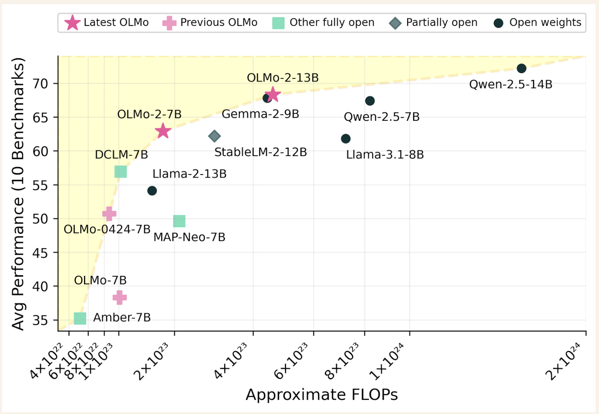

# The Allen Institute for AI (AI2) Releases OLMo 2: A New Family of Open-Sourced 7B and 13B Language Models Trained on up to 5T Tokens

> The development of language modeling focuses on creating artificial intelligence systems that can process and generate text with human-like fluency. These models play critical roles in machine translation, content generation, and conversational AI applications. They rely on extensive datasets and complex training algorithms to learn linguistic patterns, enabling them to understand context, respond to queries, […]

The development of language modeling focuses on creating artificial intelligence systems that can process and generate text with human-like fluency. These models play critical roles in machine translation, content generation, and conversational AI applications. They rely on extensive datasets and complex training algorithms to learn linguistic patterns, enabling them to understand context, respond to queries, and create coherent text. The rapid evolution in this field highlights the growing importance of open-source contributions, which aim to democratize access to powerful AI systems.

A persistent issue in the field has been the dominance of proprietary models, which often outperform open-source systems due to their extensive resources and optimized training pipelines. Proprietary systems frequently leverage massive datasets, compute power, and advanced proprietary methodologies, creating a performance gap that open models need help to close. This disparity limits accessibility and innovation in AI, as only well-funded organizations can afford to develop such cutting-edge technology.

While commendable, current open-source methods still need to fully address the challenges of scalability, training stability, and model performance. Many models are either partially open, providing only limited datasets or methodologies, or fully open but need a competitive edge over their proprietary counterparts. However, recent advancements are paving the way for a new generation of fully open and competitive models in terms of performance.

The Allen Institute for AI research team introduced [**OLMo 2**](https://allenai.org/blog/olmo2), a groundbreaking family of open-source language models. These models, available in 7 billion (7B) and 13 billion (13B) parameter configurations, were trained on up to 5 trillion tokens using state-of-the-art techniques. By refining training stability, adopting staged training processes, and incorporating diverse datasets, the researchers bridged the performance gap with proprietary systems like Llama 3.1. OLMo 2 leverages improvements in layer normalization, rotary positional embeddings, and Z-loss regularization to enhance model robustness.

OLMo 2’s training employed a curriculum approach across two stages. In the first stage, covering 90% of the pretraining budget, the models were trained on the OLMo-Mix-1124 dataset, comprising 3.9 trillion tokens sourced from various high-quality repositories like DCLM and Starcoder. The second stage involved fine-tuning Dolmino-Mix-1124, a curated dataset of 843 billion tokens featuring web-based and domain-specific content. Techniques like model souping, which merges checkpoints to optimize performance, were critical in achieving the final versions of the 7B and 13B models.

The performance of OLMo 2 sets new benchmarks in the field of open-source language modeling. Compared to its predecessor, OLMo-0424, OLMo 2 demonstrates a significant boost across all evaluation tasks. OLMo 2 7B notably outperforms Llama-3.1 8B, and OLMo 2 13B surpasses Qwen 2.5 7B, despite utilizing fewer training FLOPs. Evaluation using the Open Language Modeling Evaluation System (OLMES), a suite of 20 benchmarks, confirmed these gains, highlighting strengths in knowledge recall, reasoning, and general language capabilities.

**Key takeaways from the research include the following advancements:**

- **Training Stability Improvements**: Techniques like RMSNorm and learning rate annealing reduced loss spikes during pretraining, ensuring consistent model performance.

- **Innovative Staged Training**: Late pretraining interventions, including data curriculum adjustments, allowed for targeted enhancement of model capabilities.

- **Actionable Evaluation Framework**: The introduction of OLMES provided structured benchmarks to guide model development and track progress effectively.

- **Post-Training Methodologies**: Supervised fine-tuning, preference tuning, and reinforcement learning with verifiable rewards enhanced the models’ instruction-following capabilities.

- **Dataset Diversity and Quality**: Pretraining on datasets like Dolmino-Mix-1124 ensured the models could generalize across diverse domains.

In conclusion, OLMo 2’s achievements signify a shift in the language modeling landscape. By addressing challenges such as training stability and evaluation transparency, the researchers have set a new standard for open-source AI. These models close the gap with proprietary systems and demonstrate the potential of collaborative innovation in advancing artificial intelligence. The OLMo 2 initiative underscores the transformative power of open access to high-performance AI models, paving the way for more equitable technological advancements.

---

Check out **[the Models on Hugging Face](https://huggingface.co/collections/allenai/olmo-2-674117b93ab84e98afc72edc) and [Details](https://allenai.org/blog/olmo2).** All credit for this research goes to the researchers of this project. Also, don’t forget to follow us on **[Twitter](https://twitter.com/Marktechpost)** and join our **[Telegram Channel](https://github.com/XGenerationLab/XiYan-SQL)** and [**LinkedIn Gr**](https://www.linkedin.com/groups/13668564/)[**oup**](https://www.linkedin.com/groups/13668564/). **If you like our work, you will love our**[** newsletter..**](https://marktechpost-newsletter.beehiiv.com/subscribe) Don’t Forget to join our **[55k+ ML SubReddit](https://www.reddit.com/r/machinelearningnews/)**.

**🎙️ 🚨 ‘[Evaluation of Large Language Model Vulnerabilities: A Comparative Analysis of Red Teaming Techniques’ Read the Full Report _(Promoted)_](https://hubs.li/Q02Y39sh0)**
