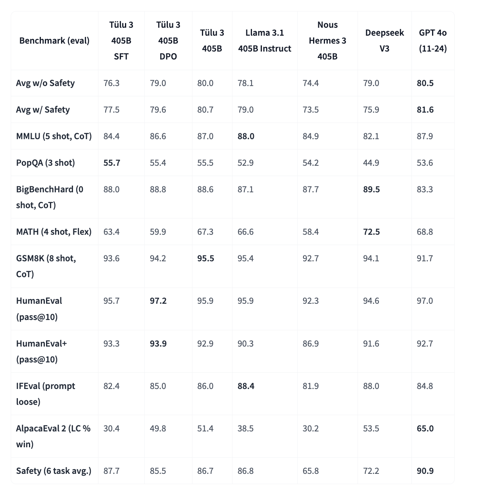

# The Allen Institute for AI (AI2) Releases Tülu 3 405B: Scaling Open-Weight Post-Training with Reinforcement Learning from Verifiable Rewards (RLVR) to Surpass DeepSeek V3 and GPT-4o in Key Benchmarks

> Post-training techniques, such as instruction tuning and reinforcement learning from human feedback, have become essential for refining language models. But, open-source approaches often fall behind proprietary models due to a lack of transparency in training data, methodologies, and optimization techniques. Despite the availability of foundational models, the absence of robust, publicly available post-training recipes creates […]

Post-training techniques, such as instruction tuning and reinforcement learning from human feedback, have become essential for refining language models. But, open-source approaches often fall behind proprietary models due to a lack of transparency in training data, methodologies, and optimization techniques. Despite the availability of foundational models, the absence of robust, publicly available post-training recipes creates a performance gap between open and closed models, limiting advancements in open AI research.

Previous open-source efforts, including Tülu 2 and Zephyr-β, have attempted to improve post-training methods but remain constrained by simpler and more cost-effective pipelines. In contrast, proprietary models like GPT-4o and Claude 3.5-Haiku benefit from access to larger datasets, refined optimization techniques, and extensive human feedback and consistently outperform open-weight models. Research on preference tuning and reinforcement learning has progressed, but existing open approaches lack the scalability and rigor of closed-source methodologies.

In collaboration with the University of Washington, the Allen Institute for AI (AI2) research team introduced Tülu 3 last year, a breakthrough in open-weight post-training. Tülu 3 builds on the Llama 3.1 base model and incorporates multiple enhancements designed to scale effectively while maintaining superior performance. 

The team has developed its latest release, [**_Tülu 3 405B_**](https://huggingface.co/allenai/Llama-3.1-Tulu-3-405B), the first open-weight model to successfully apply a fully open post-training recipe at a 405-billion-parameter scale. The model introduces a novel reinforcement learning approach known as [**_Reinforcement Learning with Verifiable Rewards (RLVR)_**](https://allenai.org/blog/tulu-3-405B), which significantly improves model performance in specialized tasks by ensuring that rewards are based on verifiable outcomes rather than subjective feedback. The research team deployed Tülu 3 405B using vLLM with 16-way tensor parallelism, optimizing computational efficiency across 256 GPUs running in parallel.

*[**Image Source**](https://allenai.org/blog/tulu-3-405B)*

**_The Tülu 3 post-training recipe follows a four-stage approach_** that begins with**_ data curation and synthesis_**, ensuring that core skills such as reasoning, mathematics, coding, and safety are well represented. The next stage involves **_supervised fine-tuning (SFT)_**, where the model is trained using carefully selected prompts and their completions. **_Direct Preference Optimization (DPO)_** is applied in the third stage, leveraging off-policy and on-policy preference data to refine responses. Finally, **_RLVR _**is introduced to enhance specialized skills, particularly in verifiable tasks such as mathematical problem-solving. One of the key differentiators of Tülu 3’s approach is its ability to scale effectively. The team found that using MATH data exclusively, rather than combining GSM8k and IFEval, yielded better results for larger models.

_Tülu 3 405B demonstrated competitive or superior performance compared to DeepSeek V3 and GPT-4o, outperforming prior open-weight models such as Llama 3.1 405B Instruct and Nous Hermes 3 405B._ The results showed a consistent edge in safety benchmarks, where many open-weight models have struggled. The RLVR framework particularly contributed to a significant increase in MATH performance at the 405B scale, with improvements in instruction-following tasks. 

The model’s training process involved extensive computational resources, including 32 nodes and 256 GPUs. During RLVR training, inference took approximately 550 seconds per iteration, weight transfer required 25 seconds, and training took around 1,500 seconds per iteration. After this rigorous training process, the final model demonstrated robust generalization capabilities across multiple benchmarks.

*[**Image Source**](https://allenai.org/blog/tulu-3-405B)*

**Some key takeaways after their latest enhancements and release from the research on Tülu 3:**

- Tülu 3 was released in multiple parameter configurations, including 8B, 70B, and 405B, each fine-tuned using supervised learning, preference optimization, and RLVR techniques.

- Training Tülu 3 405B required 256 GPUs running in parallel, with RLVR training iterations taking 550 seconds for inference and 1,500 seconds for training.

- The model surpassed DeepSeek V3 and GPT-4o in various safety and reasoning benchmarks while outperforming previous open-weight models such as Llama 3.1 405B Instruct.

- The research demonstrated that larger models perform better when trained on specialized datasets like MATH than general datasets like GSM8k.

- A novel reinforcement learning approach that rewards model completions only when results are verifiable, improving performance in mathematics and structured reasoning.

- While Tülu 3 405B sets a new standard, further research is needed to explore larger value models and alternate RL algorithms, such as GRPO, for optimizing reward structures.

In conclusion, the evolution of post-training techniques has underscored the persistent performance gap between open and proprietary models due to differences in training methodologies, data transparency, and optimization approaches. While previous open-weight models made progress, they remained behind leading proprietary models. The introduction of Tülu 3 405B marks a milestone in scaling fully open post-training techniques to large-scale models, demonstrating competitive or superior performance to state-of-the-art models such as DeepSeek V3 and GPT-4o. Notably, the Reinforcement Learning with Verifiable Rewards (RLVR) framework showed greater effectiveness at the 405B scale, particularly in mathematical problem-solving, suggesting that larger models benefit more from specialized data. Despite technical challenges in compute requirements and hyperparameter tuning, the success of Tülu 3 405B highlights the viability of open post-training recipes for achieving cutting-edge model performance.

---

Check out **_the [Model on Hugging Face](https://huggingface.co/allenai/Llama-3.1-Tulu-3-405B)._** All credit for this research goes to the researchers of this project. Also, don’t forget to follow us on **[Twitter](https://x.com/intent/follow?screen_name=marktechpost)** and join our **[Telegram Channel](https://arxiv.org/abs/2406.09406)** and [**LinkedIn Gr**](https://www.linkedin.com/groups/13668564/)[**oup**](https://www.linkedin.com/groups/13668564/). Don’t Forget to join our **[70k+ ML SubReddit](https://www.reddit.com/r/machinelearningnews/)**.

**🚨 [Meet IntellAgent](https://pxl.to/82homag): [An Open-Source Multi-Agent Framework to Evaluate Complex Conversational AI System](https://pxl.to/82homag)** _(Promoted)_
