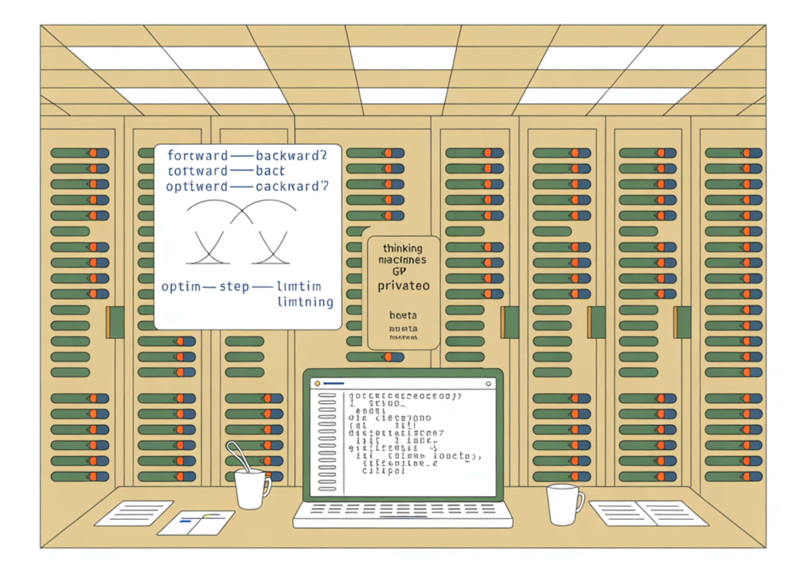

# Thinking Machines Launches Tinker: A Low-Level Training API that Abstracts Distributed LLM Fine-Tuning without Hiding the Knobs

> Thinking Machines has released Tinker, a Python API that lets researchers and engineers write training loops locally while the platform executes them on managed distributed GPU clusters. The pitch is narrow and technical: keep full control of data, objectives, and optimization steps; hand off scheduling, fault tolerance, and multi-node orchestration. The service is in private […]

Thinking Machines has released **Tinker**, a Python API that lets researchers and engineers write training loops locally while the platform executes them on managed distributed GPU clusters. The pitch is narrow and technical: keep full control of data, objectives, and optimization steps; hand off scheduling, fault tolerance, and multi-node orchestration. The service is in private beta with a waitlist and starts free, moving to usage-based pricing “in the coming weeks.”

### Alright, but tell me what it is?

Tinker exposes **low-level primitives**—not high-level “train()” wrappers. Core calls include `forward_backward`, `optim_step`, `save_state`, and `sample`, giving users direct control over gradient computation, optimizer stepping, checkpointing, and evaluation/inference inside custom loops. A typical workflow: instantiate a **LoRA** training client against a base model (e.g., Llama-3.2-1B), iterate `forward_backward`/`optim_step`, persist state, then obtain a sampling client to evaluate or export weights.

*https://thinkingmachines.ai/tinker/*

### Key Features

- **Open-weights model coverage.** Fine-tune families such as **Llama** and **Qwen**, including large mixture-of-experts variants (e.g., **Qwen3-235B-A22B**).

- **LoRA-based post-training.** Tinker implements **Low-Rank Adaptation (LoRA)** rather than full fine-tuning; their technical note (“LoRA Without Regret”) argues LoRA can match full FT for many practical workloads—especially RL—under the right setup.

- **Portable artifacts.** Download trained adapter weights for use outside Tinker (e.g., with your preferred inference stack/provider).

### What runs on it?

The Thinking Machines team positions Tinker as a **managed post-training platform** for open-weights models from small LLMs up to large mixture-of-experts systems, a good example would be **Qwen-235B-A22B** as a supported model. Switching models is intentionally minimal—change a string identifier and rerun. Under the hood, runs are scheduled on Thinking Machines’ internal clusters; the LoRA approach enables shared compute pools and lower utilization overhead.

*https://thinkingmachines.ai/tinker/*

### Tinker Cookbook: Reference Training Loops and Post-Training Recipes

To reduce boilerplate while keeping the core API lean, the team published the **[Tinker Cookbook](https://github.com/thinking-machines-lab/tinker-cookbook)** (Apache-2.0). It contains ready-to-use reference loops for **supervised learning** and **reinforcement learning**, plus worked examples for **RLHF (three-stage SFT → reward modeling → policy RL)**, **math-reasoning rewards**, **tool-use / retrieval-augmented tasks**, **prompt distillation**, and **multi-agent** setups. The repo also ships utilities for LoRA hyperparameter calculation and integrations for evaluation (e.g., InspectAI).

### Who’s already using it?

Early users include groups at **Princeton** (Gödel prover team), **Stanford** (Rotskoff Chemistry), **UC Berkeley** (SkyRL, async off-policy multi-agent/tool-use RL), and **Redwood Research** (RL on Qwen3-32B for control tasks).

Tinker is **private beta** as of now with **waitlist sign-up**. The service is **free to start**, with **usage-based pricing** planned shortly; organizations are asked to contact the team directly for onboarding.

### My thoughts/ comments

I like that Tinker exposes low-level primitives (`forward_backward`, `optim_step`, `save_state`, `sample`) instead of a monolithic `train()`—it keeps objective design, reward shaping, and evaluation in my control while offloading multi-node orchestration to their managed clusters. The LoRA-first posture is pragmatic for cost and turnaround, and their own analysis argues LoRA can match full fine-tuning when configured correctly, but I’d still want transparent logs, deterministic seeds, and per-step telemetry to verify reproducibility and drift. The Cookbook’s RLHF and SL reference loops are useful starting points, yet I’ll judge the platform on throughput stability, checkpoint portability, and guardrails for data governance (PII handling, audit trails) during real workloads.

Overall I prefer Tinker’s open, flexible API: it lets me customize open-weight LLMs via explicit training-loop primitives while the service handles distributed execution. Compared with closed systems, this preserves algorithmic control (losses, RLHF workflows, data handling) and lowers the barrier for new practitioners to experiment and iterate.

---

Check out the **[Technical details](https://thinkingmachines.ai/blog/announcing-tinker/) **and** Sign up for our waitlist [here](https://form.typeform.com/to/jH2xNWIg). If you’re a university or organization looking for wide scale access, contact [tinker@thinkingmachines.ai](mailto:tinker@thinkingmachines.ai)**.

Feel free to check out our **[GitHub Page for Tutorials, Codes and Notebooks](https://github.com/Marktechpost/AI-Tutorial-Codes-Included)**. Also, feel free to follow us on **[Twitter](https://x.com/intent/follow?screen_name=marktechpost)** and don’t forget to join our **[100k+ ML SubReddit](https://www.reddit.com/r/machinelearningnews/)** and Subscribe to **[our Newsletter](https://www.aidevsignals.com/)**. Wait! are you on telegram? **[now you can join us on telegram as well.](https://t.me/machinelearningresearchnews)**
