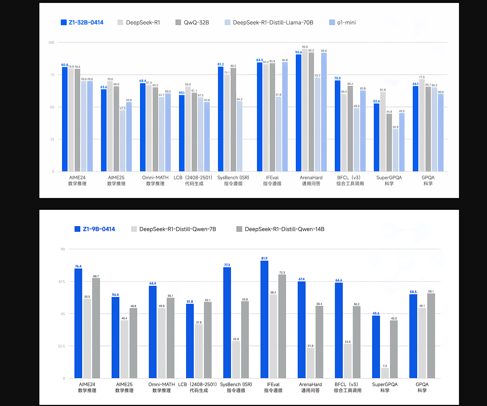

# THUDM Releases GLM 4: A 32B Parameter Model Competing Head-to-Head with GPT-4o and DeepSeek-V3

> In the rapidly evolving landscape of large language models (LLMs), researchers and organizations face significant challenges. These include enhancing reasoning abilities, providing robust multilingual support, and efficiently managing complex, open-ended tasks. Although smaller models are often more accessible and cost-effective, they typically fall short in performance when compared to their larger counterparts. Hence, there is […]

In the rapidly evolving landscape of large language models (LLMs), researchers and organizations face significant challenges. These include enhancing reasoning abilities, providing robust multilingual support, and efficiently managing complex, open-ended tasks. Although smaller models are often more accessible and cost-effective, they typically fall short in performance when compared to their larger counterparts. Hence, there is a growing emphasis on developing mid-sized models that effectively balance computational efficiency with strong reasoning and instruction-following capabilities.

The recent release of GLM 4 from Tsinghua University, particularly the GLM-Z1-32B-0414 variant, addresses these challenges effectively. Trained on a substantial dataset of 15 trillion tokens, GLM 4 is designed to offer reliable multilingual capabilities and incorporates innovative reasoning strategies referred to as “thinking mode.” This release positions GLM 4 alongside other notable models like DeepSeek Distill, QwQ, and O1-mini, and is distributed under the widely respected MIT license. Notably, despite its relatively moderate parameter size of 32 billion, GLM 4 demonstrates performance comparable to much larger models such as GPT-4o and DeepSeek-V3, which contain up to 671 billion parameters, particularly in reasoning-centric benchmarks.

On a technical level, GLM-Z1-32B-0414 leverages extensive high-quality training data, including synthetically generated reasoning tasks, to strengthen analytical capabilities. The model integrates sophisticated techniques such as rejection sampling and reinforcement learning (RL) to improve performance in agent-based tasks, coding, function calling, and search-driven question-answering tasks. Additionally, its “Deep Reasoning Model” variation further refines this by employing cold-start methods combined with extended RL training, specifically targeted at complex mathematical, logical, and coding tasks. Pairwise ranking feedback mechanisms are employed during training to enhance the model’s general reasoning effectiveness.

An advanced variant, GLM-Z1-Rumination-32B-0414, introduces a novel approach termed “rumination,” enabling prolonged reflective reasoning for tackling open-ended, complex queries like comparative AI-driven urban analysis. This variant integrates advanced search tools with multi-objective reinforcement learning, significantly enhancing its utility in research-intensive tasks and complex retrieval-based scenarios. Complementing these larger models, the GLM-Z1-9B-0414 version, with its 9 billion parameters, provides strong mathematical and general reasoning capabilities, demonstrating the practicality of smaller-scale models.

Performance data from benchmark evaluations emphasize the strengths of the GLM 4 series. Specifically, GLM-4-32B-0414 shows robust results compared to GPT-4o, DeepSeek-V3, and Qwen2.5-Max across multiple benchmarks. On the IFEval instruction-following benchmark, GLM 4 scores an impressive 87.6. In task automation benchmarks such as TAU-Bench, GLM 4 achieves strong scores in scenarios like retail (68.7) and airline (51.2). For search-augmented question-answering tasks, as evaluated by SimpleQA, the model records a high score of 88.1. Additionally, GLM 4 closely matches GPT-4o’s performance in function-calling tasks evaluated by the BFCL-v3 benchmark, securing an overall score of 69.6. In practical code repair scenarios tested through SWE-bench with the Moatless framework, GLM 4 achieves a success rate of 33.8%, underscoring its practical value.

In summary, GLM 4 presents itself as an effective family of language models, successfully bridging the performance gap between smaller, more accessible models and the traditionally superior larger-scale counterparts. The GLM-Z1 series, especially the 32B variant, exemplifies this balanced approach by providing powerful reasoning capabilities while maintaining computational affordability. With the added advantage of its permissive MIT license, GLM 4 is positioned as a robust tool for research and enterprise applications requiring high-performance AI solutions without the extensive computational overhead traditionally associated with larger models.

---

Check out [**GLM-4-Z1-32B-0414** **Model**](https://huggingface.co/THUDM/GLM-Z1-32B-0414) and **[Other Models](https://huggingface.co/collections/THUDM/glm-4-0414-67f3cbcb34dd9d252707cb2e)_._** All credit for this research goes to the researchers of this project. Also, feel free to follow us on **[Twitter](https://x.com/intent/follow?screen_name=marktechpost)** and don’t forget to join our **[90k+ ML SubReddit](https://www.reddit.com/r/machinelearningnews/)**.
