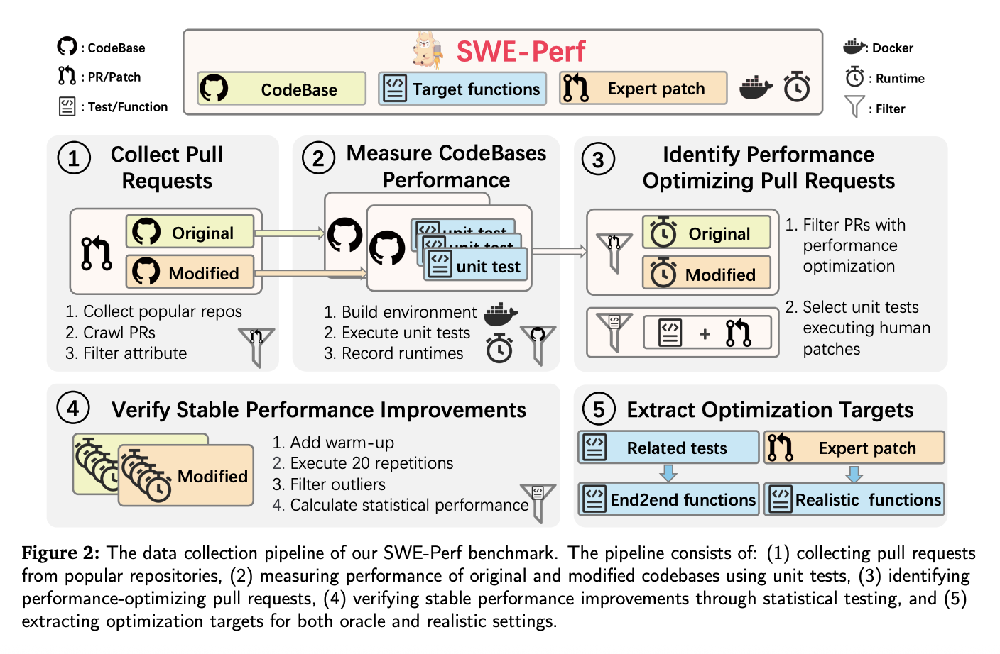

# TikTok Researchers Introduce SWE-Perf: The First Benchmark for Repository-Level Code Performance Optimization

> Introduction As large language models (LLMs) advance in software engineering tasks—ranging from code generation to bug fixing—performance optimization remains an elusive frontier, especially at the repository level. To bridge this gap, researchers from TikTok and collaborating institutions have introduced SWE-Perf—the first benchmark specifically designed to evaluate the ability of LLMs to optimize code performance in […]

## Introduction

As large language models (LLMs) advance in software engineering tasks—ranging from code generation to bug fixing—performance optimization remains an elusive frontier, especially at the repository level. To bridge this gap, researchers from TikTok and collaborating institutions have introduced **SWE-Perf**—the first benchmark specifically designed to evaluate the ability of LLMs to optimize code performance in real-world repositories.

Unlike prior benchmarks focused on correctness or function-level efficiency (e.g., SWE-Bench, Mercury, EFFIBench), SWE-Perf captures the complexity and contextual depth of repository-scale performance tuning. It provides a reproducible, quantitative foundation to study and improve the performance optimization capabilities of modern LLMs.

*Image source: https://arxiv.org/abs/2507.12415*

### Why SWE-Perf Is Needed

Real-world codebases are often large, modular, and intricately interdependent. Optimizing them for performance requires understanding of cross-file interactions, execution paths, and computational bottlenecks—challenges beyond the scope of isolated function-level datasets.

LLMs today are largely evaluated on tasks like syntax correction or small function transformations. But in production environments, performance tuning across repositories can yield more substantial system-wide benefits. SWE-Perf is explicitly built to measure LLM capabilities in such settings.

*Image source: https://arxiv.org/abs/2507.12415*

### Dataset Construction

SWE-Perf is constructed from over 100,000 pull requests across high-profile GitHub repositories. The final dataset covered 9 repositories including:

- **140 curated instances** demonstrating measurable and stable performance improvements.

- **Complete codebases** pre- and post-optimization.

- **Target functions** categorized as oracle (file-level) or realistic (repo-level).

- **Unit tests and Docker environments** for reproducible execution and performance measurement.

- **Expert-authored patches** used as gold standards.

**To ensure validity, each unit test must:**

- Pass before and after the patch.

- Show statistically significant runtime gains over 20 repetitions (Mann-Whitney U test, p ModelSettingPerformance (%)Claude-4-opusOracle1.28GPT-4oOracle0.60Gemini-2.5-ProOracle1.48Claude-3.7 (Agentless)Realistic0.41Claude-3.7 (OpenHands)Realistic**2.26**Expert (Human Patch)–**10.85**

Notably, even the best-performing LLM configurations fall significantly short of human-level performance. The agent-based method OpenHands, built on Claude-3.7-sonnet, outperforms other configurations in the realistic setting but still lags behind expert-crafted optimizations.

### Key Observations

- **Agent-based frameworks like OpenHands** are better suited for complex, multi-step optimization, outperforming direct model prompts and pipeline-based approaches like Agentless.

- **Performance degrades** as the number of target functions increases—LLMs struggle with broader optimization scopes.

- **LLMs exhibit limited scalability** in long-runtime scenarios, where expert systems continue to show performance gains.

- **Patch analysis** shows LLMs focus more on low-level code structures (e.g., imports, environment setup), while experts target high-level semantic abstractions for performance tuning.

### Conclusion

SWE-Perf represents a pivotal step toward measuring and improving the performance optimization capabilities of LLMs in realistic software engineering workflows. It uncovers a significant capability gap between existing models and human experts, offering a strong foundation for future research in repository-scale performance tuning. As LLMs evolve, SWE-Perf can serve as a north star guiding them toward practical, production-ready software enhancement at scale.

---

Check out the** [Paper](https://arxiv.org/abs/2507.12415), [GitHub Page](https://github.com/swe-perf/swe-perf) and [Project.](https://swe-perf.github.io/)** All credit for this research goes to the researchers of this project.

**Sponsorship Opportunity:** Reach the most influential AI developers in US and Europe. 1M+ monthly readers, 500K+ community builders, infinite possibilities. **[[Explore Sponsorship]](https://promotion.marktechpost.com/)**
