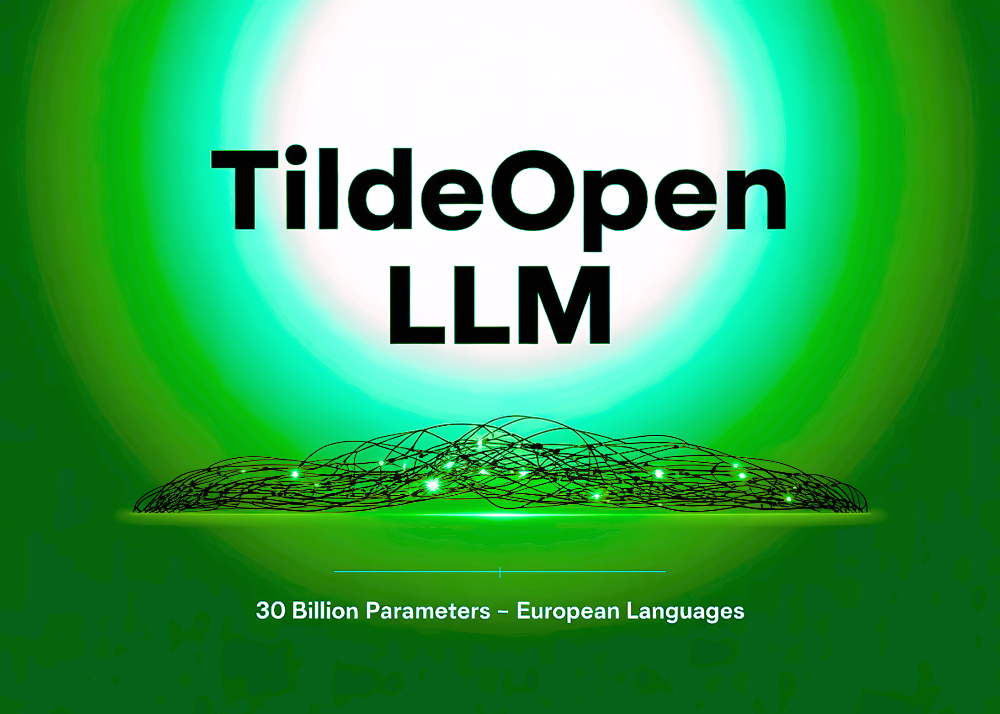

# Tilde AI Releases TildeOpen LLM: An Open-Source Large Language Model with Over 30 Billion Parameters and Support Most European Languages

> Latvian language-tech firm Tilde has released TildeOpen LLM, an open-source foundational large language model (LLM) purpose-built for European languages, with a sharp focus on under-represented and smaller national and regional languages. It’s a strategic leap toward linguistic equity and digital sovereignty within the EU. Under the Hood: Architecture, Training and Governance Language Equity and Data […]

Latvian language-tech firm **Tilde** has released **TildeOpen LLM**, an open-source foundational large language model (LLM) purpose-built for **European languages**, with a sharp focus on under-represented and smaller national and regional languages. It’s a strategic leap toward linguistic equity and digital sovereignty within the EU.

### Under the Hood: Architecture, Training and Governance

- The public release occurred on **September 3, 2025**, when Tilde deployed the model free to users via **Hugging Face**.

- Built as a **30-billion-parameter dense decoder-only transformer**, the model is available under a permissive license (CC-BY-4.0) and includes broad language support—from Latvian and Lithuanian to Ukrainian, Turkish, and beyond.

- Training occurred on the EU’s supercomputers: **LUMI** (Finland) and **JUPITER**, tapping into **2 million GPU hours** awarded via the European Commission’s **Large AI Grand Challenge**.

- Fine technical detail: trained via EleutherAI–inspired GPT-NeoX scripts across **450K updates**, consuming **~2 trillion tokens**. Training included three-stage sampling: uniform across languages, natural distribution to boost high-data-volume languages, and a final uniform sweep for balance.

- Hyperparameters: 60 layers, embedding size 6144, 48 attention heads, 8192-token context window, SwiGLU activations, RoPE positional encoding, RMSNorm layer norms.

### Language Equity and Data Sovereignty

- Mainstream models lean heavily on English and other major languages, causing skewed performance when dealing with Baltic, Slavic, or other smaller European languages. This under-representation leads to poor grammar, awkward phrasing, and hallucinations.

- TildeOpen resolves this by embedding an **“equitable tokenizer”**, engineered to represent text similarly regardless of language—reducing token count and increasing inference efficiency for lesser-represented languages.

- Crucially, organizations can **self-host**—in local data centers or secure EU-compliant clouds—ensuring adherence to GDPR and other data-protection mandates. This addresses sovereignty concerns tied to US- or Asia-hosted models.

### Strategic Horizon: From Prototype to European AI Infrastructure

- TildeOpen is a foundational “base” model. It is expected for it’s upcoming versions more specialized (e.g., instruction-tuned translation models) built atop this core.

- It’s also a geo-flag planting moment: Latvia, via Tilde, positions itself as a **tech exporter**, with aspirations to scale European AI infrastructure while preserving linguistic diversity.

- For Research, the move mirrors broader research on multilingual model behavior—gaps still exist. Evaluations show even strong open LLMs can hallucinate or lag in lexical accuracy for Baltic languages, reinforcing the need for localized development.

### Summary

**TildeOpen LLM** reframes EU AI—not just as regulatory compliance, but as **technical stewardship**. It’s a grounded, high-capacity model with transparent architecture, scalable deployment, and a fierce commitment to linguistic equity. It doesn’t indulge hype; it delivers substance.

---

### FAQs

**Q1: What is TildeOpen LLM?**
TildeOpen is a **30B-parameter multilingual large language model** trained on EU supercomputers, optimized for European languages, especially under-represented ones.

**Q2: How is it different from mainstream LLMs?**
Unlike global models that prioritize English, TildeOpen uses an **equitable tokenizer** and balanced training to ensure fair representation and accuracy across smaller European languages.

**Q3: Can organizations self-host the model?**
Yes. TildeOpen is open-source under **CC-BY-4.0** and can be deployed in local data centers or EU-compliant clouds to meet **GDPR and data sovereignty** requirements.

**Q4: What are the main use cases?**
Government services, translation, education, AI assistants, speech technologies, and multilingual customer support—any domain requiring **accurate European language processing**.

---

Check out the **[Model on Hugging Face](https://huggingface.co/TildeAI/TildeOpen-30b) and [Technical details here](https://tilde.ai/lv/tildeopen-llm/)_._** Feel free to check out our **[GitHub Page for Tutorials, Codes and Notebooks](https://github.com/Marktechpost/AI-Tutorial-Codes-Included)**. Also, feel free to follow us on **[Twitter](https://x.com/intent/follow?screen_name=marktechpost)** and don’t forget to join our **[100k+ ML SubReddit](https://www.reddit.com/r/machinelearningnews/)** and Subscribe to **[our Newsletter](https://www.aidevsignals.com/)**.
