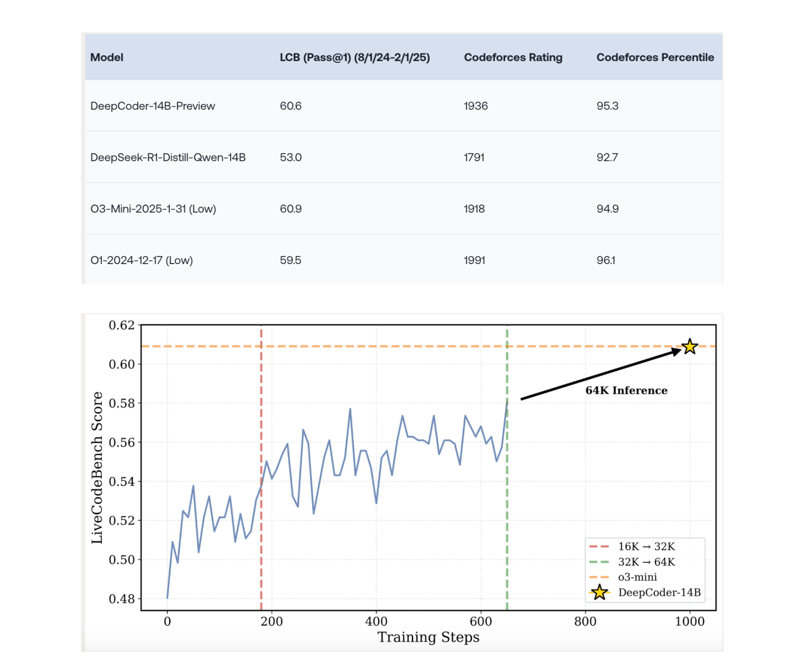

# Together AI Released DeepCoder-14B-Preview: A Fully Open-Source Code Reasoning Model That Rivals o3-Mini With Just 14B Parameters

> The demand for intelligent code generation and automated programming solutions has intensified, fueled by a rapid rise in software complexity and developer productivity needs. While natural language processing and general reasoning models have surged with significant breakthroughs, the coding domain has experienced slower progress. This lag is primarily attributed to the scarcity of high-quality, verifiable […]

The demand for intelligent code generation and automated programming solutions has intensified, fueled by a rapid rise in software complexity and developer productivity needs. While natural language processing and general reasoning models have surged with significant breakthroughs, the coding domain has experienced slower progress. This lag is primarily attributed to the scarcity of high-quality, verifiable datasets critical for effectively training RL-based systems. Unlike mathematical problems, which benefit from a wealth of structured, verifiable examples online, coding tasks often suffer from noise, insufficient test coverage, and unverifiable outputs. Consequently, advancing LLMs for code generation has remained a formidable challenge until now.

[**DeepCoder-14B-Preview**](https://huggingface.co/agentica-org/DeepCoder-14B-Preview) was released by Together AI in collaboration with the Agentica team. This powerful model was fine-tuned from DeepSeek-R1-Distilled-Qwen-14B using distributed reinforcement learning, and it demonstrates substantial progress in code reasoning. With a performance of 60.6% Pass@1 accuracy on the LiveCodeBench (LCB), DeepCoder-14B-Preview not only closes the gap with leading models like o3-mini-2025 but matches their output, all while using just 14 billion parameters, a notable feat in efficiency and capability.

The release is especially significant considering the benchmarks. DeepSeek-R1-Distill-Qwen-14B scores 53.0% on LCB, and DeepCoder-14B-Preview demonstrates an 8% leap in accuracy compared to its base model. Also, it competes toe-to-toe with established models, such as o3-mini (60.9%) and o1-2024-12-17 (59.5%) in accuracy and coding prowess. Regarding competitive coding metrics, it reaches a Codeforces rating of 1936 and a percentile of 95.3%, which are clear indicators of its real-world coding competence.

*[**Image Source**](https://www.together.ai/blog/deepcoder)*

The model was trained over 2.5 weeks on 32 H100 GPUs using a curated dataset of 24,000 verifiable coding problems. This dataset was built by rigorously filtering existing resources to ensure quality and diversity. It combines problems from the TACO Verified set, PrimeIntellect’s SYNTHETIC-1, and entries from LiveCodeBench submitted between May 2023 and July 2024. The selection process emphasized programmatic verification of test cases, a minimum of five unit tests per problem, and deduplication to avoid data contamination. This helped maintain training integrity and maximize RL effectiveness.

To facilitate this level of validation, DeepCoder’s training incorporated a scalable code sandbox environment capable of executing massive parallel evaluations. Over 1,000 coding problems were assessed at each RL step using two robust sandboxes, the Together Code Interpreter and a local sandbox. These environments ensured that every model-generated solution was rigorously tested across multiple unit tests, filtering out reward hacking and encouraging genuine reasoning over memorization.

*[**Image Source**](https://www.together.ai/blog/deepcoder)*

Also, the system architecture supporting DeepCoder was optimized through “verl-pipe,” an upgraded extension to the post-training RL pipeline that doubled training speed through systems-level improvements. This enhancement accelerates development cycles and provides a modular framework for others looking to build or iterate on similar LLMs in open-source ecosystems.

**Some Key Takeaways from the release of DeepCoder-14B-Preview include:**

- DeepCoder-14B-Preview achieves 60.6% Pass@1 accuracy on LiveCodeBench—matching o3-mini’s performance with fewer parameters.

- The model’s training leveraged 24K verifiable coding problems, carefully curated to avoid noise and reward hacking.

- It was trained on 32 H100 GPUs for 2.5 weeks, emphasizing reproducibility and system efficiency.

- A dual-sandbox environment ensured accurate and scalable code verification during training.

- System optimization via verl-pipe doubled training speed and provides a reusable pipeline for future models.

- DeepCoder is fully open-sourced, including datasets, code, and training logs, paving the way for community-driven development.

---

Check out **_the [Technical details](https://www.together.ai/blog/deepcoder)_**, **_[Model on Hugging Face](https://huggingface.co/agentica-org/DeepCoder-14B-Preview) _**and **_[GitHub Page](https://github.com/agentica-project/rllm)._** All credit for this research goes to the researchers of this project. Also, feel free to follow us on **[Twitter](https://x.com/intent/follow?screen_name=marktechpost)** and don’t forget to join our **[85k+ ML SubReddit](https://www.reddit.com/r/machinelearningnews/)**.

[**🔥 [Register Now] miniCON Virtual Conference on OPEN SOURCE AI: FREE REGISTRATION + Certificate of Attendance + 3 Hour Short Event (April 12, 9 am- 12 pm PST) + Hands on Workshop [Sponsored]**](https://pxl.to/hki7r39)
