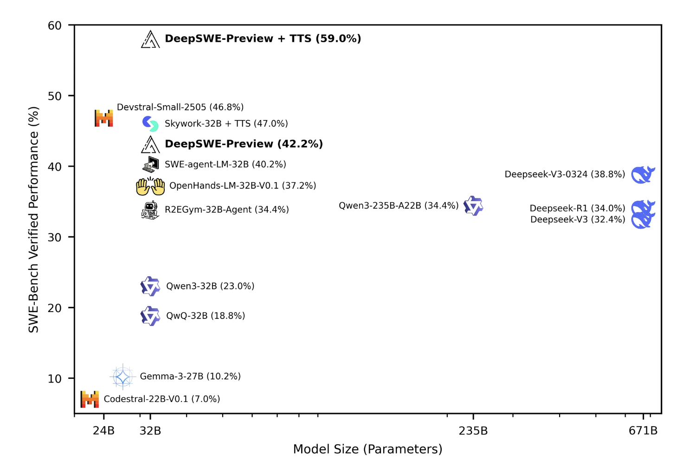

# Together AI Releases DeepSWE: A Fully Open-Source RL-Trained Coding Agent Based on Qwen3-32B and Achieves 59% on SWEBench

> Together AI has released DeepSWE, a state-of-the-art, fully open-sourced software engineering agent that is trained entirely through reinforcement learning (RL). Built on top of the Qwen3-32B language model, DeepSWE achieves 59% accuracy on the SWEBench-Verified benchmark and 42.2% Pass@1, topping the leaderboard among open-weight models. This launch represents a significant shift for Together AI, from […]

Together AI has released DeepSWE, a state-of-the-art, fully open-sourced software engineering agent that is trained entirely through reinforcement learning (RL). Built on top of the Qwen3-32B language model, DeepSWE achieves 59% accuracy on the SWEBench-Verified benchmark and 42.2% Pass@1, topping the leaderboard among open-weight models. This launch represents a significant shift for Together AI, from traditional pretraining pipelines toward creating autonomous language agents that continuously learn and improve via real-world feedback.

### Reinforcement Learning Meets Code Generation

DeepSWE is the result of post-training the Qwen3-32B foundation model using rLLM, Agentica’s modular reinforcement learning framework tailored for language agents. Unlike conventional supervised fine-tuning approaches, rLLM enables agents to adapt to real-world workflows through experience. DeepSWE has been specifically trained to solve complex software engineering tasks using a feedback-driven loop rather than static datasets.

The training pipeline incorporates Agentica’s R2EGym dataset—a software engineering benchmark designed for RL-style agent development. The framework focuses on training language models with action-oriented objectives, such as fixing bugs, completing functions, and editing code, rather than merely predicting next-token distributions. This aligns DeepSWE more closely with how human engineers iterate and learn from outcomes.

### Performance Benchmarks and Capabilities

On SWEBench-Verified, the most rigorous benchmark for software engineering agents, DeepSWE scores 59% with test-time scaling. This significantly outperforms previous open-weight models. In Pass@1 evaluations—which measure the probability that the agent solves a problem correctly on the first attempt—DeepSWE reaches an impressive 42.2%.

These results underscore the power of RL-based training in enhancing agentic behavior, particularly in domains requiring iterative reasoning and precise outputs, such as code synthesis. The model’s architecture, inherited from Qwen3-32B, enables it to scale effectively while remaining suitable for real-world applications.

### Open Source and Reproducibility at Its Core

One of the standout features of this release is its full transparency. Together AI and Agentica have open-sourced not only the DeepSWE model but also the entire training recipe, including the rLLM framework, the R2EGym dataset, and training configuration scripts. This promotes reproducibility and invites the broader research and developer communities to extend or build upon DeepSWE without restrictions.

**Developers can access DeepSWE and rLLM via the following:**

- Model Weights: [Hugging Face – DeepSWE](https://huggingface.co/agentica-org/DeepSWE-Preview)

- Training Framework: [rLLM GitHub Repository](https://github.com/agentica-project/rllm)

- Training Documentation: [DeepSWE Training Overview](https://pretty-radio-b75.notion.site/DeepSWE-Training-a-Fully-Open-sourced-State-of-the-Art-Coding-Agent-by-Scaling-RL-22281902c1468193aabbe9a8c59bbe33)

### From Language Reasoners to Language Agents

DeepSWE marks a philosophical and practical shift: from building models that reason about language to building agents that learn through interaction. Traditional LLMs have shown strong reasoning capabilities, but often lack the ability to adapt to feedback or improve with use. Reinforcement learning enables these models to not only perform well at launch but to get better over time, adapting to new problem distributions and domains.

This approach also opens the door for local deployment. Because DeepSWE is fully open-source and modular, it can be extended and retrained for organization-specific use cases. Developers and researchers can build their own agents on top of DeepSWE using rLLM to serve diverse domains such as web navigation, robotics, or autonomous research assistance.

### Conclusion

DeepSWE is a milestone in the evolution of generative AI for software engineering. By applying reinforcement learning to large language models like Qwen3-32B and releasing the entire training infrastructure, Together AI is enabling a future where agents are not just pretrained and deployed, but continually trained and improved. This leap from language understanding to action-oriented agency has significant implications across programming, automation, and intelligent system design.

---

- Model Weights: [Hugging Face – DeepSWE](https://huggingface.co/agentica-org/DeepSWE-Preview)

- Training Framework: [rLLM GitHub Repository](https://github.com/agentica-project/rllm)

- Training Documentation: [DeepSWE Training Overview](https://pretty-radio-b75.notion.site/DeepSWE-Training-a-Fully-Open-sourced-State-of-the-Art-Coding-Agent-by-Scaling-RL-22281902c1468193aabbe9a8c59bbe33)

All credit for this research goes to the researchers of this project. Also, feel free to follow us on **[Twitter](https://x.com/intent/follow?screen_name=marktechpost)** and don’t forget to join our **[100k+ ML SubReddit](https://www.reddit.com/r/machinelearningnews/)** and Subscribe to **[our Newsletter](https://www.airesearchinsights.com/subscribe)**.
