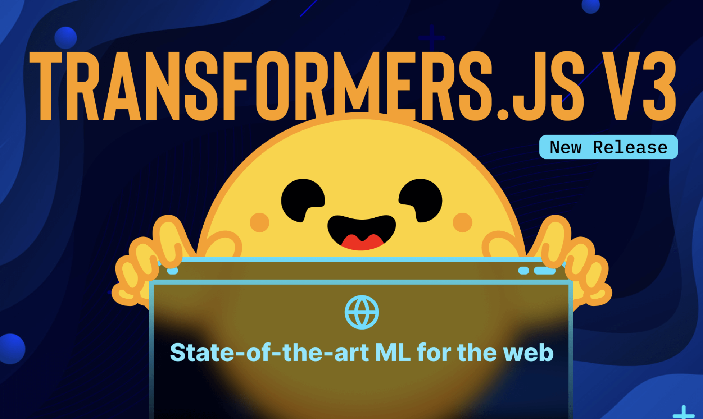

# Transformers.js v3 Released: Bringing Power and Flexibility to Browser-Based Machine Learning

> In the ever-evolving landscape of machine learning and artificial intelligence, developers are increasingly seeking tools that can integrate seamlessly into a variety of environments. One major challenge developers face is the ability to efficiently deploy machine learning models directly in the browser without relying heavily on server-side resources or extensive backend support. While JavaScript-based solutions […]

In the ever-evolving landscape of machine learning and artificial intelligence, developers are increasingly seeking tools that can integrate seamlessly into a variety of environments. One major challenge developers face is the ability to efficiently deploy machine learning models directly in the browser without relying heavily on server-side resources or extensive backend support. While JavaScript-based solutions have emerged to enable such capabilities, they often suffer from limited performance, compatibility issues, and constraints on the types of models that can be run effectively. Transformers.js v3 aims to address these shortcomings by bringing enhanced speed, compatibility, and a broad array of model support, making it a significant release for the developer community.

Transformers.js v3, the latest release by Hugging Face, is a great step forward in making machine learning accessible directly within browsers. By leveraging the power of WebGPU—a next-generation graphics API that offers considerable performance improvements over the more commonly used WebAssembly (WASM)—Transformers.js v3 provides a significant boost in speed, enabling up to 100 times faster inference compared to previous implementations. This boost is crucial for enhancing the efficiency of transformer-based models in the browser, which are notoriously resource-intensive. The release of version 3 also expands the compatibility across different JavaScript runtimes, including Node.js (both ESM and CJS), Deno, and Bun, providing developers with the flexibility to utilize these models in multiple environments.

The new version of Transformers.js not only incorporates WebGPU support but also introduces new quantization formats, allowing models to be loaded and executed more efficiently using reduced data types (dtypes). Quantization is a critical technique that helps shrink model size and enhance processing speed, especially on resource-constrained platforms like web browsers. Transformers.js v3 supports 120 model architectures, including popular ones such as BERT, GPT-2, and the newer LLaMA models, which highlights the comprehensive nature of its support. Moreover, with over 1200 pre-converted models now available, developers can readily access a broad range of tools without worrying about the complexities of conversion. The availability of 25 new example projects and templates further assists developers in getting started quickly, showcasing use cases from chatbot implementations to text classification, which helps demonstrate the power and versatility of Transformers.js in real-world applications.

The importance of Transformers.js v3 lies in its ability to empower developers to create sophisticated AI applications directly in the browser with unprecedented efficiency. The inclusion of WebGPU support addresses the long-standing performance limitations of previous browser-based solutions. With up to 100 times faster performance compared to WASM, tasks such as real-time inference, natural language processing, and even on-device machine learning have become more feasible, eliminating the need for costly server-side computations and enabling more privacy-focused AI applications. Additionally, the broad compatibility with multiple JavaScript environments—including Node.js (ESM and CJS), Deno, and Bun—means developers are not restricted to specific platforms, allowing smoother integration across a diverse range of projects. The growing collection of over 1200 pre-converted models and 25 new example projects further solidifies this release as a crucial tool for both beginners and experts in the field. Preliminary testing results show that inference times for standard transformer models are significantly reduced when using WebGPU, making user experiences much more fluid and responsive.

With the release of Transformers.js v3, Hugging Face continues to lead the charge in democratizing access to powerful machine-learning models. By leveraging WebGPU for up to 100 times faster performance and expanding compatibility across key JavaScript environments, this release stands as a pivotal development for browser-based AI. The inclusion of new quantization formats, an expansive library of over 1200 pre-converted models, and 25 readily available example projects all contribute to reducing the barriers to entry for developers looking to harness the power of transformers. As browser-based machine learning grows in popularity, Transformers.js v3 is set to be a game-changer, making sophisticated AI not only more accessible but also more practical for a wider array of applications.

**Installation**

You can get started by installing Transformers.js v3 from [NPM](https://www.npmjs.com/package/@huggingface/transformers) using:

```
`npm i @huggingface/transformers`
```

Then, importing the library with

```
`import { pipeline } from "@huggingface/transformers";`
```

or, via a CDN

```
`import { pipeline } from "https://cdn.jsdelivr.net/npm/@huggingface/transformers@3.0.0";`
```

---

Check out the** [Details](https://huggingface.co/blog/transformersjs-v3) and [GitHub](https://github.com/huggingface/transformers.js/releases/tag/3.0.0).** All credit for this research goes to the researchers of this project. Also, don’t forget to follow us on **[Twitter](https://twitter.com/Marktechpost)** and join our **[Telegram Channel](https://pxl.to/at72b5j)** and [**LinkedIn Gr**](https://www.linkedin.com/groups/13668564/)[**oup**](https://www.linkedin.com/groups/13668564/). **If you like our work, you will love our**[** newsletter..**](https://marktechpost-newsletter.beehiiv.com/subscribe) Don’t Forget to join our **[55k+ ML SubReddit](https://www.reddit.com/r/machinelearningnews/)**.

**[[Upcoming Live Webinar- Oct 29, 2024] ](https://go.predibase.com/predibase-inference-engine-102924-lp?utm_medium=3rdparty&utm_source=marktechpost)****[The Best Platform for Serving Fine-Tuned Models: Predibase Inference Engine (Promoted)](https://go.predibase.com/predibase-inference-engine-102924-lp?utm_medium=3rdparty&utm_source=marktechpost)**
