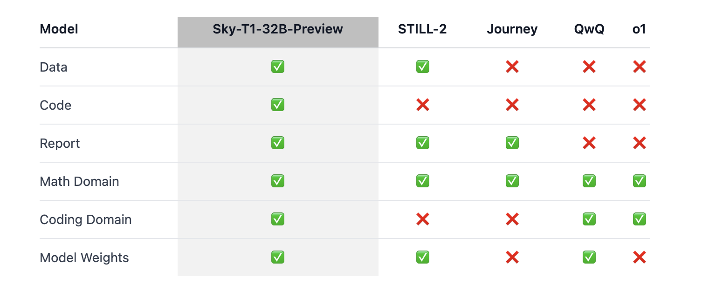

# UC Berkeley Researchers Released Sky-T1-32B-Preview: An Open-Source Reasoning LLM Trained for Under $450 Surpasses OpenAI-o1 on Benchmarks like Math500, AIME, and Livebench

> The rapid advancements in artificial intelligence have opened new possibilities, but the associated costs often limit who can benefit from these technologies. Large-scale models like GPT-4 and OpenAI’s o1 have demonstrated impressive reasoning and language capabilities, but their development and training remain financially and computationally burdensome. This creates barriers for smaller organizations, academic institutions, and […]

The rapid advancements in artificial intelligence have opened new possibilities, but the associated costs often limit who can benefit from these technologies. Large-scale models like GPT-4 and Open[AI](https://www.marktechpost.com/2025/01/13/what-is-artificial-intelligence-ai-2/)’s o1 have demonstrated impressive reasoning and language capabilities, but their development and training remain financially and computationally burdensome. This creates barriers for smaller organizations, academic institutions, and independent researchers. Moreover, the closed-source nature of many advanced models restricts broader access, limiting opportunities for collaborative innovation. This raises a critical question: How can cutting-edge AI technologies become accessible to a wider audience without compromising quality?

In response to these challenges, researchers at UC Berkeley have introduced Sky-T1-32B, a reasoning-focused language model that is both open-source and cost-efficient. Sky-T1’s standout feature is its affordability—the model can be trained for less than $450. With 32 billion parameters, the model is carefully designed to balance computational efficiency with robust performance. The development process emphasizes practical and efficient methodologies, including optimized data scaling and innovative training pipelines, enabling it to compete with larger, more resource-intensive models.

Sky-T1’s open-source nature fosters inclusivity in AI research and development. By making the model’s architecture and training process freely available, the UC Berkeley team aims to empower researchers and developers worldwide to customize and apply Sky-T1 to diverse use cases. This initiative addresses long-standing limitations posed by proprietary systems and paves the way for collaborative advancements in AI.

### Technical Insights and Key Benefits

Sky-T1 achieves its cost efficiency through a series of carefully implemented technical strategies. The model’s training process relies on optimized data scaling and parameter-efficient techniques, ensuring effective resource utilization. Methods like sparse computation and low-rank adaptation (LoRA) reduce the model’s memory and compute requirements without compromising performance. Furthermore, its architecture incorporates reasoning-centric pretraining, enhancing its ability to handle logical inference and complex problem-solving tasks.

**The key benefits of Sky-T1 include:**

- **Affordability:** Training costs under $450 make Sky-T1 accessible to a broader range of users, including smaller institutions and individual developers.

- **Open Access:** The open-source design encourages collaboration and customization, breaking down barriers to innovation.

- **Reasoning Optimization:** Unlike general-purpose LLMs, Sky-T1 is fine-tuned for reasoning tasks, making it highly effective in education, research, and automated decision-making.

- **Sustainability:** The model’s reduced computational requirements align with environmental sustainability goals by minimizing energy consumption.

### Performance Evaluation and Insights

Sky-T1 has been tested against established benchmarks such as Math500, AIME, and Livebench, which evaluate reasoning and problem-solving capabilities. On medium and hard tasks within these benchmarks, Sky-T1 outperforms OpenAI’s o1, a notable competitor in reasoning-focused AI. For instance, on Math500—a benchmark for mathematical reasoning—Sky-T1 demonstrates superior accuracy while requiring fewer computational resources.

The model’s adaptability is another significant achievement. Despite its relatively modest size, Sky-T1 generalizes well across a variety of reasoning tasks. This versatility is attributed to its high-quality pretraining data and a deliberate focus on reasoning-centric objectives. Additionally, the training process, which requires just 19 hours, highlights the feasibility of developing high-performance models quickly and cost-effectively.

### Conclusion: A Path Toward Inclusive AI

UC Berkeley’s Sky-T1 model represents a meaningful step toward making advanced AI technologies more accessible and equitable. By significantly reducing the cost of training and offering an open-source framework, Sky-T1 has the potential to transform how AI is developed and deployed. Its performance on reasoning benchmarks demonstrates that affordability does not necessitate a trade-off in quality. As Sky-T1 gains traction among researchers and developers, it may inspire a wave of innovation that extends AI’s benefits to underserved sectors and communities. In this sense, Sky-T1 is more than a technological achievement; it’s a blueprint for a more inclusive AI future.

---

Check out **_the [Model on Hugging Face](https://huggingface.co/bartowski/Sky-T1-32B-Preview-GGUF), [Details](https://novasky-ai.github.io/posts/sky-t1/), and [GitHub Page](https://github.com/NovaSky-AI/SkyThought)._** All credit for this research goes to the researchers of this project. Also, don’t forget to follow us on **[Twitter](https://x.com/intent/follow?screen_name=marktechpost)** and join our **[Telegram Channel](https://arxiv.org/abs/2406.09406)** and [**LinkedIn Gr**](https://www.linkedin.com/groups/13668564/)[**oup**](https://www.linkedin.com/groups/13668564/). Don’t Forget to join our **[65k+ ML SubReddit](https://www.reddit.com/r/machinelearningnews/)**.

**🚨 [Recommend Open-Source Platform](https://pxl.to/kgqelf6): [Parlant is a framework that transforms how AI agents make decisions in customer-facing scenarios.](https://pxl.to/kgqelf6)**
