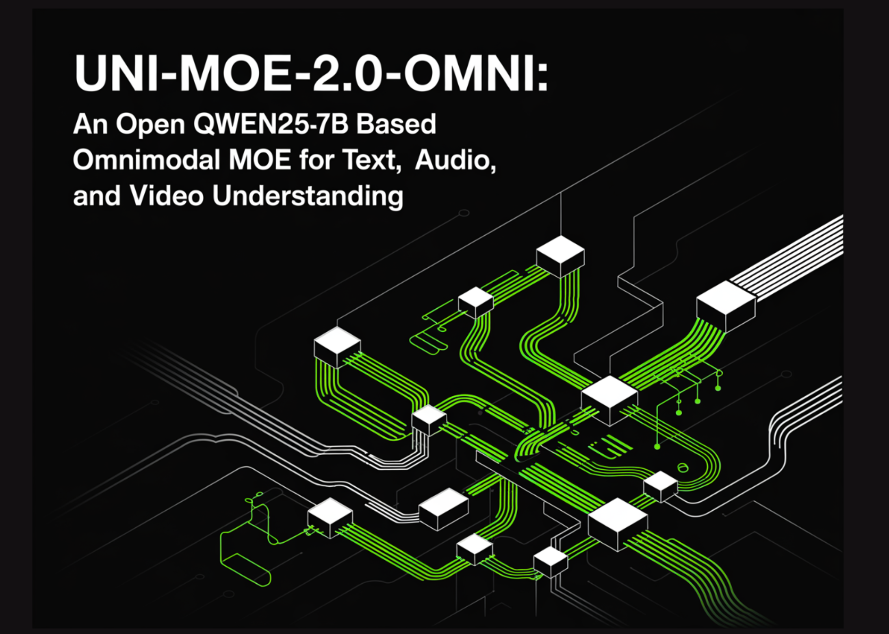

# Uni-MoE-2.0-Omni: An Open Qwen2.5-7B Based Omnimodal MoE for Text, Image, Audio and Video Understanding

> How do you build one open model that can reliably understand text, images, audio and video while still running efficiently? A team of researchers from Harbin Institute of Technology, Shenzhen introduced Uni-MoE-2.0-Omni, a fully open omnimodal large model that pushes Lychee’s Uni-MoE line toward language centric multimodal reasoning. The system is trained from scratch on […]

How do you build one open model that can _reliably_ understand text, images, audio and video while still running efficiently? A team of researchers from Harbin Institute of Technology, Shenzhen introduced **Uni-MoE-2.0-Omni**, a fully open omnimodal large model that pushes Lychee’s Uni-MoE line toward language centric multimodal reasoning. The system is trained from scratch on a Qwen2.5-7B dense backbone and extended into a Mixture of Experts architecture with dynamic capacity routing, a progressive supervised and reinforcement learning recipe, and about 75B tokens of carefully matched multimodal data. It handles text, images, audio and video for understanding and can generate images, text and speech.

*https://idealistxy.github.io/Uni-MoE-v2.github.io/*

### Architecture, unified modality encoding around a language core

The core of Uni-MoE-2.0-Omni is a Qwen2.5-7B style transformer that serves as a language centric hub. Around this hub, the research team attach a unified speech encoder that maps diverse audio, including environmental sound, speech and music, into a common representation space. On the vision side, pre-trained visual encoders process images and video frames, then feed token sequences into the same transformer. For generation, a context aware MoE based TTS module and a task aware diffusion transformer handle speech and image synthesis.

*https://idealistxy.github.io/Uni-MoE-v2.github.io/*

All modalities are converted into token sequences that share a unified interface to the language model. This design means the same self attention layers see text, vision and audio tokens, which simplifies cross modal fusion and makes the language model the central controller for both understanding and generation. The architecture is designed to support 10 cross modal input configurations, such as image plus text, video plus speech and tri modal combinations.

### Omni Modality 3D RoPE and MoE driven fusion

Cross modal alignment is handled by an Omni Modality 3D RoPE mechanism that encodes temporal and spatial structure directly into the rotary positional embeddings. Instead of only using one dimensional positions for text, the system assigns three coordinates to tokens, time, height and width for visual and audio streams, and time for speech. This gives the transformer an explicit view of when and where each token occurs, which is important for video understanding and audio visual reasoning tasks.

The Mixture of Experts layers replace standard MLP blocks with an MoE stack that has three expert types. Empty experts act as null functions that allow computation skipping at inference time. Routed experts are modality specific and store domain knowledge for audio, vision or text. Shared experts are small and always active, providing a communication path for general information across modalities. A routing network chooses which experts to activate based on the input token, giving specialization without paying the full cost of a dense model with all experts active.

### Training recipe, from cross modal pretraining to GSPO DPO

The training pipeline is organised into a data matched recipe. First, a language centric cross modal pretraining phase uses paired image text, audio text and video text corpora. This step teaches the model to project each modality into a shared semantic space aligned with language. The base model is trained on around 75B open source multimodal tokens and is equipped with special speech and image generation tokens so that generative behaviour can be learned by conditioning on linguistic cues.

Next, a progressive supervised fine tuning stage activates modality specific experts grouped into audio, vision and text categories. During this stage, the research team introduce special control tokens so that the model can perform tasks like text conditioned speech synthesis and image generation inside the same language interface. After large scale SFT (Supervised Fine-Tuning), a data balanced annealing phase re-weights the mixture of datasets across modalities and tasks and trains with a lower learning rate. This avoids over fitting to a single modality and improves stability of the final omnimodal behaviour.

To unlock long form reasoning, Uni-MoE-2.0-Omni adds an iterative policy optimisation stage built on GSPO and DPO. GSPO uses the model itself or another LLM as a judge to evaluate responses and construct preference signals, while DPO converts these preferences into a direct policy update objective that is more stable than standard reinforcement learning from human feedback. The research team apply this GSPO DPO loop in multiple rounds to form the Uni-MoE-2.0-Thinking variant, which inherits the omnimodal base and adds stronger step by step reasoning.

### Generation, MoE TTS and task aware diffusion

For speech generation, Uni-MoE-2.0-Omni uses a context aware MoE TTS module that sits on top of the language model. The LLM emits control tokens that describe timbre, style and language, along with the text content. The MoE TTS consumes this sequence and produces discrete audio tokens, which are then decoded into waveforms by an external codec model, aligning with the unified speech encoder on the input side. This design makes speech generation a first class controlled generation task instead of a separate pipeline.

On the vision side, a task aware diffusion transformer is conditioned on both task tokens and image tokens. Task tokens encode whether the system should perform text to image generation, editing or low level enhancement. Image tokens can capture semantics from the omnimodal backbone, for example from a text plus image dialogue. Lightweight projectors map these tokens into the diffusion transformer conditioning space, enabling instruction guided image generation and editing, while keeping the main omnimodal model frozen during the final visual fine tuning stage.

### Benchmarks and open checkpoints

Uni-MoE-2.0-Omni is evaluated on 85 multimodal benchmarks that cover image, text, video, audio and cross or tri modal reasoning. The model surpasses Qwen2.5-Omni, which is trained on about 1.2T tokens, on more than 50 of 76 shared benchmarks. Gains include about +7% average on video understanding across 8 tasks, +7% average on omnimodality understanding across 4 benchmarks including OmniVideoBench and WorldSense, and about +4% on audio visual reasoning.

For long form speech processing, Uni-MoE-2.0-Omni reduces word error rate by up to 4.2% relative on long LibriSpeech splits and brings about 1% WER improvement on TinyStories-en text to speech. Image generation and editing results are competitive with specialised visual models. The research team reports a small but consistent gain of about 0.5% on GEdit Bench compared to Ming Lite Omni, while also outperforming Qwen Image and PixWizard on several low level image processing metrics.

*https://arxiv.org/pdf/2511.12609*

### Key Takeaway

- Uni-MoE-2.0-Omni is a fully open omnimodal large model built from scratch on a Qwen2.5-7B dense backbone, upgraded to a Mixture of Experts architecture that supports 10 cross modal input types and joint understanding across text, images, audio and video.

- The model introduces a Dynamic Capacity MoE with shared, routed and null experts plus Omni Modality 3D RoPE, which together balance compute and capability by routing experts per token while keeping spatio temporal alignment across modalities inside the self attention layers.

- Uni-MoE-2.0-Omni uses a staged training pipeline, cross modal pretraining, progressive supervised fine tuning with modality specific experts, data balanced annealing and GSPO plus DPO based reinforcement learning to obtain the Uni-MoE-2.0-Thinking variant for stronger long form reasoning.

- The system supports omnimodal understanding and generation of images, text and speech via a unified language centric interface, with dedicated Uni-MoE-TTS and Uni-MoE-2.0-Image heads derived from the same base for controllable speech and image synthesis.

- Across 85 benchmarks, Uni-MoE-2.0-Omni surpasses Qwen2.5-Omni on more than 50 of 76 shared tasks, with around +7% gains on video understanding and omnimodality understanding, +4% on audio visual reasoning and up to 4.2% relative WER reduction on long form speech.

---

Check out the[ **Paper**](https://arxiv.org/pdf/2511.12609)**, [Repo](https://github.com/HITsz-TMG/Uni-MoE), [Model Weights](https://huggingface.co/collections/HIT-TMG/lychee-uni-moe-20) and [Project Page](https://idealistxy.github.io/Uni-MoE-v2.github.io/)**. Feel free to check out our **[GitHub Page for Tutorials, Codes and Notebooks](https://github.com/Marktechpost/AI-Tutorial-Codes-Included)**. Also, feel free to follow us on **[Twitter](https://x.com/intent/follow?screen_name=marktechpost)** and don’t forget to join our **[100k+ ML SubReddit](https://www.reddit.com/r/machinelearningnews/)** and Subscribe to **[our Newsletter](https://www.aidevsignals.com/)**. Wait! are you on telegram? **[now you can join us on telegram as well.](https://t.me/machinelearningresearchnews)**
