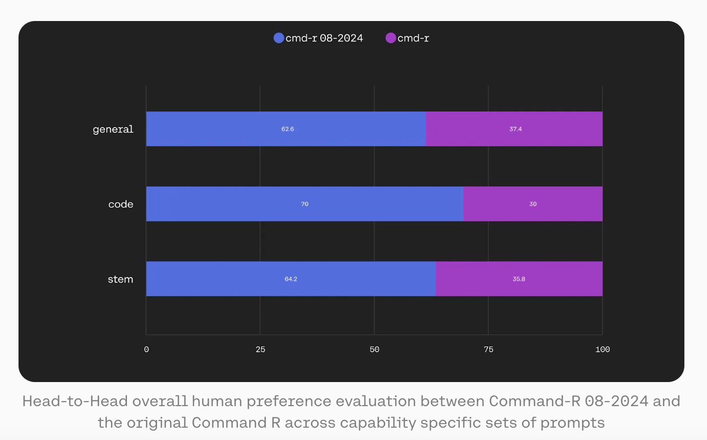

# Updated Versions of Command R (35B) and Command R+ (104B) Released: Two Powerful Language Models with 104B and 35B Parameters for Multilingual AI

> Cohere For AI unveiled two significant advancements in AI models with the release of the C4AI Command R+ 08-2024 and C4AI Command R 08-2024 models. These state-of-the-art language models are designed to push what’s achievable with AI, especially in terms of text generation, reasoning, and tool use. They offer profound implications for both research and […]

Cohere For AI unveiled two significant advancements in AI models with the release of the [**C4AI Command R+ 08-2024**](https://huggingface.co/CohereForAI/c4ai-command-r-plus-08-2024) and [**C4AI Command R 08-2024**](https://huggingface.co/CohereForAI/c4ai-command-r-08-2024) models. These state-of-the-art language models are designed to push what’s achievable with AI, especially in terms of text generation, reasoning, and tool use. They offer profound implications for both research and practical applications across various domains.

**Overview of C4AI Command R+ 08-2024**

The C4AI Command R+ 08-2024 model represents a monumental leap in AI capabilities. It is an open-weight research release with a staggering 104 billion parameters. This model is equipped with Retrieval Augmented Generation (RAG) and advanced tool-use functionalities that enable it to automate complex, multi-step tasks. These tasks include summarization, question answering, reasoning across various contexts, and more. The model is designed to interact with tools sophisticatedly, combining multiple tools over multiple steps to achieve the desired outcome.

One of the standout features of the C4AI Command R+ 08-2024 is its multilingual proficiency. The model has been trained in 23 languages, including English, Spanish, French, Italian, German, and Japanese. This extensive language training allows the model to cater to a global audience, making it a versatile tool for international applications. Moreover, it has been evaluated in 10 languages, ensuring its robustness and reliability in multilingual environments.

In terms of architecture, the C4AI Command R+ 08-2024 is an auto-regressive language model that leverages an optimized transformer architecture. After its initial pre-training, the model undergoes supervised fine-tuning (SFT) and preference training to align its behavior with human preferences, particularly in areas of helpfulness and safety. The model also utilizes Grouped Query Attention (GQA) to enhance inference speed, making it highly efficient in processing and generating text.

**Grounded Generation and Tool Use**

The C4AI Command R+ 08-2024 is specifically designed with grounded generation capabilities. This means the model can generate responses that are not only contextually accurate but also backed by specific document snippets provided during the input phase. This capability is critical for tasks that require the model to produce grounded summarizations or to perform the final step in RAG. The grounding spans, or citations, that the model includes in its responses indicate the source of the information, making the outputs more trustworthy and verifiable.

The model’s tool use capabilities are another area where it excels. It has been trained to handle conversational tool use, allowing it to interact with various tools during a conversation. This interaction is not limited to a single tool; the model can employ multiple tools across different stages of a conversation to achieve more complex objectives. For instance, it can use a tool repeatedly if the task demands it, or it can use a special directly_answer tool to abstain from using any other tools when unnecessary.

**Context Length and Multilingual Capabilities**

Another notable feature of the C4AI Command R+ 08-2024 is its support for an extensive context length of 128K tokens. This extended context allows the model to maintain coherence and relevance over longer conversations or documents, making it useful for tasks that involve processing large amounts of information or generating lengthy outputs.

The model’s multilingual capabilities further enhance its utility. With training across 23 languages and evaluation in 10, the C4AI Command R+ 08-2024 is well-suited for applications in diverse linguistic settings. This makes it an invaluable tool for global research initiatives, content creation, and customer support systems that need to operate across different languages.

**C4AI Command R 08-2024: A Compact Companion**

While the C4AI Command R+ 08-2024 represents the pinnacle of performance with its 104 billion parameters, Cohere also introduced a more compact model, the C4AI Command R 08-2024, which contains 35 billion parameters. Despite its smaller size, the C4AI Command R 08-2024 remains a highly performant generative model with capabilities similar to those of its larger counterpart, albeit on a reduced scale. The C4AI Command R 08-2024 is optimized for reasoning, summarization, and question answering, much like the Command R+ model. It also supports multilingual generation, trained and evaluated in the same languages. This model offers a more accessible option for users requiring high-performance AI within a more constrained computational or resource environment.

**Applications and Implications**

The release of these two models by Cohere and Cohere For AI marks a significant advancement in AI research. Their open-weight nature means that researchers and developers worldwide can access and utilize these powerful tools for various applications, ranging from academic research to practical implementations in many industries, such as finance, healthcare, and customer service. Moreover, the sophisticated tool use and grounded generation capabilities of the C4AI Command R+ 08-2024 model are particularly promising for tasks requiring high accuracy and contextual understanding. For instance, in legal or medical fields, where precise information retrieval and generation are crucial, these models can significantly enhance the efficiency and reliability of AI-driven systems.

*[**Image Source**](https://huggingface.co/spaces/CohereForAI/c4ai-command?model=command-r-plus-08-2024)*

**Conclusion**

Cohere for AI’s release of the C4AI Command R+ 08-2024 and C4AI Command R 08-2024 models represents a major milestone in the evolution of AI. These models offer unprecedented text generation, reasoning, and multilingual support capabilities and open up new possibilities for automating complex tasks through advanced tool use. With the open weights making these powerful tools accessible to the global research community, Cohere for AI lays the foundation for future innovations that will shape how AI is integrated into complex, real-world applications.

---

Check out the [**Model Card** ](https://huggingface.co/CohereForAI/c4ai-command-r-plus-08-2024)and **[Details](https://cohere.com/blog/command-series-0824).** All credit for this research goes to the researchers of this project. Also, don’t forget to follow us on **[Twitter](https://twitter.com/Marktechpost)** and join our **[Telegram Channel](https://www.zyphra.com/post/zamba2-mini)** and [**LinkedIn Gr**](https://www.linkedin.com/groups/13668564/)[**oup**](https://www.linkedin.com/groups/13668564/). **If you like our work, you will love our**[** newsletter..**](https://marktechpost-newsletter.beehiiv.com/subscribe)

Don’t Forget to join our **[50k+ ML SubReddit](https://www.reddit.com/r/machinelearningnews/)**

Here is a highly recommended webinar from our sponsor: **[‘Building Performant AI Applications with NVIDIA NIMs and Haystack’](https://landing.deepset.ai/webinar-nvidia-nims-and-haystack?utm_campaign=2409-campaign-nvidia-nims-and-haystack-&utm_source=marktechpost&utm_medium=banner-ad-desktop)**
