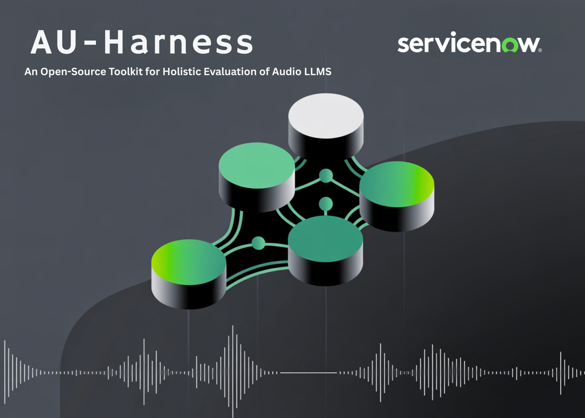

# UT Austin and ServiceNow Research Team Releases AU-Harness: An Open-Source Toolkit for Holistic Evaluation of Audio LLMs

> Voice AI is becoming one of the most important frontiers in multimodal AI. From intelligent assistants to interactive agents, the ability to understand and reason over audio is reshaping how machines engage with humans. Yet while models have grown rapidly in capability, the tools for evaluating them have not kept pace. Existing benchmarks remain fragmented, […]

Voice AI is becoming one of the most important frontiers in multimodal AI. From intelligent assistants to interactive agents, the ability to understand and reason over audio is reshaping how machines engage with humans. Yet while models have grown rapidly in capability, the tools for evaluating them have not kept pace. Existing benchmarks remain fragmented, slow, and narrowly focused, often making it difficult to compare models or test them in realistic, multi-turn settings.

To address this gap, **UT Austin and ServiceNow Research Team** has released **AU-Harness**, a new open-source toolkit built to evaluate Large Audio Language Models (LALMs) at scale. AU-Harness is designed to be fast, standardized, and extensible, enabling researchers to test models across a wide range of tasks—from speech recognition to complex audio reasoning—within a single unified framework.

### Why do we need a new audio evaluation framework?

Current audio benchmarks have focused on applications like speech-to-text or emotion recognition. Frameworks such as **AudioBench**, **VoiceBench**, and **DynamicSUPERB-2.0** broadened coverage, but they left some really critical gaps.

Three issues stand out. First is **throughput bottlenecks**: many toolkits don’t take advantage of batching or parallelism, making large-scale evaluations painfully slow. Second is **prompting inconsistency**, which makes results across models hard to compare. Third is **restricted task scope**: key areas like diarization (who spoke when) and spoken reasoning (following instructions delivered in audio) are missing in many cases.

These gaps limit the progress of LALMs, especially as they evolve into multimodal agents that must handle long, context-heavy, and multi-turn interactions.

*https://arxiv.org/pdf/2509.08031*

### How does AU-Harness improve efficiency?

The research team designed AU-Harness with focus on speed. By integrating with the **vLLM inference engine**, it introduces a token-based request scheduler that manages concurrent evaluations across multiple nodes. It also shards datasets so that workloads are distributed proportionally across compute resources.

This design allows near-linear scaling of evaluations and keeps hardware fully utilized. In practice, AU-Harness delivers **127% higher throughput** and reduces the **real-time factor (RTF) by nearly 60%** compared to existing kits. For researchers, this translates into evaluations that once took days now completing in hours.

### Can evaluations be customized?

Flexibility is another core feature of AU-Harness. Each model in an evaluation run can have its own hyperparameters, such as temperature or max token settings, without breaking standardization. Configurations allow for **dataset filtering** (e.g., by accent, audio length, or noise profile), enabling targeted diagnostics.

Perhaps most importantly, AU-Harness supports **multi-turn dialogue evaluation**. Earlier toolkits were limited to single-turn tasks, but modern voice agents operate in extended conversations. With AU-Harness, researchers can benchmark dialogue continuity, contextual reasoning, and adaptability across multi-step exchanges.

### What tasks does AU-Harness cover?

AU-Harness dramatically expands task coverage, supporting **50+ datasets, 380+ subsets, and 21 tasks** across six categories:

- **Speech Recognition**: from simple ASR to long-form and code-switching speech.

- **Paralinguistics**: emotion, accent, gender, and speaker recognition.

- **Audio Understanding**: scene and music comprehension.

- **Spoken Language Understanding**: question answering, translation, and dialogue summarization.

- **Spoken Language Reasoning**: speech-to-coding, function calling, and multi-step instruction following.

- **Safety & Security**: robustness evaluation and spoofing detection.

**Two innovations stand out:**

- **LLM-Adaptive Diarization**, which evaluates diarization through prompting rather than specialized neural models.

- **Spoken Language Reasoning**, which tests models’ ability to process and reason about spoken instructions, rather than just transcribe them.

*https://arxiv.org/pdf/2509.08031*

### What do the benchmarks reveal about today’s models?

When applied to leading systems like **GPT-4o**, **Qwen2.5-Omni**, and **Voxtral-Mini-3B**, AU-Harness highlights both strengths and weaknesses.

Models excel at **ASR and question answering**, showing strong accuracy in speech recognition and spoken QA tasks. But they lag in **temporal reasoning tasks**, such as diarization, and in **complex instruction-following**, particularly when instructions are given in audio form.

A key finding is the **instruction modality gap**: when identical tasks are presented as spoken instructions instead of text, performance drops by as much as **9.5 points**. This suggests that while models are adept at processing text-based reasoning, adapting those skills to the audio modality remains an open challenge.

*https://arxiv.org/pdf/2509.08031*

### Summary

AU-Harness marks an important step toward standardized and scalable evaluation of audio language models. By combining efficiency, reproducibility, and broad task coverage—including diarization and spoken reasoning—it addresses the long-standing gaps in benchmarking voice-enabled AI. Its open-source release and public leaderboard invite the community to collaborate, compare, and push the boundaries of what voice-first AI systems can achieve.

---

Check out the **[Paper](https://arxiv.org/abs/2509.08031), [Project](https://au-harness.github.io/)** and **[GitHub Page](https://github.com/ServiceNow/AU-Harness)_._** Feel free to check out our **[GitHub Page for Tutorials, Codes and Notebooks](https://github.com/Marktechpost/AI-Tutorial-Codes-Included)**. Also, feel free to follow us on **[Twitter](https://x.com/intent/follow?screen_name=marktechpost)** and don’t forget to join our **[100k+ ML SubReddit](https://www.reddit.com/r/machinelearningnews/)** and Subscribe to **[our Newsletter](https://www.aidevsignals.com/)**.
