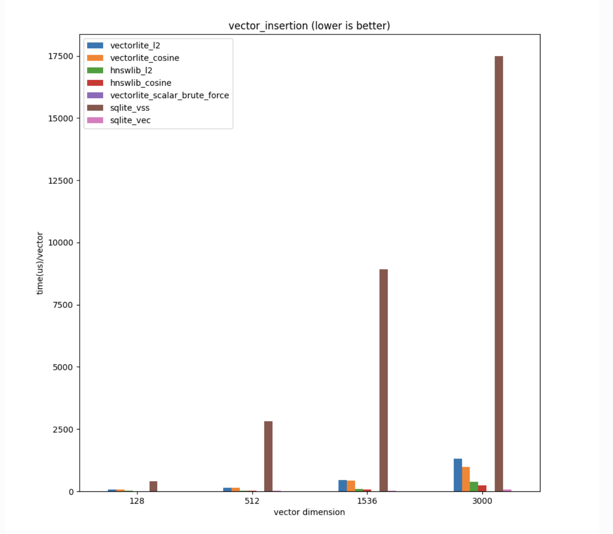

# Vectorlite v0.2.0 Released: Fast, SQL-Powered, in-Process Vector Search for Any Language with an SQLite Driver

> Many modern applications, such as recommendation systems, image and video search, and natural language processing, rely on vector representations to capture semantic similarity or other relationships between data points. As datasets grow, traditional database systems need help handling vector data efficiently, leading to slow query performance and scalability issues. These limitations create the need for […]

Many modern applications, such as recommendation systems, image and video search, and natural language processing, rely on vector representations to capture semantic similarity or other relationships between data points. As datasets grow, traditional database systems need help handling vector data efficiently, leading to slow query performance and scalability issues. These limitations create the need for efficient vector search, especially for applications that require real-time or near-real-time responses.

Existing solutions for vector search often rely on traditional database systems designed to store and manage structured data. These models focus on efficient data retrieval but need more optimized vector operations for high-dimensional data. These systems either use brute-force methods, which are slow and non-scalable, or depend on external libraries like insulin, which can have limitations in performance, particularly on different hardware architectures. 

Vectorlite 0.2.0 is an extension for SQLite designed to address the challenge of performing efficient nearest-neighbor searches on large datasets of vectors. Vectorlite 0.2.0 leverages SQLite’s robust data management capabilities while incorporating specialized functionalities for vector search. It stores vectors as BLOB data within SQLite tables and supports various indexing techniques, such as inverted indexes and Hierarchical Navigable Small World (HNSW) indexes. Additionally, Vectorlite offers multiple distance metrics, including Euclidean distance, cosine similarity, and Hamming distance, making it a versatile tool for measuring vector similarity. The tool also integrates approximate nearest neighbor (ANN) search algorithms to find the closest neighbors of a query vector efficiently.

Vectorlite 0.2.0 introduces several enhancements over its predecessors, focusing on performance and scalability. A key improvement is the implementation of a new vector distance computation using Google’s Highway library, which provides portable and SIMD-accelerated operations. This implementation allows Vectorlite to dynamically detect and utilize the best available SIMD instruction set at runtime, significantly improving search performance across various hardware platforms. For instance, on x64 platforms with AVX2 support, Vectorlite’s distance computation is 1.5x-3x faster than hnswlib’s, particularly for high-dimensional vectors. Additionally, vector normalization is now guaranteed to be SIMD-accelerated, offering a 4x-10x speed improvement over scalar implementations.

The experiments to evaluate the performance of Vectorlite 0.2.0 show that its vector query is 3x-100x faster than brute-force methods used by other SQLite-based vector search tools, especially as dataset sizes grow. Although Vectorlite’s vector insertion is slower than hnswlib due to the overhead of SQLite, it maintains almost identical recall rates and offers superior query speeds for larger vector dimensions. These results demonstrate that Vectorlite is scalable and highly efficient, making it suitable for real-time or near-real-time vector search applications.

In conclusion, Vectorlite 0.2.0 represents a powerful tool for efficient vector search within SQLite environments. By addressing the limitations of existing vector search methods, Vectorlite 0.2.0 provides a robust solution for modern vector-based applications. Its ability to leverage SIMD acceleration and its flexible indexing and distance metric options make it a compelling choice for developers needing to perform fast and accurate vector searches on large datasets.

---

Check out the **[Details](https://1yefuwang1.github.io/vectorlite/markdown/news.html#vectorlite-gets-even-faster-with-v0-2-0-release).** All credit for this research goes to the researchers of this project. Also, don’t forget to follow us on **[Twitter](https://twitter.com/Marktechpost)** and join our **[Telegram Channel](https://arxiv.org/abs/2408.08231)** and [**LinkedIn Gr**](https://www.linkedin.com/groups/13668564/)[**oup**](https://www.linkedin.com/groups/13668564/). **If you like our work, you will love our**[** newsletter..**](https://marktechpost-newsletter.beehiiv.com/subscribe)

Don’t Forget to join our **[50k+ ML SubReddit](https://www.reddit.com/r/machinelearningnews/)**

Here is a highly recommended webinar from our sponsor: **[‘Building Performant AI Applications with NVIDIA NIMs and Haystack’](https://landing.deepset.ai/webinar-nvidia-nims-and-haystack?utm_campaign=2409-campaign-nvidia-nims-and-haystack-&utm_source=marktechpost&utm_medium=banner-ad-desktop)**
