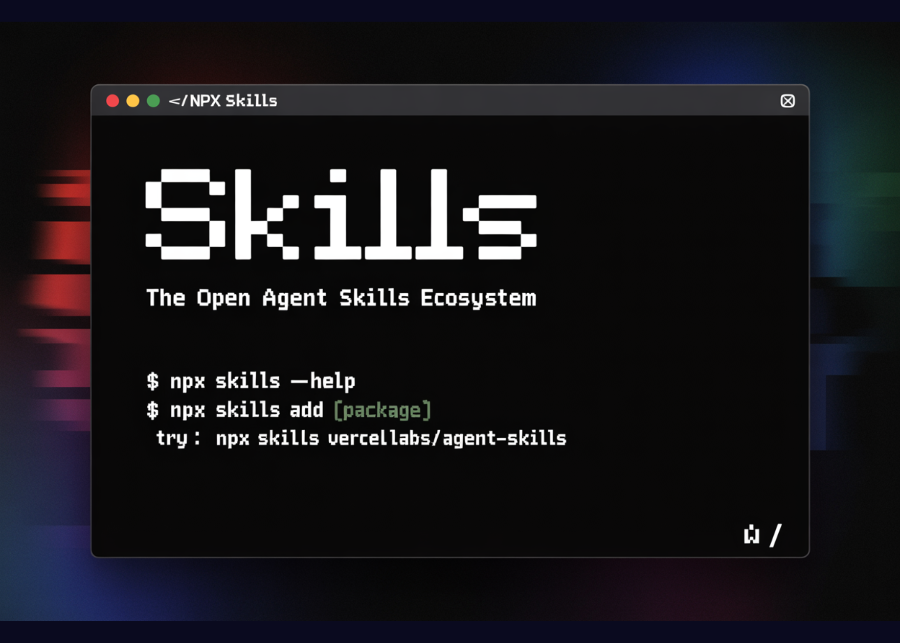

# Vercel Releases Agent Skills: A Package Manager For AI Coding Agents With 10 Years of React and Next.js Optimisation Rules

> Vercel has released agent-skills, a collection of skills that turns best practice playbooks into reusable skills for AI coding agents. The project follows the Agent Skills specification and focuses first on React and Next.js performance, web design review, and claimable deployments on Vercel. Skills are installed with a command that feels similar to npm, and […]

Vercel has released `agent-skills`, a collection of skills that turns best practice playbooks into reusable skills for AI coding agents. The project follows the [Agent Skills ](https://github.com/vercel-labs/agent-skills)specification and focuses first on React and Next.js performance, web design review, and claimable deployments on Vercel. Skills are installed with a command that feels similar to `npm`, and are then discovered by compatible agents during normal coding flows.

### Agent Skills format

Agent Skills is an open format for packaging capabilities for AI agents. A skill is a folder that contains instructions and optional scripts. The format is designed so that different tools can understand the same layout.

**A typical skill in `vercel-labs/agent-skills` has three main components:**

- `SKILL.md` for natural language instructions that describe what the skill does and how it should behave

- a `scripts` directory for helper commands that the agent can call to inspect or modify the project

- an optional `references` directory with additional documentation or examples

`react-best-practices` also compiles its individual rule files into a single `AGENTS.md` file. This file is optimized for agents. It aggregates the rules into one document that can be loaded as a knowledge source during a code review or refactor. This removes the need for ad-hoc prompt engineering per project.

### Core skills in vercel-labs/agent-skills

**The repository currently presents three main skills that target common front end workflows:**

**1. `react-best-practices`**

This skill encodes React and Next.js performance guidance as a structured rule library. It contains more than 40 rules grouped into 8 categories. These cover areas such as elimination of network waterfalls, bundle size reduction, server side performance, client side data fetching, re-render behavior, rendering performance, and JavaScript micro optimizations.

Each rule includes an impact rating. Critical issues are listed first, then lower impact changes. Rules are expressed with concrete code examples that show an anti pattern and a corrected version. When a compatible agent reviews a React component, it can map findings directly onto these rules.

**2. `web-design-guidelines`**

This skill is focused on user interface and user experience quality. It includes more than 100 rules that span accessibility, focus handling, form behavior, animation, typography, images, performance, navigation, dark mode, touch interaction, and internationalization.

During a review, an agent can use these rules to detect missing ARIA attributes, incorrect label associations for form controls, misuse of animation when the user requests reduced motion, missing alt text or lazy loading on images, and other issues that are easy to miss during manual review.

**3. `vercel-deploy-claimable`**

This skill connects the agent review loop to deployment. It can package the current project into a tarball, auto detect the framework based on `package.json`, and create a deployment on Vercel. The script can recognize more than 40 frameworks and also supports static HTML sites.

The skill returns two URLs. One is a preview URL for the deployed site. The other is a claim URL. The claim URL allows a user or team to attach the deployment to their Vercel account without sharing credentials from the original environment.

### Installation and integration flow

Skills can be installed from the command line. **The launch announcement highlights a simple path:**

Copy CodeCopiedUse a different Browser
```
npx skills i vercel-labs/agent-skills
```

This command fetches the `agent-skills` repository and prepares it as a skills package.

Vercel and the surrounding ecosystem also provide an `add-skill` CLI that is designed to wire skills into specific agents. A typical flow looks like this:

Copy CodeCopiedUse a different Browser
```
npx add-skill vercel-labs/agent-skills
```

`add-skill` scans for installed coding agents by checking their configuration directories. For example, Claude Code uses a `.claude` directory, and Cursor uses `.cursor` and a directory under the home folder. The CLI then installs the chosen skills into the correct `skills` folders for each tool.

You can call `add-skill` in non interactive mode to control exactly what is installed. For example, you can install only the React skill for Claude Code at a global level:

Copy CodeCopiedUse a different Browser
```
npx add-skill vercel-labs/agent-skills --skill react-best-practices -g -a claude-code -y
```

You can also list available skills before installing them:

Copy CodeCopiedUse a different Browser
```
npx add-skill vercel-labs/agent-skills --list
```

After installation, skills live in agent specific directories such as `~/.claude/skills` or `.cursor/skills`. The agent discovers these skills, reads `SKILL.md`, and is then able to route relevant user requests to the correct skill.

After deployment, the user interacts through natural language. For example, ‘Review this component for React performance issues’ or ‘Check this page for accessibility problems’. The agent inspects the installed skills and uses `react-best-practices` or `web-design-guidelines` when appropriate.

### Key Takeaways

- `vercel-labs/agent-skills` implements the Agent Skills specification, packaging each capability as a folder with `SKILL.md`, optional `scripts`, and `references`, so different AI coding agents can consume the same skill layout.

- The repository currently ships 3 skills, `react-best-practices` for React and Next.js performance, `web-design-guidelines` for UI and UX review, and `vercel-deploy-claimable` for creating claimable deployments on Vercel.

- `react-best-practices` encodes more than 40 rules in 8 categories, ordered by impact, and provides concrete code examples, which lets agents run structured performance reviews instead of ad hoc prompt based checks.

- `web-design-guidelines` provides more than 100 rules across accessibility, focus handling, forms, animation, typography, images, performance, navigation, dark mode, touch interaction, and internationalization, enabling systematic UI quality checks by agents.

- Skills are installed through commands such as `npx skills i vercel-labs/agent-skills` and `npx add-skill vercel-labs/agent-skills`, then discovered from agent specific `skills` directories, which turns best practice libraries into reusable, version controlled building blocks for AI coding workflows.

---

Check out the [**GitHub Repo**](https://github.com/vercel-labs/agent-skills). Also, feel free to follow us on **[Twitter](https://x.com/intent/follow?screen_name=marktechpost)** and don’t forget to join our **[100k+ ML SubReddit](https://www.reddit.com/r/machinelearningnews/)** and Subscribe to **[our Newsletter](https://www.aidevsignals.com/)**. Wait! are you on telegram? **[now you can join us on telegram as well.](https://t.me/machinelearningresearchnews)**
