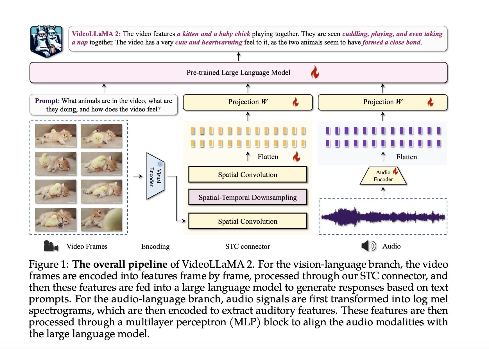

# VideoLLaMA 2 Released: A Set of Video Large Language Models Designed to Advance Multimodal Research in the Arena of Video-Language Modeling

> Recent AI advancements have notably impacted various sectors, particularly in image recognition and photorealistic image generation, with significant medical imaging and autonomous driving applications. However, the video understanding and generation domain, especially Video-LLMs, still needs help. These models struggle with processing temporal dynamics and integrating audio-visual data, limiting their effectiveness in predicting future events and […]

Recent AI advancements have notably impacted various sectors, particularly in image recognition and photorealistic image generation, with significant medical imaging and autonomous driving applications. However, the video understanding and generation domain, especially Video-LLMs, still needs help. These models struggle with processing temporal dynamics and integrating audio-visual data, limiting their effectiveness in predicting future events and performing comprehensive multimodal analyses. Addressing these complexities is crucial for enhancing Video-LLM performance.

Researchers at DAMO Academy, Alibaba Group, have introduced VideoLLaMA 2, a set of advanced Video-LLMs designed to improve spatial-temporal modeling and audio understanding in video-related tasks. Based on previous models, VideoLLaMA 2 features a custom Spatial-Temporal Convolution (STC) connector to better handle video dynamics and an integrated Audio Branch for enhanced multimodal understanding. Evaluations indicate that VideoLLaMA 2 excels in tasks like video question answering and captioning, outperforming many open-source models and rivaling some proprietary ones. These advancements position VideoLLaMA 2 as a new standard in intelligent video analysis.

Current Video-LLMs typically use a pre-trained visual encoder, a vision-language adapter, and an instruction-tuned language decoder to process video content. However, existing models often overlook temporal dynamics, relying on language decoders for this task, which could be more efficient. To address this, VideoLLaMA 2 introduces an STC Connector that better captures spatial-temporal features while maintaining visual token efficiency. Additionally, recent advancements have focused on integrating audio streams into Video-LLMs, enhancing multimodal understanding and enabling more comprehensive video scene analysis through models like PandaGPT, XBLIP, and CREMA.

VideoLLaMA 2 retains the dual-branch architecture of its predecessor, with separate Vision-Language and Audio-Language branches that connect pre-trained visual and audio encoders to a large language model. The Vision-Language branch uses an image-level encoder (CLIP) and introduces an STC Connector for improved spatial-temporal representation. The Audio-Language branch preprocesses audio into spectrograms and uses the BEATs audio encoder for temporal dynamics. This modular design ensures effective visual and auditory data integration, enhancing VideoLLaMA 2’s multimodal capabilities and allowing easy adaptation for future expansions.

VideoLLaMA 2 excels in video and audio understanding tasks, consistently outperforming open-source models and competing closely with top proprietary systems. It demonstrates strong performance in video question answering, video captioning, and audio-based tasks, particularly excelling in multi-choice video question answering (MC-VQA) and open-ended audio-video question answering (OE-AVQA). The model’s ability to integrate complex multimodal data, such as video and audio, shows significant advancements over other models. Overall, VideoLLaMA 2 stands out as a leading video and audio understanding model, with robust and competitive results across benchmarks.

The VideoLLaMA 2 series introduces advanced Video-LLMs to enhance multimodal comprehension in video and audio tasks. By integrating an STC connector and a jointly trained Audio Branch, the model captures spatial-temporal dynamics and incorporates audio cues. VideoLLaMA 2 consistently outperforms similar open-source models and competes closely with proprietary models across multiple benchmarks. Its strong performance in video question answering, video captioning, and audio-based tasks highlights its potential for tackling complex video analysis and multimodal research challenges. The models are publicly available for further development.

---

Check out the **[Paper](https://arxiv.org/abs/2406.07476)**, **[Model Card on HF](https://huggingface.co/collections/DAMO-NLP-SG/videollama-2-6669b6b6f0493188305c87ed)** and **[GitHub](https://github.com/DAMO-NLP-SG/VideoLLaMA2)**. All credit for this research goes to the researchers of this project. Also, don’t forget to follow us on **[Twitter](https://twitter.com/Marktechpost)** and join our **[Telegram Channel](https://pxl.to/at72b5j)** and [**LinkedIn Gr**](https://www.linkedin.com/groups/13668564/)[**oup**](https://www.linkedin.com/groups/13668564/). **If you like our work, you will love our**[** newsletter..**](https://marktechpost-newsletter.beehiiv.com/subscribe)

Don’t Forget to join our **[48k+ ML SubReddit](https://www.reddit.com/r/machinelearningnews/)**

**Find Upcoming [AI Webinars here](https://www.marktechpost.com/ai-webinars-list-llms-rag-generative-ai-ml-vector-database/)**

---

> [Researchers at FPT Software AI Center Introduce XMainframe: A State-of-the-Art Large Language Model (LLM) Specialized for Mainframe Modernization to Address the $100B Legacy Code Modernization](https://www.marktechpost.com/2024/08/12/researchers-at-fpt-software-ai-center-introduce-xmainframe-a-state-of-the-art-large-language-model-llm-specialized-for-mainframe-modernization-to-address-the-100b-legacy-code-modernization/)
