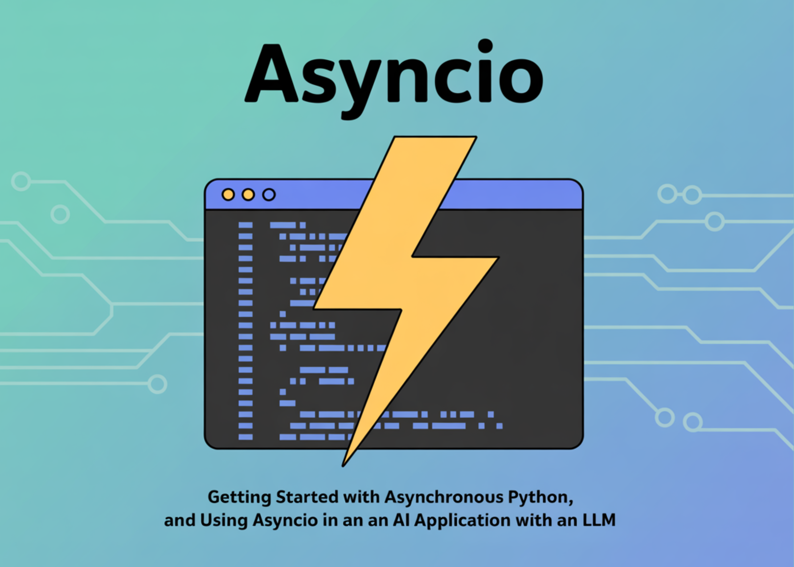

# What is Asyncio? Getting Started with Asynchronous Python and Using Asyncio in an AI Application with an LLM

> In many AI applications today, performance is a big deal. You may have noticed that while working with Large Language Models (LLMs), a lot of time is spent waiting—waiting for an API response, waiting for multiple calls to finish, or waiting for I/O operations. That’s where asyncio comes in. Surprisingly, many developers use LLMs without […]

In many AI applications today, performance is a big deal. You may have noticed that while working with Large Language Models (LLMs), a lot of time is spent waiting—waiting for an API response, waiting for multiple calls to finish, or waiting for I/O operations.

That’s where asyncio comes in. Surprisingly, many developers use LLMs without realizing they can speed up their apps with asynchronous programming.

**This guide will walk you through:**

- What is asyncio?

- Getting started with asynchronous Python

- Using asyncio in an AI application with an LLM

## What is Asyncio?

Python’s asyncio library enables writing concurrent code using the async/await syntax, allowing multiple I/O-bound tasks to run efficiently within a single thread. At its core, asyncio works with awaitable objects—usually coroutines—that an event loop schedules and executes without blocking.

In simpler terms, synchronous code runs tasks one after another, like standing in a single grocery line, while asynchronous code runs tasks concurrently, like using multiple self-checkout machines. This is especially useful for API calls (e.g., OpenAI, Anthropic, Hugging Face), where most of the time is spent waiting for responses, enabling much faster execution.

## Getting Started with asynchronous Python

### Example: Running Tasks With and Without asyncio

In this example, we ran a simple function three times in a synchronous way. The output shows that each call to say_hello() prints “Hello…”, waits 2 seconds, then prints “…World!”. Since the calls happen one after another, the wait time adds up — 2 seconds × 3 calls = 6 seconds total. Check out the **[FULL CODES here](https://github.com/Marktechpost/AI-Tutorial-Codes-Included/blob/main/ML%20Project%20Codes/Getting%20Started%20with%20Asyncio.ipynb)**.

Copy CodeCopiedUse a different Browser
```
import time

def say_hello():
    print("Hello...")
    time.sleep(2)  # simulate waiting (like an API call)
    print("...World!")

def main():
    say_hello()
    say_hello()
    say_hello()

if __name__ == "__main__":
    start = time.time()
    main()
    print(f"Finished in {time.time() - start:.2f} seconds")
```

The below code shows that all three calls to the say_hello() function started almost at the same time. Each prints “Hello…” immediately, then waits 2 seconds concurrently before printing “…World!”.

Because these tasks ran in parallel rather than one after another, the total time is roughly the longest single wait time (~2 seconds) instead of the sum of all waits (6 seconds in the synchronous version). This demonstrates the performance advantage of asyncio for I/O-bound tasks. Check out the **[FULL CODES here](https://github.com/Marktechpost/AI-Tutorial-Codes-Included/blob/main/ML%20Project%20Codes/Getting%20Started%20with%20Asyncio.ipynb)**.

Copy CodeCopiedUse a different Browser
```
import nest_asyncio, asyncio
nest_asyncio.apply()
import time

async def say_hello():
    print("Hello...")
    await asyncio.sleep(2)  # simulate waiting (like an API call)
    print("...World!")

async def main():
    # Run tasks concurrently
    await asyncio.gather(
        say_hello(),
        say_hello(),
        say_hello()
    )

if __name__ == "__main__":
    start = time.time()
    asyncio.run(main())
    print(f"Finished in {time.time() - start:.2f} seconds")
```

### Example: Download Simulation

Imagine you need to download several files. Each download takes time, but during that wait, your program can work on other downloads instead of sitting idle.

Copy CodeCopiedUse a different Browser
```
import asyncio
import random
import time

async def download_file(file_id: int):
    print(f"Start downloading file {file_id}")
    download_time = random.uniform(1, 3)  # simulate variable download time
    await asyncio.sleep(download_time)    # non-blocking wait
    print(f"Finished downloading file {file_id} in {download_time:.2f} seconds")
    return f"File {file_id} content"

async def main():
    files = [1, 2, 3, 4, 5]

    start_time = time.time()
    
    # Run downloads concurrently
    results = await asyncio.gather(*(download_file(f) for f in files))
    
    end_time = time.time()
    print("\nAll downloads completed.")
    print(f"Total time taken: {end_time - start_time:.2f} seconds")
    print("Results:", results)

if __name__ == "__main__":
    asyncio.run(main())
```


- All downloads started almost at the same time, as shown by the “Start downloading file X” lines appearing immediately one after another.

- Each file took a different amount of time to “download” (simulated with asyncio.sleep()), so they finished at different times — file 3 finished first in 1.42 seconds, and file 1 last in 2.67 seconds.

- Since all downloads were running concurrently, the total time taken was roughly equal to the longest single download time (2.68 seconds), not the sum of all times.

This demonstrates the power of asyncio — when tasks involve waiting, they can be done in parallel, greatly improving efficiency.

## Using asyncio in an AI application with an LLM

Now that we understand how asyncio works, let’s apply it to a real-world AI example. Large Language Models (LLMs) such as OpenAI’s GPT models often involve multiple API calls that each take time to complete. If we run these calls one after another, we waste valuable time waiting for responses.

In this section, we’ll compare running multiple prompts with and without asyncio using the OpenAI client. We’ll use 15 short prompts to clearly demonstrate the performance difference. Check out the **[FULL CODES here](https://github.com/Marktechpost/AI-Tutorial-Codes-Included/blob/main/ML%20Project%20Codes/Getting%20Started%20with%20Asyncio.ipynb)**.

Copy CodeCopiedUse a different Browser
```
!pip install openai
```

Copy CodeCopiedUse a different Browser
```
import asyncio
from openai import AsyncOpenAI

import os
from getpass import getpass
os.environ['OPENAI_API_KEY'] = getpass('Enter OpenAI API Key: ')

```

Copy CodeCopiedUse a different Browser
```
import time
from openai import OpenAI

# Create sync client
client = OpenAI()

def ask_llm(prompt: str):
    response = client.chat.completions.create(
        model="gpt-4o-mini",
        messages=[{"role": "user", "content": prompt}]
    )
    return response.choices[0].message.content

def main():
    prompts = [
    "Briefly explain quantum computing.",
    "Write a 3-line haiku about AI.",
    "List 3 startup ideas in agri-tech.",
    "Summarize Inception in 2 sentences.",
    "Explain blockchain in 2 sentences.",
    "Write a 3-line story about a robot.",
    "List 5 ways AI helps healthcare.",
    "Explain Higgs boson in simple terms.",
    "Describe neural networks in 2 sentences.",
    "List 5 blog post ideas on renewable energy.",
    "Give a short metaphor for time.",
    "List 3 emerging trends in ML.",
    "Write a short limerick about programming.",
    "Explain supervised vs unsupervised learning in one sentence.",
    "List 3 ways to reduce urban traffic."
]

    start = time.time()
    results = []
    for prompt in prompts:
        results.append(ask_llm(prompt))
    end = time.time()

    for i, res in enumerate(results, 1):
        print(f"\n--- Response {i} ---")
        print(res)

    print(f"\n[Synchronous] Finished in {end - start:.2f} seconds")

if __name__ == "__main__":
    main()
```

The synchronous version processed all 15 prompts one after another, so the total time is the sum of each request’s duration. Since each request took time to complete, the overall runtime was much longer — **49.76** seconds in this case. Check out the **[FULL CODES here](https://github.com/Marktechpost/AI-Tutorial-Codes-Included/blob/main/ML%20Project%20Codes/Getting%20Started%20with%20Asyncio.ipynb)**.

Copy CodeCopiedUse a different Browser
```
from openai import AsyncOpenAI

# Create async client
client = AsyncOpenAI()

async def ask_llm(prompt: str):
    response = await client.chat.completions.create(
        model="gpt-4o-mini",
        messages=[{"role": "user", "content": prompt}]
    )
    return response.choices[0].message.content

async def main():
    prompts = [
    "Briefly explain quantum computing.",
    "Write a 3-line haiku about AI.",
    "List 3 startup ideas in agri-tech.",
    "Summarize Inception in 2 sentences.",
    "Explain blockchain in 2 sentences.",
    "Write a 3-line story about a robot.",
    "List 5 ways AI helps healthcare.",
    "Explain Higgs boson in simple terms.",
    "Describe neural networks in 2 sentences.",
    "List 5 blog post ideas on renewable energy.",
    "Give a short metaphor for time.",
    "List 3 emerging trends in ML.",
    "Write a short limerick about programming.",
    "Explain supervised vs unsupervised learning in one sentence.",
    "List 3 ways to reduce urban traffic."
]

    start = time.time()
    results = await asyncio.gather(*(ask_llm(p) for p in prompts))
    end = time.time()

    for i, res in enumerate(results, 1):
        print(f"\n--- Response {i} ---")
        print(res)

    print(f"\n[Asynchronous] Finished in {end - start:.2f} seconds")

if __name__ == "__main__":
    asyncio.run(main())

```

The asynchronous version processed all 15 prompts concurrently, starting them almost at the same time instead of one by one. As a result, the total runtime was close to the time of the slowest single request — **8.25** seconds instead of adding up all requests.

The large difference happens because, in synchronous execution, each API call blocks the program until it finishes, so times add up. In asynchronous execution with asyncio, API calls run in parallel, allowing the program to handle many tasks while waiting for responses, drastically reducing total execution time.

## Why This Matters in AI Applications

In real-world AI applications, waiting for each request to finish before starting the next can quickly become a bottleneck, especially when dealing with multiple queries or data sources. This is particularly common in workflows such as:

- Generating content for multiple users simultaneously — e.g., chatbots, recommendation engines, or multi-user dashboards.

- Calling the LLM several times in one workflow — such as for summarization, refinement, classification, or multi-step reasoning.

- Fetching data from multiple APIs — for example, combining LLM output with information from a vector database or external APIs.

**Using asyncio in these cases brings significant benefits:**

- **Improved performance** — by making parallel API calls instead of waiting for each one sequentially, your system can handle more work in less time.

- **Cost efficiency** — faster execution can reduce operational costs, and batching requests where possible can further optimize usage of paid APIs.

- **Better user experience** — concurrency makes applications feel more responsive, which is crucial for real-time systems like AI assistants and chatbots.

- **Scalability **— asynchronous patterns allow your application to handle many more simultaneous requests without proportionally increasing resource consumption.

---

Check out the **[FULL CODES here](https://github.com/Marktechpost/AI-Tutorial-Codes-Included/blob/main/ML%20Project%20Codes/Getting%20Started%20with%20Asyncio.ipynb)**. Feel free to check out our **[GitHub Page for Tutorials, Codes and Notebooks](https://github.com/Marktechpost/AI-Tutorial-Codes-Included)**. Also, feel free to follow us on **[Twitter](https://x.com/intent/follow?screen_name=marktechpost)** and don’t forget to join our **[100k+ ML SubReddit](https://www.reddit.com/r/machinelearningnews/)** and Subscribe to **[our Newsletter](https://www.aidevsignals.com/)**.
